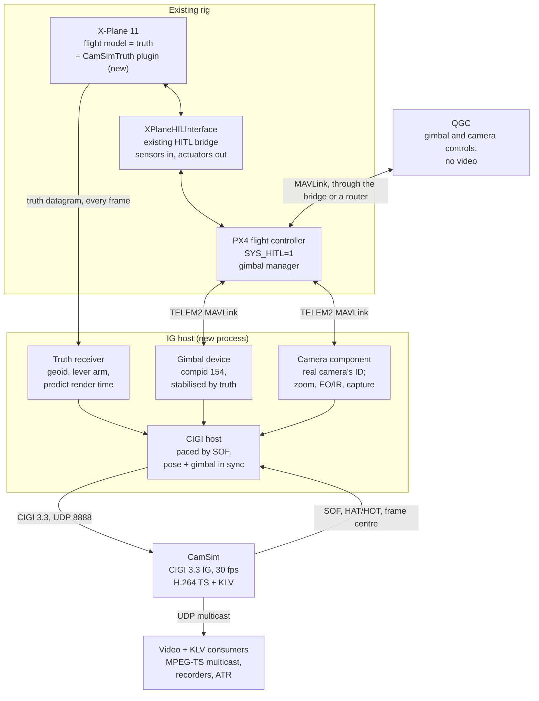

# Hooter HITL video: CamSim with PX4 and X-Plane 11

Oct 1, 2026 · @Mac Clayton

> **Status (2026-10-02):** implemented on branch `hitl`. CamSim gaps 1–12, the 107 frame-centre lag and gap 16 are fixed (ROADMAP.md "HITL support"), so the "send half a frame after SOF" workaround and the ±180° yaw limit are no longer required, and the flat-earth frame-centre fallback now includes roll. The IG host, gimbal and camera components are in `hitl/camsim_hitl`, the X-Plane plugin in `hitl/xplane_plugin`, wire formats in `hitl/PROTOCOL.md`. PX4 v1.17 sends an idle setpoint of flags 12 with q and rates all NaN (hold), and the gimbal must broadcast its attitude status (target 0/0) for PX4 to forward it. The rest of this document is the original design.

## Summary

Hooter's hardware-in-the-loop (HITL) rig gets gimbal video from two new pieces, and CamSim needs no code changes for a first picture. Here, "truth" means X-Plane's simulated true state, as opposed to PX4's estimate.

1. **What to build and connect** (order and checks are in the phased plan):
   - **A read-only X-Plane plugin** that streams the aircraft's truth over UDP every frame.
   - **The IG host:** a new program that is the CIGI host for CamSim, the image generator (IG). It takes the real gimbal's and camera's place on PX4's payload port (e.g. TELEM2).
   - **Settings:** PX4 `MNT_MODE_OUT=2` and the payload port's `MAV_x_*` parameters, plus CamSim's HITL profile (CIGI mapping section).
   - **Before building, read XPlaneHILInterface's source.** Check how it reads X-Plane, and whether it relays MAVLink to QGroundControl (QGC); see the open questions.
2. **The gimbal is a module inside the IG host, not in CamSim or X-Plane.**
   - **Why not those two:** X-Plane has no gimbal model, and CamSim takes only airframe-relative angles and speaks no MAVLink.
   - **What it does:** it answers PX4 as a Gimbal Protocol v2 device (component 154) and stabilises with X-Plane truth. PX4 v1.16+ sends the gimbal no vehicle attitude in HITL.
   - **How to write it:** as a library with its own thread and serial port, so it can become its own process later.
   - **Its neighbour:** the camera component sits beside it, copying the real camera's MAVLink identity.
3. **From X-Plane 11, use truth only:**
   - double-precision latitude, longitude and elevation;
   - true pitch, roll and heading;
   - body rates, velocities and airspeeds;
   - sim flags, time and weather.

   X-Plane has no CIGI or DIS output, so it can't drive CamSim directly. Leave its network data output alone: the bridge may own it.
4. **The KLV reports truth.** It then matches the rendered image, apart from the KLV gaps listed under CamSim today. CamSim already builds the KLV from the pose it renders, so this needs no change. An option to inject PX4's estimate can come later.

Three traps:

- **Heights.** Add the EGM96 geoid height to X-Plane's sea-level heights: CamSim expects WGS-84 ellipsoid heights.
- **Timing.** Send each CIGI datagram about half a frame (\~16 ms at 30 Hz) after CamSim's Start of Frame (SOF), with pose and gimbal predicted to the same render time.
- **Yaw.** Fix CamSim's yaw-wrap bug first (gap 1 under CamSim today, one line). Until then the host must send View Control yaw within ±180°. That is outside CIGI's 0–360° range, so a host built on the CIGI Class Library (CCL) can't send it.

Video: CamSim's H.264 MPEG-TS over UDP multicast is the only video output, and video and KLV consumers read it directly. QGC needs no video; it only drives the gimbal and camera.

## System architecture

Two new pieces join the rig: a read-only truth plugin in X-Plane and the IG host. X-Plane, XPlaneHILInterface, PX4, CamSim and the ground station stay as they are.



*New parts: the CamSimTruth plugin and the IG host. CamSim sends H.264 MPEG-TS + KLV over UDP multicast (default 239.1.1.1:5004).*

X-Plane truth and PX4's gimbal setpoints meet in the IG host, which sends CamSim one CIGI datagram per frame. Video and KLV consumers read CamSim's multicast, and the ground station gets MAVLink through the bridge.

| Link | Carries | Status |
| --- | --- | --- |
| X-Plane ↔ XPlaneHILInterface | Whatever the bridge uses today (plugin datarefs or UDP) | Existing; don't touch its data output |
| XPlaneHILInterface ↔ PX4 | To PX4: `HIL_SENSOR`, `HIL_GPS`, possibly `HIL_STATE_QUATERNION`. From PX4: `HIL_ACTUATOR_CONTROLS`. Assumed to be USB; PX4 always forwards MAVLink on its USB instance. | Existing |
| Truth plugin → IG host (UDP) | One datagram per X-Plane frame: double lat/lon/elevation, `true_psi/theta/phi`, body rates, velocities, airspeeds, `y_agl`, pause and replay flags, frame counter, time | New |
| PX4 TELEM2 ↔ IG host (serial) | To the host: `GIMBAL_DEVICE_SET_ATTITUDE`, `REQUEST_MESSAGE`, camera commands from the GCS and from missions. From the host: heartbeats, `GIMBAL_DEVICE_INFORMATION`, `GIMBAL_DEVICE_ATTITUDE_STATUS`, camera messages | New |
| IG host → CamSim (UDP 8888) | IG Control, Entity Control, View Control, plus View Definition and Sensor Control on change. Celestial, Atmosphere and Weather. HAT/HOT (height above terrain / height of terrain) requests near the ground | New |
| CamSim → IG host (UDP 8889) | Start of Frame and the Sensor Extended Response (frame centre) every tick, plus HAT/HOT responses | Existing in CamSim |
| CamSim → multicast | H.264 MPEG-TS with ST 0601 KLV | Existing |
| Ground station ↔ PX4 | MAVLink through XPlaneHILInterface, if it relays to the GCS, or through a MAVLink router | Depends on the bridge |

## Gimbal and camera simulator

The IG host impersonates Hooter's gimbal and camera on the MAVLink link where the real ones sit, so PX4 and the ground station behave as they do in flight. It stabilises the gimbal with X-Plane truth, because PX4 sends no usable attitude in HITL.

### Why it lives in the IG host

- **CamSim only takes airframe-relative gimbal angles,** and PX4's setpoint is horizon-locked, with yaw relative to the vehicle's heading or to north. The conversion needs the same truth sample as the Entity Control in the same CIGI frame; anything else makes a stabilised view wobble.
- **PX4 v1.16 and later send an identity quaternion** in `AUTOPILOT_STATE_FOR_GIMBAL_DEVICE` while HIL is on ("In HIL mode the gimbal is not moving…"). A device that stabilises from PX4's attitude would stabilise against nothing.
- **X-Plane has no gimbal model.** CamSim's MAVLink adapter (ROADMAP 5.1) is unbuilt, blocked by ROADMAP rule 5, and would tie a CIGI IG to PX4.
- **Keep it out of XPlaneHILInterface.** That bridge owns the flight-critical sensor loop.
- **Write it as a separable library** with its own thread and serial port, so it can become its own process later.

### PX4 configuration

| Parameter | Value | Why |
| --- | --- | --- |
| `MNT_MODE_IN` | 4 (MAVLink gimbal v2), or 0 (auto: RC + MAVLink) | PX4 is the gimbal manager |
| `MNT_MODE_OUT` | 2 (MAVLink gimbal v2) | Setpoints go to a MAVLink gimbal device |
| `MAV_1_CONFIG` | The port the real gimbal uses, e.g. TELEM2 | The host takes the gimbal's place |
| `MAV_1_MODE` | 10 (Gimbal), or the real payload port's mode | Streams `GIMBAL_DEVICE_SET_ATTITUDE` and `AUTOPILOT_STATE_FOR_GIMBAL_DEVICE` at 20 Hz |
| `MAV_1_FORWARD` | 1 | Forwards GCS commands and gimbal/camera replies |
| `SER_TEL2_BAUD` | Match the host's serial adapter, e.g. 921600 |  |

With v2 output, PX4 does not enforce `MNT_RANGE_*` or `MNT_LND_*`. The device enforces its limits and advertises them in `GIMBAL_DEVICE_INFORMATION`, which PX4 copies into `GIMBAL_MANAGER_INFORMATION`. Unplug the real gimbal and camera, or PX4 and QGC see two devices answering. While HIL is on, PX4 also streams `HIL_ACTUATOR_CONTROLS` at 200 Hz (about 19 kB/s) on every link faster than 5000 B/s, TELEM2 included. The host must parse and discard it, and the baud rate must leave room for it.

### What the gimbal device does

1. **Identity.** MAVLink 2, sysid = `MAV_SYS_ID`, component 154 (`MAV_COMP_ID_GIMBAL`). Accept `target_component` 154 or 0: PX4 sends 0 until it has discovered the device.
2. **Heartbeat** at 1 Hz: `MAV_TYPE_GIMBAL` (26), `MAV_AUTOPILOT_INVALID`. PX4 forwards targeted messages only to links where it has seen the component.
3. **Discovery.** PX4 sends `MAV_CMD_REQUEST_MESSAGE` (512) for message 283 to 0/0 every second until answered. Reply with `COMMAND_ACK`, then `GIMBAL_DEVICE_INFORMATION`:
   - vendor, model and firmware copied from the real gimbal;
   - `cap_flags` for the axes and lock modes it really has;
   - roll/pitch/yaw min and max in radians;
   - `gimbal_device_id` 0.

   Also honour `MAV_CMD_SET_MESSAGE_INTERVAL` for message 285, which QGC sends.
4. **Setpoints: `GIMBAL_DEVICE_SET_ATTITUDE` (284).**
   - **Flags:** RETRACT 1, NEUTRAL 2, ROLL\_LOCK 4, PITCH\_LOCK 8, YAW\_LOCK 16, YAW\_IN\_VEHICLE\_FRAME 32, YAW\_IN\_EARTH\_FRAME 64. The yaw-frame rule is in the frames section.
   - **Rate mode:** a quaternion of all NaN.
   - **Neutral:** q = (1, 0, 0, 0).
   - **Link loss:** PX4 resends its latest setpoint at the stream rate (20 Hz in Gimbal mode, 5 Hz in Normal or Onboard mode) even when its own inputs time out, so silence means link loss. Hold the last setpoint, and zero rates after about 2 s.
5. **Plant.**
   - Decompose the target into Hooter's real joint order.
   - Apply joint limits, per-joint maximum rate and acceleration, and a first-order servo lag τ.
   - Integrate at 200 Hz or more.
   - Optional: a small stabilisation error. ArduPilot's SITL gimbal models one as a constant gyro bias (no noise term).
6. **Status: `GIMBAL_DEVICE_ATTITUDE_STATUS` (285)** at 10 Hz:
   - the locks in force, plus exactly one YAW\_IN\_\* flag;
   - the actual (post-plant) q and angular velocities;
   - `failure_flags` AT\_\*\_LIMIT when clamped;
   - `delta_yaw` = vehicle heading in radians, and `delta_yaw_velocity`.

   PX4 publishes `GIMBAL_MANAGER_STATUS` only when this arrives, and QGC needs both before its gimbal control appears.
7. **Hand-off.** Give the actual airframe-relative orientation q\_BC, with its timestamp, to the CIGI module.

### PX4 version quirks

| PX4 | What changes for the device |
| --- | --- |
| v1.18.0-rc1 (Sept 2026, not yet stable) | Sets YAW\_IN\_EARTH/VEHICLE\_FRAME. Neutral clears the lock flags. `MNT_RANGE_PITCH` becomes `MNT_MIN_PITCH`/`MNT_MAX_PITCH` (AUX output only). `MNT_DO_STAB` can earth-lock RC yaw. |
| v1.16, v1.17 (latest stable) | Identity attitude in `AUTOPILOT_STATE_FOR_GIMBAL_DEVICE` under HIL. Legacy yaw rule (no YAW\_IN\_\* flags). 2 s input timeout zeroes rates. |
| v1.14, v1.15 | `DO_GIMBAL_MANAGER_PITCHYAW` rates pass through in deg/s, in fields labelled rad/s. `AUTOPILOT_STATE_FOR_GIMBAL_DEVICE` carries PX4's estimate, even in HIL. |

### Quick fallback: AUX outputs

Set `MNT_MODE_OUT=0` and map `HIL_ACT_FUNCn` to 420/421/422 (Gimbal Roll/Pitch/Yaw). The angles then appear in `HIL_ACTUATOR_CONTROLS`. PX4 streams that at 200 Hz on every MAVLink instance faster than 5000 B/s while HIL is on, TELEM2 included.

It's fine for a first demo, but it is not Hooter's configuration. The outputs read 0 while disarmed, and PX4 only stabilises when `MNT_DO_STAB` ≠ 0 (default 0), using its own estimate.

### Starting code

- MAVSDK [`cpp/examples/gimbal_device`](https://github.com/mavlink/MAVSDK/tree/main/cpp/examples/gimbal_device): two-axis, with no earth-frame handling; add roll, the yaw-frame rules and the CIGI output. Its sibling [`gimbal_device_tester`](https://github.com/mavlink/MAVSDK/tree/main/cpp/examples/gimbal_device_tester) checks the device against Gimbal Protocol v2.
- PX4 [`GZGimbal.cpp`](https://github.com/PX4/PX4-Autopilot/blob/main/src/modules/simulation/gz_bridge/GZGimbal.cpp): the q\_vehicle⁻¹ · q\_sp conversion.
- Gazebo Classic [`gazebo_gimbal_controller_plugin.cpp`](https://github.com/PX4/PX4-SITL_gazebo-classic/blob/main/src/gazebo_gimbal_controller_plugin.cpp) (Apache-2.0): a gimbal device on its own UDP endpoint, Z-X-Y decomposition.
- [pymavlink](https://github.com/ArduPilot/pymavlink), if the host is Python.

### Camera component

PX4 does not manage Camera Protocol v2 cameras: it only routes their traffic and re-emits mission camera items as commands. So the host implements the whole camera side, copying the real camera's identity, and the ground station behaves as it does with the real payload.

**Identity and discovery:**

1. **Heartbeat** at 1 Hz: sysid = `MAV_SYS_ID`, compid = the real camera's (100–105), `MAV_TYPE_CAMERA`. QGC 5.1 only accepts camera messages from the vehicle's sysid and compids 100–105, and drops a camera after 5 s of silence.
2. **Requests.** Answer `MAV_CMD_REQUEST_MESSAGE` (512) and the superseded per-message commands (521, 522, 525, 527, 2504, 2505). QGC alternates between them.
3. **ACK within about 1 s.** QGC 5.1 times out after 1200 ms and doesn't retry most camera commands. It also refuses a second command with the same ID while one is pending, so a late zoom ACK drops the zoom-stop. ACK first, then do the work.
4. **`CAMERA_INFORMATION`.**
   - Copy from the real camera: vendor, model, `flags`, `cam_definition_version`. Point `cam_definition_uri` at the host's own copy of the file.
   - Fill `resolution_h/v` and the sensor size, which QGC uses for the aspect ratio.
   - Set `gimbal_device_id` = 154 if the gimbal is a separate component.
5. **Definition file.**
   - Serve the real camera's XML over `http://` (plain `.xml`). With `mftp://`, a failed download stalls QGC's whole camera setup, with no fallback.
   - Implement `PARAM_EXT_REQUEST_LIST`, `_REQUEST_READ` and `_SET`.
   - QGC caches the file by vendor, model and version, so bump the version if the sim's file differs.
6. **Topology.** If the real payload serves camera and gimbal on one compid (Gremsy does), serve both protocols there. If they are separate, the camera component must not answer `GIMBAL_DEVICE_INFORMATION`: PX4 takes the gimbal's ID from whoever answers.

**Commands:**

| Command | What the host does |
| --- | --- |
| `SET_CAMERA_ZOOM` (531): QGC sends RANGE (slider), STEP and CONTINUOUS | Zoom model (real lens curve) → HFOV → View Definition; reply with `CAMERA_SETTINGS`. Add FOCAL\_LENGTH or HORIZONTAL\_FOV if the real camera has them. |
| `SET_CAMERA_MODE` (530) | Report the new `mode_id` in `CAMERA_SETTINGS` |
| `SET_CAMERA_FOCUS` (532) | ACK; a stub without a defocus model |
| EO/IR: the real file's source parameter (e.g. Gremsy's `C_SOURCE`), or `SET_CAMERA_SOURCE` (534) | Sensor Control Sensor ID (0 EO, 1 IR); a polarity parameter goes to Polarity. QGC never sends 534; PX4 re-emits it from missions. |
| `IMAGE_START_CAPTURE` / `STOP` (2000/2001), `DO_DIGICAM_CONTROL` (203, param5 = 1) | One capture per `IMAGE_START_CAPTURE` `param4` sequence number, and per `DO_DIGICAM_CONTROL` `param6` (Command Identity) or short time window. With `TRIG_INTERFACE=3`, PX4 can deliver up to three triggers per photo, so de-duplicate. Take the image from CamSim's `GET /snapshot` (`operational.snapshot_endpoint_enabled`) and send `CAMERA_IMAGE_CAPTURED` with MSL altitude and `file_url`. |
| `VIDEO_START_CAPTURE` / `STOP` (2500/2501) | Record CamSim's raw UDP (e.g. `check.js capture`); never extract KLV with ffmpeg |
| `VIDEO_START_STREAMING` / `STOP` (2502/2503) | ACK |
| `CAMERA_TRACK_POINT` / `RECTANGLE` / `STOP_TRACKING` (2004/2005/2010) | Only if the real camera tracks |

Accept `COMMAND_INT` as well as `COMMAND_LONG`, and broadcast targets: PX4 sends mission zoom commands to component 0.

**Status messages:**

- **`CAMERA_SETTINGS`** after every zoom or focus change. QGC re-requests it one second after each command anyway.
- **`CAMERA_CAPTURE_STATUS`**, and **`STORAGE_INFORMATION`** with one virtual storage reporting READY.
- **`CAMERA_FOV_STATUS`** feeds QGC 5.1's click-to-point gimbal control, which needs the correct `hfov`.
  - Fill the image centre from CamSim's Sensor Extended Response track point, converted from ellipsoid height to MSL. It lags one frame (see CamSim today).
  - The host must detect a boresight above the horizon itself, from its own pose and gimbal angles, and send `INT32_MIN` then. CamSim leaves the last ground hit in the track point and keeps reporting "tracking".

### PX4 routing for the camera

- **Forwarding.**
  - Set `MAV_x_FORWARD=1` on the payload port.
  - The USB instance always forwards ("Always forward messages to/from the USB instance", `mavlink_main.cpp`).
  - Keep `MAV_HB_FORW_EN=1`, or the camera's heartbeat never reaches QGC.
- **Mirror the real port's `MAV_x_MODE`.** Gimbal mode streams gimbal setpoints at 20 Hz. The Onboard modes stream them at 5 Hz, but also carry the `CAMERA_TRIGGER` stream used with `TRIG_INTERFACE=3`.
- **Keep Hooter's real `TRIG_MODE` and `TRIG_INTERFACE`.**
- **Library.** A small pymavlink state machine fits best. MAVSDK's CameraServer lacks `DO_DIGICAM_CONTROL` and `SET_CAMERA_SOURCE`, and sends `gimbal_device_id` 0.

## X-Plane 11 and XPlaneHILInterface

Read truth with a small, read-only X-Plane plugin. It never touches X-Plane's network settings, so it can't disturb XPlaneHILInterface. Check how the bridge talks to X-Plane before adding any UDP subscriber.

### XPlaneHILInterface

XPlaneHILInterface has no public footprint: GitHub, Sourcegraph and web searches find nothing, so it is probably in-house. Its closest public relatives:

- **QGroundControl's old X-Plane HIL link** (`QGCXPlaneLink`), the documented PX4 path up to QGC 3.5; QGC 4.0 removed its UI. It read X-Plane's UDP DATA output and re-pointed X-Plane's data-output destination to itself.
- **[mav2xplane](https://github.com/borune-k12/mav2xplane)**, the same link extracted into a standalone app.
- **[px4xplane](https://github.com/alireza787b/px4xplane)** is a plugin but SITL-only (TCP 4560).

What to check in its source and on the rig:

1. **Plugin or app?** `XPluginStart` and a `.xpl` target mean a plugin. Socket code that sends `DATA`, `DSEL`, `USEL`, `ISE4`, `RREF` or `RPOS` means an external app; note which it sends.
2. **Which X-Plane output it reads.** If Settings > Data Output has "Send network data output" ticked, the bridge uses DATA. X-Plane has one DATA destination, so the IG host must never send `ISE4`, `DSEL` or `USEL`.
3. **What X-Plane receives.** Settings > General > "Output network data to Log.txt" logs every UDP command, including the bridge's.
4. **MAVLink to PX4.** Which `HIL_*` messages, at what rates, and whether it sends `HIL_STATE_QUATERNION`.
5. **Relay to the GCS.** Whether it forwards MAVLink both ways, for every component ID, including the camera's and 154.
6. **If it derives from QGC's link:** QGC parsed attitude and rates only with "X-Plane 10" selected (DATA sets 16/17), which is why XP11 users picked X-Plane 10.

### Getting truth out of X-Plane 11

| Mechanism | Precision | Shares with the bridge? | Verdict |
| --- | --- | --- | --- |
| Read-only plugin (`XPLM303`, SDK 3.0.x API) | Native doubles for lat/lon/elevation | Yes: no sockets or settings shared | **Use this** |
| RREF from the host's own socket | Every value is float32: about 0.2–0.85 m steps in lat/lon at mid-latitudes | Replies go to each requester; test with the bridge running | Fallback |
| RPOS | Doubles for position; float attitude (earth-relative, same as `true_*`); no timestamp | Unverified with two requesters; risky if the bridge uses RPOS | Only if the bridge doesn't use RPOS |
| DATA output, `DSEL`, `USEL`, `ISE4` | Float32 | No: one destination, so it would steal or break the bridge's feed | Don't |

**Plugin design ("CamSimTruth"):**

- **Flight loop.** `XPLMCreateFlightLoop` in the `xplm_FlightLoop_Phase_AfterFlightModel` phase, returning −1 to run every frame. Cache dataref handles once, then read with `XPLMGetDatad` / `XPLMGetDataf`.
- **Per-frame datagram:**
  - `XPLMGetCycleNumber()` and a host monotonic timestamp;
  - the truth datarefs below;
  - pause, replay and sim-speed flags;
  - `zulu_time_sec`, `local_time_sec` and the local month and day.

  Once a second, add the weather datarefs.
- **Threading.** Send with a non-blocking `sendto` from the flight loop. The plugin SDK is not thread-safe: never call XPLM from another thread.
- **Optional terrain probe.** `XPLMProbeTerrainXYZ` under the aircraft gives X-Plane's ground height, to compare with Cesium.
- **Packaging.** Ship it as `CamSimTruth/{lin_x64,win_x64,mac_x64}/CamSimTruth.xpl`, built with the current SDK at API level `XPLM303` (X-Plane 11.50+).

If you fall back to RPOS: X-Plane 11.55 sends the header as `RPOS4`, not `RPOS\0`. Match only the first four bytes.

### Truth datarefs

| Dataref (`sim/flightmodel/position/` unless noted) | Type, units | Use |
| --- | --- | --- |
| `latitude`, `longitude` | double, deg | Entity Control latitude and longitude |
| `elevation` | double, m above MSL | Plus N\_geoid (EGM96), giving the ellipsoid height |
| `true_psi`, `true_theta`, `true_phi` (10.30+) | float, deg; earth-relative at the aircraft; `true_psi` is true north | Entity Control yaw/pitch/roll; q\_NB for the gimbal |
| `Prad`, `Qrad`, `Rrad` | float, rad/s, body axes | Attitude interpolation, gimbal plant |
| `local_vx`, `local_vy`, `local_vz` | float, m/s; OpenGL frame (east, up, south at the OpenGL origin) | Short extrapolation; rotate to NED first |
| `true_airspeed`, `groundspeed` | float, m/s | KLV 8 and 56 (gap 9) |
| `indicated_airspeed` | float, knots | KLV 9 (gap 9) |
| `mag_psi` | float, deg | KLV 64 (gap 9) |
| `y_agl` | float, m; probably measured at the wheels | Near-ground terrain blend |
| `sim/time/paused`, `is_in_replay` (11.00+), `sim_speed`, `sim_speed_actual_ogl` (11.30+) | int / float | Gate the stream; detect time dilation |

Don't use `q`, `psi`/`theta`/`phi` or `local_x/y/z`. They are in X-Plane's OpenGL frame, which tilts with distance from its moving origin: about 0.09° at 10 km, enough to matter at narrow FOV.

### Time and date

- **X-Plane 11 has no UTC date and no year dataref.** `zulu_date_days` only arrives in 12.4.1.
- **Simplest: run on system time.** Set X-Plane to track real time (`use_system_time = 1`) and run NTP on every machine. Send Celestial with Date/Time Valid = 0 and **Ephemeris Model Enable = 1**, so CamSim's clock runs on wall-clock UTC. With Ephemeris = 0, CamSim freezes its clock, and KLV Tag 2 freezes with it.
- **Scenario time (a chosen time of day)** needs the UTC date derived from local time. Pass the **local** year: a UTC year breaks the result for up to about 14 h around every 1 January.

```python
from datetime import date, datetime, timedelta

def xp11_utc(L, Z, local_month, local_day, lon_deg, local_year):
    """L = local_time_sec, Z = zulu_time_sec; month and day from sim/cockpit2/clock_timer/current_*."""
    d = L - Z                                               # = tz offset - 86400 * k
    k = round(((lon_deg / 15.0) * 3600.0 - d) / 86400.0)   # day wrap: -1, 0 or +1
    utc_day = date(local_year, local_month, local_day) - timedelta(days=k)
    return datetime(utc_day.year, utc_day.month, utc_day.day) + timedelta(seconds=Z)
```

- **Check the clock datarefs once on the rig.** That `current_month`/`current_day` are local in XP11 is inferred, not documented, and so is their leap-year behaviour.
- **Re-sets can step backwards.** CamSim re-sets its clock to hh:mm:00 on every Celestial change, which can step Tag 2 back by up to a minute. Send the first packet exactly at X-Plane's minute rollover. `CAMSIM_START_DATETIME` only helps if the host then sends Date/Time Valid = 0: the first Valid = 1 packet always re-sets the clock.
- **Order samples by counter, not sim time.** `zulu_time_sec` is a float inside X-Plane too, about 7.8 ms per step late in the day, so order samples by the cycle counter and host clock.

### Pitfalls

- **Time dilation.** Below about 20 fps X-Plane slows its physics, and a real flight controller can't follow. CamSim renders the imagery, so turn X-Plane's graphics right down. Flag runs while `sim_speed_actual_ogl` < 0.98.
- **Earth model.**
  - X-Plane's world is a sphere. Treat its lat/lon as WGS-84 and `elevation` as MSL.
  - X-Plane velocities placed on the ellipsoid can disagree by up to about 0.7%, so use them only to extrapolate a frame or two, never to integrate position. Read `sim/physics/earth_radius_m` once at startup.
- **Terrain.**
  - X-Plane 11's default mesh is SRTM-based, covering 74°N to 60°S, and flattens airports.
  - Cesium World Terrain is 1–30 m resolution in the US.
  - No published comparison exists, so measure it at Hooter's airfield in phase 1.

## CIGI mapping to CamSim

On each CamSim frame the host sends one datagram: IG Control, Entity Control, View Control, plus View Definition and Sensor Control when they change and about once a second. Over UDP, one lost datagram would otherwise leave the wrong FOV or waveband. Each table gives the field values and what CamSim actually does with them, checked against the code.

### CamSim configuration for the rig

```yaml
# deploy/camsim_config.yaml (top-level keys; YAML only, no env overrides yet)
camera_entity_id: 1          # the Entity ID the host uses for Hooter
gimbal_max_slew_rate: 0.0    # snap: the host's plant owns the gimbal dynamics
gimbal_pitch_max: 90.0       # default 30 would clip; the host enforces the real limits
sensor_fov_presets: []       # ignore Sensor Control Gain; FOV comes from View Definition
cigi_response_addr: "<IG host IP>"   # or CAMSIM_CIGI_RESPONSE_ADDR
```

Output goes to `CAMSIM_MULTICAST_ADDR` (default 239.1.1.1). On Linux receivers, raise `net.core.rmem_max`: each keyframe goes out as one burst larger than the default socket buffer.

### IG Control (opcode 1), first in every datagram

- IG Mode = Operate, Database Number = 0, Timestamp Valid = 1.
- Timestamp = a free-running monotonic counter in 10 µs ticks. Host Frame Number increments per datagram.
- CamSim ignores IG Mode and Database Number. It uses the timestamp only for its ground-speed estimate (Tag 56).

### Entity Control (opcode 2): the airframe

| Field | Value | CamSim behaviour |
| --- | --- | --- |
| Entity ID | `camera_entity_id` (1) | Routed to the camera, never drawn (`CIGI/CigiReceiver.cpp:102-110`) |
| Entity State | Active |  |
| Attach State | Detach | Attach would turn Lat/Lon/Alt into body-frame offsets |
| Latitude, Longitude | X-Plane `latitude`, `longitude` (double) + lever arm |  |
| Altitude | `elevation + N_geoid`, or the near-ground blend, + lever arm | Stored as float32; negligible at drone altitudes |
| Yaw | `true_psi` | 0–360°, true north |
| Pitch | `true_theta` | ±90° |
| Roll | `true_phi` | ±180°, right wing down positive |
| Entity Type, Clamp, Alpha, Animation, Extrapolation | Any | Ignored for the camera entity |

Send exactly one camera Entity Control per CamSim frame. If several arrive, the last wins and the rest are dropped (`Camera/CamSimPlatformRig.cpp:52-65`). A NaN anywhere skips the whole pose. Don't send Rate Control (opcode 8) for this entity: CamSim drops it.

### View Control (opcode 16): the gimbal

| Field | Value | CamSim behaviour |
| --- | --- | --- |
| View ID, Group ID | 0, 0 | Ignored (one view) |
| Entity ID | 0 | **Use 0. Any non-zero ID goes through the first-person-view path. For a spawned entity, it moves the camera to that entity and keeps only its heading, overriding Entity Control** (`Camera/CamSimPlatformRig.cpp:114-146`) |
| X/Y/Z Offset | 0, enables off | Stored, never used; the host applies the lever arm |
| Yaw/Pitch/Roll Enable | 1, 1, 1 |  |
| Yaw, Pitch, Roll | From q\_BC (see the frames section), degrees, **yaw within ±180°** | Applied relative to the airframe as `FRotator(Pitch, Yaw, Roll)` (`Camera/CamSimCamera.cpp:354`). Pitch is clamped to `gimbal_pitch_min/max` and yaw to `gimbal_yaw_min/max`; roll is not clamped. |

Use View Control, not Articulated Part Control: it is CIGI's mechanism for the sensor eyepoint, and it snaps. Short Articulated Part Control (opcode 7) is not handled by CamSim.

### View Definition (opcode 21): field of view

| Field | Value | CamSim behaviour |
| --- | --- | --- |
| View ID, Group ID | 0, 0 |  |
| Left, Right | −HFOV/2, +HFOV/2 | Only Right − Left is used, clamped to 1–179°. Applied after Sensor Control in the same frame, so it wins (`Camera/CamSimCamera.cpp:333-348`). |
| Top, Bottom | ±VFOV/2, with VFOV = 2·atan(tan(HFOV/2)·H/W) | Ignored |
| Projection, Mirror Mode | Perspective, none | Ignored |

The HFOV comes from the zoom model in the camera simulator. KLV Tag 16 = HFOV; Tag 17 uses the linear formula (gap 5).

### Sensor Control (opcode 17): EO/IR

| Field | Value | CamSim behaviour |
| --- | --- | --- |
| Sensor On/Off | **On, always** | Off stops capture: the stream stalls rather than going black (`Camera/CamSimCamera.cpp:225-231`) |
| Sensor ID | 0 = EO, 1 = IR | Any other ID logs one warning and falls back to EO |
| Polarity | 0 = white-hot, 1 = black-hot | Feeds the sensor graph and KLV Tag 47 |
| Gain | 0 | Ignored with `sensor_fov_presets: []` |
| Track Mode, Level, AC Coupling, Noise, Auto-Gain | Any | Ignored |

Send it on change and about once a second: every packet writes a log line (gap 4), which is acceptable at 1 Hz. The IR preset is `sensor_modes.ir.preset` (`mwir_cooled` by default, or `lwir_uncooled`). Physics-based thermal IR has been verified on Metal only; Linux/Vulkan `ThermalCS` is unverified.

### Time and weather (opcodes 9, 10, 12, 14)

CamSim uses a small part of CIGI's weather model, so the mapping is lossy. It applies one global cloud layer, takes fog from visibility, and renders no rain or snow.

| CIGI packet and field | X-Plane 11 source | CamSim behaviour |
| --- | --- | --- |
| Celestial: Ephemeris Model Enable | 1 | 0 freezes CamSim's clock (and KLV Tag 2). Send 0 while X-Plane is paused or replaying. |
| Celestial: Sun, Moon, Star Field Enable | 1 |  |
| Celestial: Date/Time Valid, Hour, Minute, Date | 0 on system time. For scenario time: 1, with the UTC recipe in the X-Plane section | Sets the clock to hh:mm:00, only when the values change |
| Atmosphere: Atmospheric Model Enable | 1 |  |
| Atmosphere: Global Visibility Range | `sim/weather/visibility_reported_m` | Drives fog |
| Atmosphere: Global Air Temperature | `sim/weather/temperature_ambient_c` | Reaches telemetry and the thermal model |
| Atmosphere: Global Humidity | `relative_humidity_sealevel_percent` (11.35+, sea level only) | Stored, not yet used |
| Atmosphere: wind speed and direction, barometric pressure | Scalar `sim/weather/wind_speed_kt` (actually m/s: "the dataref NAME has a bug") and `wind_direction_degt` (from, true); `barometer_sealevel_inhg` × 33.8639 for hPa | Parsed, not used |
| Weather: Region ID 0, Weather Enable 1, global scope | The dominant layer of the three: highest coverage, or the lowest at 50% or more | Last global packet per frame wins; Layer ID ignored |
| Weather: Base Elevation, Thickness | `cloud_base_msl_m[i]` + N\_geoid; `cloud_tops_msl_m[i]` − base | Volumetric cloud layer |
| Weather: Coverage (%) | `cloud_coverage[i]` (scale 0–6 or 0–4, unverified) or `cloud_type[i]` (0 Clear, 1 High Cirrus, 2 Scattered, 3 Broken, 4 Overcast, 5 Stratus) | Sky light, cloud visibility, cloud shadows |
| Weather: Visibility Range | Same value as Atmosphere visibility | Blended into global fog by coverage, so an in-cloud value would fog the whole scene |
| Weather: Cloud Type | Optional | Ignored |
| Wave Control: height, wavelength, period, direction | `wave_amplitude`, `wave_length`, period = `wave_length` / `wave_speed`, `wave_dir` | Applied to CamSim's ocean |

- **Pairing.** Send Atmosphere and Weather together in one datagram at about 1 Hz. CamSim re-applies both on every packet, and Weather overrides the fog that Atmosphere sets.
- **Check on the rig:**
  - the units of the per-layer `wind_speed_kt[i]` and `shear_speed_kt[i]` (knots or m/s);
  - the `cloud_coverage` scale;
  - whether `wave_amplitude` is amplitude or crest-to-trough height;
  - whether `wave_dir` is the direction the waves come from or travel towards.

## Frames, altitudes and conversions

Three conversions decide whether the picture lines up with the world:

- sea-level heights to ellipsoid heights;
- the camera's offset from the aircraft reference point;
- PX4's stabilised gimbal setpoint to the airframe-relative angles CamSim takes.

### Altitude: sea level to ellipsoid

X-Plane's `elevation` is metres above mean sea level (MSL), on a spherical earth. CamSim treats every CIGI altitude as WGS-84 ellipsoid height (`CIGI/CigiPacketTypes.h:27`, passed straight to Cesium at `Camera/CamSimPlatformRig.cpp:161`). The host must add the EGM96 geoid height, written N\_geoid here:

```latex
h_{\mathrm{WGS84}} = h_{\mathrm{MSL}} + N_{\mathrm{EGM96}}(\varphi, \lambda)
```

- **How big N\_geoid is.** About −8 to −50 m across the continental US, and −106 to +85 m worldwide. Without it, a landed aircraft floats |N\_geoid| above the runway in the US, where N\_geoid is negative, and sinks where it is positive.
- **Which grid.** Use the grid CamSim itself uses, `Content/NonUFS/Geoid/WW15MGH.DAC` (git LFS). A Python bilinear reader already exists at `scripts/ocean_check.py:91-108`.
- **What you get back.** KLV Tag 15 (MSL) then round-trips to X-Plane's `elevation`, and Tag 75 (height above ellipsoid) equals h.
- **Clouds too.** Add N\_geoid to the cloud base and top heights before sending them.
- **Latitude and longitude** go through unchanged as WGS-84 geodetic coordinates. They are the same values PX4 receives in `HIL_GPS`.

### Terrain near the ground

X-Plane's terrain mesh and Cesium World Terrain are different surfaces. Expect a few metres of difference on flat open ground, and tens of metres in steep terrain or at flattened airports (magnitudes unverified).

- **Below about 50–100 m above ground,** blend the altitude to `HOT_Cesium(lat, lon) + y_agl`, moving smoothly back to `elevation + N_geoid` above that band. Wheels then touch the rendered runway.
- **Getting `HOT_Cesium`.** Use a CIGI HAT/HOT Request (opcode 24), answered with 102/103 (`CIGI/CigiQueryHandler.cpp:56-155`). It only hits tiles that are already loaded, and CamSim has no periodic requests, so the host polls at 1–5 Hz.
- **Check `y_agl` first.** Its accessor reads a tyre-referenced height (`get_y_agl_mtr_tire`), so it may be measured from the wheels, not the reference point. On the ground, compare it with `elevation` minus X-Plane's own terrain height.
- **The cost:** a few metres of disagreement with PX4's GPS altitude near the ground. That is the right trade for takeoff and landing footage.

### Camera lever arm

CamSim stores View Control X/Y/Z offsets but never uses them (`Camera/CamSimGimbalComponent.cpp:87-92`), so the host applies the camera offset itself. Rotate the body-frame offset into North-East-Down, then shift the position. M and N\_r are the WGS-84 meridian and prime-vertical radii.

```latex
\begin{aligned}
[\delta N,\ \delta E,\ \delta D]^{T} &= R_{NB}\, r_{\mathrm{cam}} \\
\varphi' &= \varphi + \delta N / (M + h) \\
\lambda' &= \lambda + \delta E / \big((N_r + h)\cos\varphi\big) \\
h' &= h - \delta D
\end{aligned}
```

Which point on the airframe X-Plane reports (the centre of gravity or the Plane Maker reference point) is unverified. Measure r\_cam from that point.

### Gimbal setpoint to View Control angles

Conventions: Hamilton quaternions, w first. q\_AB rotates frame B into frame A. N = local North-East-Down, B = body forward-right-down, C = camera.

```python
q_NB = qz(psi) * qy(theta) * qx(phi)          # X-Plane true_psi, true_theta, true_phi

# yaw frame of PX4's setpoint q_sp (GIMBAL_DEVICE_SET_ATTITUDE)
if   flags & YAW_IN_EARTH_FRAME:   yaw_frame = EARTH     # 64, PX4 v1.18+ only
elif flags & YAW_IN_VEHICLE_FRAME: yaw_frame = VEHICLE   # 32, PX4 v1.18+ only
else: yaw_frame = EARTH if flags & YAW_LOCK else VEHICLE  # legacy rule, PX4 <= v1.17

if flags & (ROLL_LOCK | PITCH_LOCK):          # horizon-referenced: PX4's normal case
    q_NC = q_sp if yaw_frame == EARTH else qz(psi) * q_sp
else:                                         # body-referenced (e.g. Neutral on v1.18)
    q_NC = q_NB * q_sp

q_BC_target = q_NB.inverse() * q_NC           # same formula as PX4 GZGimbal.cpp
q_BC = plant(decompose(q_BC_target, HOOTER_JOINT_ORDER))   # limits, rate, servo lag

# CIGI View Control: yaw -> pitch -> roll; yaw right +, pitch up +, roll right +
yaw   = atan2(2*(w*z + x*y), 1 - 2*(y*y + z*z))
pitch = asin(clamp(2*(w*y - z*x), -1, 1))
roll  = atan2(2*(w*x + y*z), 1 - 2*(x*x + y*y))

# reported back to PX4 in GIMBAL_DEVICE_ATTITUDE_STATUS
q_status = q_NB * q_BC if yaw_frame == EARTH else qz(psi).inverse() * q_NB * q_BC
```

- **Rate mode.** If q\_sp is all NaN, PX4 is in rate mode (its default for RC input). Integrate `angular_velocity_y/z` into the setpoint in the locked frame.
- **Nadir.** The yaw-pitch-roll decomposition is singular at pitch −90°, so keep yaw and roll continuous across it.
- **Yaw range.** The CIGI ICD defines View Control yaw as 0–360°, but CamSim clamps it to ±180° without wrapping (`Camera/CamSimGimbalComponent.cpp:79`). Send ±180° until that is fixed (gap 1 in the CamSim section).
- **Limits.** CamSim clamps pitch to −90°/+30° by default. Set `gimbal_pitch_max: 90` so the host's plant owns the limits.
- **Sign convention.** No CamSim test pins it to the world (`Tests/CameraWiringTest.cpp` only checks pass-through), so phase 0 of the plan verifies it.

* **Mixed lock flags.** The sketch treats ROLL\_LOCK or PITCH\_LOCK alone as fully horizon-referenced. PX4 can set the locks per axis from `GIMBAL_MANAGER_SET_ATTITUDE`. With PITCH\_LOCK alone, roll should follow the airframe, so handle each axis separately if Hooter's ground station sends that.
* **CCL.** A C++ host packing CIGI with the CIGI Class Library can't send negative yaw: CCL rejects values outside 0–360°. Fix gap 1 first, or pack View Control by hand.

## Timing, sync and KLV

CamSim never waits for the host and snaps the camera to the newest pose. So the host paces itself from CamSim's Start of Frame and sends pose and gimbal together, both predicted to the render time. The KLV reports X-Plane truth.

### Rates

| Stream | Rate | Notes |
| --- | --- | --- |
| X-Plane truth | X-Plane frame rate | Aim for 60 fps or more. Below about 20 fps X-Plane stretches sim time, which also breaks HITL. |
| PX4 `GIMBAL_DEVICE_SET_ATTITUDE` | 20 Hz | On a link in Gimbal mode (`MAV_x_MODE=10`); 5 Hz in Normal or Onboard mode. |
| Gimbal plant | 200 Hz or more | Internal sub-steps between truth samples |
| `GIMBAL_DEVICE_ATTITUDE_STATUS` | 10 Hz | Device to PX4 |
| CIGI host frame | One per CamSim Start of Frame | 30 Hz by default; CamSim's `frame_rate` accepts 1–120. |
| Celestial Sphere Control | On change | CamSim only acts when the values change, so also resend about once a second: a lost datagram would otherwise leave the wrong time. |
| Atmosphere + Weather Control | About 1 Hz | Always together in one datagram (see Time and weather) |
| HAT/HOT Request | 1–5 Hz | Only inside the near-ground blend band (about 50–100 m above ground) |

### Who drives the frame

- **CamSim is asynchronous** and has no synchronous mode. It sends Start of Frame (opcode 101) every tick to `cigi_response_addr:8889` (`Entity/CamSimEntityManager.cpp:60-92`).
- **The host is SOF-paced.** On each Start of Frame it computes the pose and gimbal for the next CamSim tick and sends exactly one datagram.
- **Send about half a frame (\~16 ms) after SOF, not at once.** CamSim reads the platform pose in the entity-manager tick, the same tick that sends SOF. It reads View Control, View Definition and Sensor Control later, in `ACamSimCamera::Tick` (`TG_PostUpdateWork`, `Camera/CamSimCamera.cpp:36, 327-356`). A packet landing between those two points applies the gimbal one frame before the pose, which shows as jitter in a stabilised view. This comes from reading the code, not from a measurement; gap 2 in the CamSim section removes the need.

### Interpolation

- **CamSim does none for the camera.** It does no smoothing or extrapolation of the camera platform, and drops Rate Control for the camera entity (`Entity/CamSimEntityManager.cpp:152-158`).
- **So the host resamples.** It keeps a ring of truth samples stamped on arrival with a monotonic clock. It predicts the render time t\_r, roughly the SOF arrival plus one frame period.
- **One time for everything.** It interpolates position linearly and slerps attitude to t\_r, and steps the gimbal plant to the same t\_r. If the newest sample is older than t\_r, it extrapolates with the velocities and body rates.
- **IG Control timestamp.** Use a free-running monotonic counter in 10 µs ticks. The "ticks since UTC midnight" scheme in `scripts/send_cigi_test.py:124` jumps at midnight, which gives one bad ground-speed value (KLV Tag 56).

**When the host goes quiet** (X-Plane paused, replaying, or the host restarting), CamSim keeps streaming its last pose. `/ready` stays 200, because it only checks that a CIGI packet has ever arrived (`Subsystem/CamSimSubsystem.cpp:512`). On pause or replay, send Celestial with Ephemeris Model Enable = 0, as the CIGI ICD requires of a frozen host, so the sun and KLV Tag 2 stop too. Send 1 on resume.

### Latency, pose to encoded frame

| Stage | Typical |
| --- | --- |
| Age of the X-Plane sample when it is sent | 0–17 ms at 60 fps |
| LAN UDP | Under 1 ms |
| Wait for the CamSim tick | Absorbed by predicting to t\_r |
| CamSim, CIGI dequeue to encoded frame (RTX 5080, 1080p, NVENC) | EO p50 12.5 / p95 26.7 / p99 32.3 ms; IR p50 13.7 / p95 29.5 / p99 32.1 ms (`ROADMAP.md:1073-1074`) |
| Network, jitter buffer and decode in the receiver | Not measured; likely tens to hundreds of ms |

A gimbal command adds up to 50 ms of PX4 setpoint period at 20 Hz, the servo lag of the plant, and one CamSim frame. On macOS, VideoToolbox adds about 330 ms (`ROADMAP.md:168`), so run CamSim on Linux with NVENC.

### KLV: truth, not PX4's estimate

**Decision: the KLV reports X-Plane truth.** CamSim already builds the KLV from the pose it renders, so this needs no CamSim change.

- **The KLV describes the pixels.** With truth, its geometry matches the rendered image exactly. That keeps geo-registration, target geolocation and CamSim's COCO ground truth consistent, which is what ATR training needs.
- **The difference is small anyway.** In HITL, PX4's estimator is fed simulated sensors derived from the same truth, so its solution should track it closely (not measured on this rig).
- **Realism can come later, as an option.** A real payload builds its KLV from the autopilot's navigation solution plus gimbal encoders, so real KLV carries estimation error. If training needs that error, add it as an option: either PX4's `GLOBAL_POSITION_INT` and `ATTITUDE` in the KLV fields, or a noise model. Keep truth as the default.

How the KLV lines up in time:

- **Frame and metadata always agree.** Each KLV packet is built from the same telemetry snapshot as its frame, with its PTS tied to the video PTS (`Encoder/VideoEncoder.cpp:529-533`).
- **Tag 2 is CamSim's own clock.** It is the sim clock at the snapshot (`Camera/CamSimTelemetryAssembler.cpp:95`), started at wall-clock UTC, not the host's sample time. With NTP on every machine and the host predicting to t\_r, it should be close.
- **`check.js` can't prove millisecond alignment.** It compares Tag 2 against a single `Date.now()` and only catches offsets of seconds. Exact alignment needs gap 10 (Tag 2 from the host timestamp).
- **PX4 logs.** Lining the video up with PX4 logs goes through the bridge's UTC to PX4-boot-time mapping. How PX4 sets its UTC clock in HITL is unverified.

## CamSim today and its gaps

CamSim needs no code changes for a first picture. Gap 1, a one-line yaw fix, is worth doing first. The rest are small fidelity improvements. Paths are relative to `unreal_project/CamSimTest/Source/CamSimTest/`, as of commit `d2568d3`.

### Already there

- **Camera platform:** CIGI Entity Control on `camera_entity_id`. It is routed to the camera, never drawn as an entity (`CIGI/CigiReceiver.cpp:102-110`).
- **Gimbal:** airframe-relative angles, either by View Control (snaps) or Articulated Part Control on the camera entity (slews at `gimbal_max_slew_rate`; snaps at 0).
- **Field of view** from View Definition: only Right − Left is used, clamped to 1–179°.
- **Sensor:** EO or IR from Sensor Control (Sensor ID 0 or 1), plus IR polarity.
- **Environment:** Celestial, Atmosphere (visibility, temperature), one global Weather layer, and Wave and Maritime control.
- **Replies to the host:** Start of Frame every tick; HAT/HOT and LOS responses (102–105); a Sensor Extended Response (107) every tick, carrying the frame-centre latitude, longitude and altitude.
- **Output:** H.264 MPEG-TS over UDP with ST 0601 KLV, built from the same snapshot as each frame.
- **Health:** `/live`, `/ready` and `/metrics`. `/ready` needs at least one CIGI packet (`Subsystem/CamSimSubsystem.cpp:512`).
- **Record and replay:** `CAMSIM_CIGI_RECORD_PATH` writes a binary record that only `CAMSIM_CIGI_PLAYBACK_PATH` reads back. `scripts/capture_cigi_stream.py` and `replay_cigi_stream.py` are a separate JSONL pair.

### Gaps

| # | Gap | Where | Size | Needed for |
| --- | --- | --- | --- | --- |
| 1 | View Control yaw is clamped to ±180° without wrapping. The CIGI ICD allows 0–360°, so a host that sends 270° (look left) gets 180° and the camera looks backwards. Fix: `FMath::UnwindDegrees` before the clamp. | `Camera/CamSimGimbalComponent.cpp:71-79` | S | Correctness; until fixed, the host sends ±180° |
| 2 | The platform pose and the gimbal, FOV and sensor packets are read at different points in a frame; read them in one place. | `Camera/CamSimPlatformRig.cpp:44-58` vs `Camera/CamSimCamera.cpp:327-356` | S | Stabilised views without the host's mid-frame send |
| 3 | No test pins the gimbal sign convention to the world. Example test: heading 0, gimbal yaw +90°, pitch −45° puts the frame centre due east, about one altitude away. | New test in `Tests/` | S | Trusting the conversion maths |
| 4 | Every Sensor Control packet writes a Log-level line (30 a second at 30 Hz). | `Camera/CamSimSensorComponent.cpp:82-84` | S | Clean logs; the host sends Sensor Control only on change |
| 5 | KLV Tag 17 (vertical FOV) uses the linear `HFOV · H/W`, not `2·atan(tan(HFOV/2)·H/W)`. | `Camera/CamSimCamera.cpp:190-191`, `Encoder/MultiViewFrameSink.cpp:97` | S | KLV fidelity, worst at wide FOV |
| 6 | Tags 6/7 (platform pitch, roll) clamp at ±20°/±50°; the full-range Tags 90/91 are not sent. Update `KNOWN_TAGS` in `check.js` too. | `Metadata/KlvBuilder.cpp:452-468` | S | Steep manoeuvres |
| 7 | Wind (35/36), pressure (37), outside air temperature (39) and humidity (55) are not sent, though the data is parsed. Humidity reaches telemetry but nothing reads it. | `CIGI/CigiReceiver.cpp:501-516`, `Metadata/KlvBuilder.cpp` | S | KLV fidelity |
| 8 | Mission ID (3), platform designation (10) and call sign (59) are not sent. The tail number (Tag 4) is already in config. | `Metadata/KlvBuilder.cpp`, `deploy/camsim_config.yaml` `phase26:` | S | Identifying Hooter in KLV |
| 9 | True and indicated airspeed (8/9), magnetic heading (64), velocity north/east (79/80). CIGI 3.3 has no fields for them, so this needs a user-defined packet (opcodes 201–255) with a raw parser like Celestial's. | `CIGI/CigiReceiver.cpp:469-549`, telemetry, `KlvBuilder.cpp` | M | KLV fidelity |
| 10 | Tag 2 is CamSim's clock, not the host's sample time. Needs a UTC epoch for the host timestamp, e.g. carried in the packet from gap 9. | `CIGI/CigiHostClock.h`, `Camera/CamSimTelemetryAssembler.cpp:95` | M | Exact video-to-log alignment |
| 11 | Frame corners (Tags 26–33 / 82–89) are not sent. | `Metadata/KlvBuilder.cpp`, `Camera/CamSimTelemetryAssembler.cpp` | M | Geo-registration consumers |
| 12 | `camera_entity_id`, `gimbal_*` and `sensor_fov_presets` have no `CAMSIM_*` environment overrides. | `Config/CamSimConfig.cpp:~388`, `docs/configuration.md` | S | Docker deployments |
| 13 | One cloud layer only. Weather visibility is blended into global fog, regional weather is ignored, and nothing renders rain or snow. | `Environment/CamSimEnvironment.cpp:177-200, 474-571` | M | Weather fidelity |
| 14 | HAT/HOT only hits loaded tiles, and periodic requests are not implemented. | `CIGI/CigiQueryHandler.cpp`, `ROADMAP.md:185` | M | Robust near-ground terrain blend |
| 15 | No RTSP/RTP output (ROADMAP 5.2). | `Encoder/` | M | **Not needed:** video stays MPEG-TS over UDP multicast. |
| 16 | Python tooling. `cigi_web_ui.py`'s `pack_view_control` puts Group, flags and Entity ID in the wrong bytes, and `send_cigi_test.py` has no View Control packer. `check_cigi_responses.py` only counts 101/102/104, and `check.js` can't assert the frame centre or attitude. | `scripts/` | S | Phase 0 tests and the host's packer |
| 17 | An in-process MAVLink adapter (ROADMAP 5.1) is not built. | `Hosts/` | L | **Not needed:** the gimbal and camera live in the host. |

Other notes:

- **Process rules.** ROADMAP rule 5 blocks new feature phases until Milestones 0–4 land. The host lives outside CamSim, so it adds no CamSim phase. Gaps 1–3 are correctness fixes.
- **Bookkeeping.** Record each change in `ROADMAP.md`, as `CLAUDE.md` requires.
- **Not a gap here.** The yaw slew sticks at ±180° when `gimbal_max_slew_rate` > 0 (`Camera/CamSimGimbalComponent.cpp:136-152`), but the HITL profile sets it to 0.

**The frame centre in the Sensor Extended Response (107) lags one frame.** It is staged in the entity-manager tick, before `ACamSimCamera::Tick` recomputes the frame centre. So it carries the previous frame's centre with the current frame number (`Entity/CamSimEntityManager.cpp:83-90`, `Camera/CamSimCamera.cpp:196`). Treat it as one frame old, or move the staging after the camera tick (size S).

## Phased plan

Build the smallest useful slice first. Rough sizes for the new pieces: truth plugin S, IG host core (truth, CIGI, gimbal) M, camera component M–L. Each phase ends with a check that uses the repo's own tools where possible, so a failure points at one layer.

1. **Phase 0: CamSim HITL profile and a scripted sign test.** No X-Plane, no PX4.
   - **Build:**
     - Apply the configuration in the CIGI mapping section.
     - Fix gap 1 (the yaw wrap), or have the host send ±180°.
     - Write a small Python host with a correct View Control packer. `cigi_web_ui.py`'s is mis-packed, and `send_cigi_test.py` has none.
   - **Check:**
     - `scripts/test_video_output.sh --addr <addr>` shows video, and `curl :8080/ready` returns 200.
     - `node scripts/klv_conformance/check.js stream udp://239.1.1.1:5004 --expect-position LAT,LON,ALT_ELLIPSOID` passes for a fixed pose.
     - **Sign test.** Over flat ground, set heading 0, level, then View Control yaw +90° and pitch −45°. The frame centre should be about one altitude away, due east. Read it from KLV Tags 23/24 via misb.js, over loaded terrain: when the boresight hits nothing, the KLV falls back to a flat-earth estimate. Repeat with roll. Add this as an automated test (gap 3) when convenient.
2. **Phase 1: X-Plane pose with a fixed gimbal.**
   - **Build:**
     - The truth tap chosen in the X-Plane section.
     - Host v0: paced by Start of Frame and sending at SOF + half a frame. It sends IG Control, Entity Control with the geoid correction, a constant View Control (e.g. pitch −30°), and Sensor Control once.
   - **Check:**
     - With the aircraft parked or hovering, Tag 15 ≈ X-Plane `elevation`, and Tags 5/6/7 ≈ `true_psi`/`true_theta`/`true_phi` (inside the ±20°/±50° clamps).
     - Measure the terrain difference at Hooter's airfield: Cesium's HOT under the aircraft minus N\_geoid (HOT is an ellipsoid height) vs `elevation − y_agl`. The HAT/HOT packer is in `scripts/ocean_check.py:150`.
     - The runway lines up visually at takeoff, and the `/metrics` drop counters stay at 0.
     - Record with `CAMSIM_CIGI_RECORD_PATH` and replay with `CAMSIM_CIGI_PLAYBACK_PATH` as a regression fixture.
     - Add the near-ground terrain blend if the difference is visible.
3. **Phase 2: the gimbal device simulator.**
   - **Build:** the device described in the gimbal and camera section. Test it first against PX4 SITL with a Gimbal-mode MAVLink instance and MAVSDK's `gimbal_device_tester`. Then move it to the flight controller's gimbal port, with the real gimbal unplugged.
   - **Check:**
     - In the PX4 shell, `gimbal status` lists the device, and `listener gimbal_device_attitude_status` shows updates.
     - The QGC gimbal control appears, and tilt and pan move the multicast video (`test_video_output.sh --play`).
     - `MAV_CMD_DO_SET_ROI_LOCATION` while circling keeps the KLV frame centre on the ROI, to within a few percent of slant range.
     - With earth-locked yaw, yawing the aircraft leaves the frame centre still. During roll and pitch doublets, consecutive frame centres don't jitter.
     - Check those last two over loaded terrain: when the boresight tile isn't loaded, CamSim falls back to a flat-earth frame centre that ignores roll.
4. **Phase 3: the camera component, zoom and EO/IR.**
   - **Build:** the camera component described in the gimbal and camera section, mirroring the real camera's identity. Zoom drives View Definition; EO/IR and polarity drive Sensor Control.
   - **Check:**
     - KLV Tag 16 equals the commanded HFOV, and QGC's zoom control changes it.
     - Tag 11 switches between EO and IR, and Tag 47 follows polarity.
     - Night IR looks plausible against the `scripts/thermal_check.py` gates. Thermal is unverified on Linux/Vulkan, so check it there first.
5. **Phase 4: time and weather.**
   - **Build:** Celestial on change, and Atmosphere plus one Weather layer together at about 1 Hz.
   - **Check:**
     - `check.js stream … --max-age-sec 2` passes on system time (it catches whole-second offsets only; with scenario time Tag 2 is not wall-clock time, by design).
     - Side by side with X-Plane, the sun direction and shadows match, low visibility produces fog, and overcast dims the sky.
6. **Phase 5: KLV fidelity in CamSim.**
   - **Build:** gaps 5–11 (Tag 17, Tags 90/91, environment tags, identity tags, the telemetry-extension packet, Tag 2 from host time, frame corners).
   - **Check:** the `CamSim.KlvConformance.*` automation tests and `check.js packets` / `check.js stream` stay green, with `KNOWN_TAGS` updated. Update `docs/klv-tags.md` and `ROADMAP.md`.

## Open questions

The answers below change the design. Most can be read from the XPlaneHILInterface source or from Hooter's PX4 parameter file.

| Question | What it changes |
| --- | --- |
| Is XPlaneHILInterface an X-Plane plugin or an external app? Which X-Plane outputs does it use: Data Output, RREF, RPOS? | Which truth tap is safe. The truth plugin is safe either way; RREF or RPOS from the host might clash. |
| Does XPlaneHILInterface relay MAVLink to the ground station, in both directions, for every component ID (camera, 154)? | Whether QGC reaches the simulated camera and gimbal through the bridge, or needs a MAVLink router |
| Does XPlaneHILInterface send `HIL_STATE_QUATERNION`, and what does it put in `time_usec`? | How close PX4's reported state is to truth, and how video lines up with PX4 logs |
| Hooter's real camera: component ID, vendor and model strings, `CAMERA_INFORMATION` flags, definition file URI (`http://` or `mftp://`) | What the simulated camera copies so the GCS behaves the same |
| One video stream that switches EO/IR, or two streams (IR flagged thermal)? | One CamSim instance renders one waveband per frame; two simultaneous streams need two CamSim instances driven with the same pose. Each needs its own CIGI, response and health ports and its own multicast address; the host paces from one instance's SOF and sends the same datagram to both. |
| Do the camera and gimbal share one component ID (Gremsy-style) or use two? Which flight-controller port and `MAV_x_MODE` do they use? | Which IDs the host answers on, and the gimbal setpoint rate (20 Hz in Gimbal mode, 5 Hz in Onboard mode) |
| The real gimbal's axes, joint order, limits, slew and acceleration rates; the lens's zoom-to-focal-length curve | The plant model and the zoom-to-FOV mapping |
| PX4 version, QGC version, and Hooter's `TRIG_MODE` / `TRIG_INTERFACE` | Gimbal flag handling (v1.18 differs) and capture de-duplication |
| Airframe type: fixed wing, multirotor or VTOL? | KLV Tags 90/91, the lever arm, and how steep the attitudes get |
| Where does Hooter fly, and how much does takeoff and landing footage matter? | Whether the near-ground terrain blend is needed, and Cesium tile coverage |
| Which machine runs CamSim (Linux with an NVIDIA GPU is the verified path), is multicast allowed, and is NTP available? | Encoder latency, video delivery, and timestamp alignment |
| Does training need the real camera's estimation error in the KLV, or its video latency? | Whether to build the optional estimate mode and a configurable delay |
| Python or C++ for the IG host? | Python fits pymavlink and the repo's CIGI packers; C++ fits MAVSDK's gimbal example and tighter plant timing. |

Also check:

- **Terrain access.** CamSim streams Cesium World Terrain from Cesium ion, which needs internet access and an ion token. If the HITL lab is offline, plan an offline tileset or a pre-filled tile cache before phase 1.
- **Wiring.** The IG host reaches the flight controller's payload port through a USB-to-serial adapter. Check the port's voltage level, connector and flow control, and match its baud rate.

## Sources

CamSim claims were checked against the code at commit `d2568d3`. External sources were opened on 2026-10-01.

**PX4**

- [Gimbal configuration](https://docs.px4.io/main/en/advanced/gimbal_control.html)
- [MAVLink peripherals](https://docs.px4.io/main/en/peripherals/mavlink_peripherals.html)
- [Camera architecture](https://docs.px4.io/main/en/camera/camera_architecture.html)
- [HITL simulation](https://docs.px4.io/main/en/simulation/hitl.html)
- Source: [gimbal module](https://github.com/PX4/PX4-Autopilot/tree/main/src/modules/gimbal), [`mavlink_main.cpp`](https://github.com/PX4/PX4-Autopilot/blob/main/src/modules/mavlink/mavlink_main.cpp), [`AUTOPILOT_STATE_FOR_GIMBAL_DEVICE.hpp`](https://github.com/PX4/PX4-Autopilot/blob/main/src/modules/mavlink/streams/AUTOPILOT_STATE_FOR_GIMBAL_DEVICE.hpp), [`GZGimbal.cpp`](https://github.com/PX4/PX4-Autopilot/blob/main/src/modules/simulation/gz_bridge/GZGimbal.cpp)

**MAVLink and MAVSDK**

- [Gimbal Protocol v2](https://mavlink.io/en/services/gimbal_v2.html)
- [Camera Protocol](https://mavlink.io/en/services/camera.html)
- [Camera definition files](https://mavlink.io/en/services/camera_def.html)
- [`common.xml`](https://github.com/mavlink/mavlink/blob/master/message_definitions/v1.0/common.xml)
- MAVSDK [`gimbal_device` example](https://github.com/mavlink/MAVSDK/tree/main/cpp/examples/gimbal_device), [`gimbal_device_tester`](https://github.com/mavlink/MAVSDK/tree/main/cpp/examples/gimbal_device_tester), [CameraServer implementation](https://github.com/mavlink/MAVSDK/blob/main/cpp/src/mavsdk/plugins/camera_server/camera_server_impl.cpp)

**QGroundControl**

- v5.1.5: [`QGCCameraManager.cc`](https://github.com/mavlink/qgroundcontrol/blob/v5.1.5/src/Camera/QGCCameraManager.cc)
- v3.5.6: [`QGCXPlaneLink.cc`](https://github.com/mavlink/qgroundcontrol/blob/v3.5.6/src/comm/QGCXPlaneLink.cc), the old X-Plane HIL link

**X-Plane**

- [Dataref list](https://developer.x-plane.com/datarefs/), and [`DataRefs.txt`](https://github.com/X-Plane/XPlane2Blender/blob/master/io_xplane2blender/resources/DataRefs.txt) in Laminar's XPlane2Blender repository
- SDK: [XPLMProcessing](https://developer.x-plane.com/sdk/XPLMProcessing/), [XPLMDataAccess](https://developer.x-plane.com/sdk/XPLMDataAccess/), [XPLMScenery](https://developer.x-plane.com/sdk/XPLMScenery/)
- XPPython3 UDP notes: [RREF](https://xppython3.readthedocs.io/en/latest/development/udp/rref.html), [RPOS](https://xppython3.readthedocs.io/en/3.1.5/_sources/development/udp/rpos.rst.txt)
- [X-Plane 11 desktop manual](https://www.x-plane.com/manuals/desktop/11/)
- [Is the earth really round?](https://x-plane.helpscoutdocs.com/article/33-is-the-earth-really-round)
- Related bridges: [mav2xplane](https://github.com/borune-k12/mav2xplane), [px4xplane](https://github.com/alireza787b/px4xplane)

**Other**

- [Cesium World Terrain](https://cesium.com/platform/cesium-ion/content/cesium-world-terrain/)
- [ArduPilot SITL gimbal](https://github.com/ArduPilot/ardupilot/blob/master/libraries/SITL/SIM_Gimbal.cpp)
- [Gazebo Classic gimbal controller plugin](https://github.com/PX4/PX4-SITL_gazebo-classic/blob/main/src/gazebo_gimbal_controller_plugin.cpp)
