# CamSim Roadmap

Started fresh on 2026-09-26 after a full architecture review. It replaces `Plan.md` and the
per-phase plans that used to live in `docs/superpowers/plans/`.

## Direction

CamSim stays on **UE5 + Cesium for Unreal + FFmpeg + CIGI (CCL)**. That stack is still the
right foundation for an open-source alternative to VRSG. The work ahead is about **depth, not
breadth**. First, make what exists correct against the standards it claims. Then make the
sensor physically meaningful. Only then add surface area.

Guiding rules:

1. **Standards correctness beats feature count.** A host integrator or MISB decoder tests
   exactly the edge cases (entity-relative coordinates, frame counters, timestamps,
   checksums). One wrong field breaks interoperability.
2. **Keep pixels on the GPU.** CPU-side image processing is a fallback, not the main path.
3. **One source of truth** for time, coordinate frames, and entity state.
4. **Nothing is "done" until CI proves it.** No `|| true` on validation steps.
5. **No new feature phases** until Milestones 0–4 land.

---

## Milestone 0: Correctness fixes (standards and geometry)

Small, independent fixes. Each gets its own commit and a regression test.

**Status (2026-09-26): done.** All eight are fixed (see "Milestone 0 results" below), and a live
stream driven by a scripted CIGI host passes the misb.js check on macOS
(`scripts/ci_validate.sh --native`).

| ID  | Issue                                                                                                                                                                                                                                                             | Where                                                                                       | Fix                                                                                                                                                                                                        |
| --- | ----------------------------------------------------------------------------------------------------------------------------------------------------------------------------------------------------------------------------------------------------------------- | ------------------------------------------------------------------------------------------- | ---------------------------------------------------------------------------------------------------------------------------------------------------------------------------------------------------------- |
| 0.1 | **Heading ~90° off; frame tilts away from the origin.** Rotations are set in UE world space, but Cesium world space is +X=East. A CIGI heading of 0° (north) renders facing east, and the local up/north frame drifts with distance from the georeference origin. | `Camera/CamSimCamera.cpp:163,936,1279`, `Entity/CamSimEntity.cpp` (`SetActorRotation`)      | Use `GlobeAnchor->SetEastSouthUpRotation()` with yaw = heading − 90°. Route every conversion through `Geospatial/` (see 2.2). Test: heading 0 looks north at lat 0 and lat 60, and 500 km from the origin. |
| 0.2 | **KLV Tag 2 is not UTC.** It uses `FPlatformTime::Seconds()` (a monotonic clock since boot), so decoders show 1970 dates.                                                                                                                                         | `Camera/CamSimCamera.cpp:1455`                                                              | Short term: capture the UTC↔monotonic offset once at startup. Long term: use the sim clock (2.1).                                                                                                          |
| 0.3 | **KLV fails the downstream decoder.** See the misb.js conformance section below.                                                                                                                                                                                  | `Metadata/KlvBuilder.cpp`, `scripts/validate_klv.py`, `deploy/camsim_config.yaml:130-135`   | Fix all items in the section below. Add the misb.js conformance test to CI.                                                                                                                                |
| 0.4 | **Entity-relative CIGI coordinates ignored.** Offsets in metres are read as lat/lon degrees for attached Entity Control, HAT/HOT requests, and LOS segment/vector requests.                                                                                       | `CIGI/CigiReceiver.cpp` (entity ctrl, HAT/HOT, LOS processors), `CIGI/CigiQueryHandler.cpp` | Carry `AttachState`/`ParentID` and the source/destination coordinate-system flags through. Resolve the offset in the parent entity's frame.                                                                |
| 0.5 | **SOF echoes only 8 bits of the host frame counter** (it's 32-bit on the wire), so the value wraps every 256 frames.                                                                                                                                              | `Subsystem/CamSimSubsystem.cpp:744`, `CIGI/CigiSender.h:50`                                 | Pass `uint32` end to end.                                                                                                                                                                                  |
| 0.6 | **Ground speed (Tag 8) wrong.** It's zeroed on any tick without a host update, and divided by the IG's frame time rather than the host's update interval.                                                                                                         | `Camera/CamSimCamera.cpp:961,971`                                                           | Derive speed from host timestamps or Rate Control. Hold the last value between updates.                                                                                                                    |
| 0.7 | **Frames stream before terrain is loaded.** Startup and teleports emit low-detail terrain with no signal, which is bad data for ATR training.                                                                                                                     | `Camera/CamSimCamera.cpp:607` (only logged)                                                 | Gate capture/encode on tileset load progress around the camera. Report `terrain_ready` in `/ready` and the health JSON.                                                                                    |
| 0.8 | **libx264 has no VBV cap**, so bitrate spikes burst over UDP (bad on ROVER/ATAK links).                                                                                                                                                                           | `Encoder/VideoEncoder.cpp`                                                                  | Set `nal-hrd=cbr`, `vbv-maxrate`, and `vbv-bufsize` (~1–1.5× target).                                                                                                                                      |

### 0.3: KLV conformance with misb.js

**Reference:** [vidterra/misb.js](https://github.com/vidterra/misb.js) (npm
`@vidterra/misb.js` 0.1.30, commit `52c3837`). This is the decoder on the receiving side, so
it defines "correct" for this project. It replaces the old spec PDF.

These problems were found on 2026-09-26 by running a port of `FKlvBuilder` through
`st0601.parse()`:

| #   | Problem                                                                                                                                                     | What misb.js does with it                                                                                | Fix                                                                                                                                        |
| --- | ----------------------------------------------------------------------------------------------------------------------------------------------------------- | -------------------------------------------------------------------------------------------------------- | ------------------------------------------------------------------------------------------------------------------------------------------ |
| a   | **Wrong checksum algorithm.** It defaults to CRC-16/CCITT; misb.js expects a 16-bit running sum.                                                            | Marks every packet `checksum.valid = false`.                                                             | Use the running sum only and remove the `crc16` option and config key.                                                                     |
| b   | **Wrong checksum range.** Even `bcc16` mode sums before appending the checksum's own `01 02` bytes. misb.js sums everything except the final 2 value bytes. | Still `valid = false`.                                                                                   | Append `01 02`, *then* sum.                                                                                                                |
| c   | **Target track gate written as tags 40/41.** In ST 0601 those are Target Location Lat/Lon (4 bytes each); gate width/height are **43/44**.                  | **Parsing throws `RangeError` and the whole packet is lost** whenever `target_track_gate_*` is non-zero. | Move the gate values to tags 43/44. misb.js decodes them as `2 × value` pixels, so encode `width / 2`.                                     |
| d   | **Tag 47 flag bits wrong.** The spec numbers bits from 1 at the least-significant end. CamSim sets `0x20` for black-hot and `0x08` for slant range.         | Black-hot reads as **"Image Invalid"** (bit 6); slant range reads as **"Icing Detected"** (bit 4).       | IR black-hot = `0x04` (bit 3). The slant-range bit (`0x10`, bit 5) means "measured"; CamSim's slant range is calculated, so leave it at 0. |
| e   | **Ground speed sent as Tag 8.** Tag 8 is Platform *True Airspeed*; ground speed is **Tag 56**.                                                              | Decoded as airspeed.                                                                                     | Emit Tag 56. Emit Tag 8 only with a real airspeed. Combines with 0.6.                                                                      |
| f   | **ST 0102 country codes in the wrong tag.** The country-code string goes in tag 12, which is *Object Country Coding Method* (a 1-byte code).                | Decodes as "No reference for 85".                                                                        | Tag 12 = `1` (ISO-3166 two-letter); country string in **tag 13**. Check tag 13's string encoding against misb.js `st0102.js`.              |
| g   | **Tag 2 is not UTC.** (Same as 0.2.)                                                                                                                        | Shows a 1970 date.                                                                                       | See 0.2 / 2.1.                                                                                                                             |
| h   | **`validate_klv.py` passes broken output.** It shares CamSim's checksum-range bug, accepts either algorithm, and doesn't check tag semantics.               | n/a                                                                                                      | Replace the Python validator with a Node check that uses misb.js.                                                                          |

**Conformance test (CI gate):**

1. Take KLV from both the unit-test builder output and a live stream
   (`ffmpeg -i out.ts -map 0:d:0 -c copy -f data -`).
2. Parse it with pinned misb.js.
3. Assert all of the following:
   - no exceptions;
   - `checksum.valid !== false`;
   - tag 2 is within ±1 s of the sim clock;
   - decoded values match input telemetry within quantization tolerance for every emitted tag;
   - no unknown tags.

Keep the misb.js version pinned. Treat bumping it as a deliberate change: re-run the
conformance suite when it moves.

**Exit criteria:** all eight fixed with tests. A recorded stream passes the misb.js
conformance test in CI, and a scripted CIGI host (heading sweep plus an attached child
entity) renders correctly.

### Milestone 0 results

| ID  | Change | Regression tests (`CamSim.*`) |
| --- | ------ | ----------------------------- |
| 0.1 | `Geospatial/CigiFrames.h` converts CIGI heading/pitch/roll to Cesium East-South-Up; the camera, entities and first-person view use `SetEastSouthUpRotation`. Also fixed: dead-reckoned entities pitched nose-up *descended* (body Z sign), and the laser-designator overlay projected from the actor instead of the gimballed sensor. | `CigiFrames.Math`, `CigiFrames.HeadingNorthAwayFromOrigin` (real Cesium georeference: origin, 500 km away, lat 60, equator, southern hemisphere) |
| 0.2 | `Metadata/UtcClock` anchors the monotonic clock to UTC once; Tag 2 uses it. | `UtcClock.*` |
| 0.3 | All eight items (a–h) fixed. `klv_checksum` config key removed. Tags 21/23–25 are now omitted together when the boresight has no ground intersection (they carried stale/zero frame centres). `scripts/validate_klv.py` replaced by `scripts/klv_conformance/check.js`, which CI runs on exported packets (unit-tests job) and on the captured stream (`ci_validate.sh`). | `Phase26.*`, `KlvConformance.ExportPackets` + misb.js check |
| 0.4 | Receiver carries attach state, parent id and coordinate-system flags (casting to the CCL classes a 3.3 session actually builds). Attached entities and an attached camera platform follow their parent every tick; entity-relative HAT/HOT, LOS segment (incl. Destination Entity ID) and LOS vector requests are resolved to geodetic first. | `CigiEntityRelative.Math`, `CigiEntityRelative.ReceiverCarriesFlags` (real CCL host packets over UDP) |
| 0.5 | SOF echoes the full 32-bit host frame counter. | `CigiSender.SofEchoesFull32BitHostFrame` |
| 0.6 | `FCigiHostClock` stamps each update with host time (IG Control timestamp when valid, arrival time otherwise); `FGroundSpeedEstimator` holds the estimate between updates. Speed moved to Tag 56. | `GroundSpeed.*` |
| 0.7 | `FTerrainReadinessGate` holds capture until tilesets report ≥ 99% (re-arms on teleports > 5 km, 30 s timeout); `terrain_ready` in `/ready` and `camsim_health.json`; `terrain_gate:` config block. Also fixed: the heartbeat log reported tile progress ×100. | `TerrainReadinessGate.HoldsUntilLoaded` |
| 0.8 | `rc_max_rate` = bitrate, 0.5 s VBV buffer, `nal-hrd=cbr` for libx264. Without it a single noise frame hit 81 KB against a 37 KB budget. | `VideoEncoder.VbvCapsBurstsOnNoise` |

Every new test was checked to fail with its fix reverted. Full suite: 208 tests pass
(macOS, UE 5.7).

**Verified end to end on macOS (2026-09-26):** `scripts/ci_validate.sh --native` launches CamSim
headless, drives it with `send_cigi_test.py --sweep`, waits for `/ready`, captures 5 s of the
stream and checks it: H.264 + KLVA present, no decode errors, all 150 KLV packets conform to
misb.js, and the KLV sensor position (tags 13/14/15) matches the pose the host commanded. That
last check was added because the first live run passed while the camera ignored the host
entirely (see below). About 30 s warm; a cold start adds a few minutes of shader compiles. It
needs the Xcode Metal toolchain (`xcodebuild -downloadComponent MetalToolchain`).

Bugs the live run found:

- `send_cigi_test.py` defaulted `--entity-id` to 0, but `camera_entity_id` has been 1 since
  April (to match trillium-cigi), so its Entity Control spawned a stray entity 0 and the camera
  never moved. It also identified itself as CIGI 3.0 (IG Control minor version 0; CCL reads 3 as
  3.3) and sent 100 µs timestamp ticks instead of the ICD's 10 µs, which made the host-time
  ground speed (0.6) 10× too high.
- `deploy/camsim_config.yaml` still had `health_http_enabled: false`, overriding the code
  default, so `/live`, `/ready` and `/metrics` were off in the shipped config (and in Docker).
- UE's HTTP server binds to 127.0.0.1 unless configured, so the health server was unreachable from
  outside the host/container. `DefaultEngine.ini` now sets `[HTTPServer.Listeners]
  DefaultBindAddress=0.0.0.0`.
- `ci_validate.sh` could not fail: missing streams and decode errors were only warnings, and its
  capture had no `-map 0`, so the KLV stream was never recorded for the misb.js check. Every
  check is now a hard failure, and it no longer needs coreutils `timeout` (absent on macOS).
- `run.sh` printed the wrong log path for the macOS editor (UE logs to
  `~/Library/Logs/CamSimTest/`).

### Engine and dependency upgrade (2026-09-26)

| From | To |
| ---- | -- |
| UE 5.7 | UE 5.8.3 (`EngineAssociation` `"5.8"`, `BuildSettingsVersion.V7`, `Unreal5_8` include order) |
| Cesium for Unreal 2.23.0 | 2.29.1 (`CesiumForUnreal-58`). Camera registration moved from the deprecated `AddCamera`/`UpdateCamera`/`RemoveCamera` to `AdditionalCameras`. |
| glTFRuntime 20260113 | 20260826 (upstream UE 5.8 fixes) |
| FFmpeg n7.0 (libavcodec 61) | n8.1.3 (libavcodec 62). `FF_PROFILE_*` → `AV_PROFILE_*`. |

- UE 5.8 requires editor targets on an installed engine to match its build settings, so the
  targets must use V7.
- Cesium for Unreal is now installed into the engine (`$UE_ROOT/Engine/Plugins/Marketplace`) instead
  of the project's `Plugins/`, so UBT uses the release zip's prebuilt binaries. As a project plugin
  it was rebuilt from source (~20 min), which needed `repo_setup.sh` to patch Cesium: 2.29.1's
  `IonQuickAddPanel.cpp` captures a variable inside its own initializer, which Apple clang 21
  rejects. With the engine install, `repo_setup.sh` patches nothing. (Of the old patches, the
  `CesiumCartographicPolygon.cpp` include was already upstream, and on macOS V7 only warns about
  Cesium's unreachable code.) `repo_setup.sh` also replaces a Cesium install at the wrong version
  and fast-forwards glTFRuntime.
- V7's `-Wunreachable-code-loop-increment` found a real bug: a designer-placed `ACamSimCamera`
  made `ACamSimGameMode::BeginPlay` return before spawning `ACamSimEnvironment`.
- `encoder: videotoolbox` (macOS hardware H.264/HEVC). It is opt-in: on pure noise it overshoots
  `rc_max_rate` about 3.6× even with `qmax=51` and `constant_bit_rate`, so `auto` stays NVENC →
  libx264. An encoder that fails `avcodec_open2` now falls through to the next candidate.
- Fixed: `FVideoEncoder::Close()` flushed packets without rescaling timestamps or writing them to
  the local recording. It had never been hit before, because libx264 in zero-latency mode buffers
  nothing, while VideoToolbox holds about 10 frames.

Full suite: 209 tests pass (macOS, UE 5.8.3, FFmpeg 8.1.3); misb.js KLV check passes.

**Human follow-ups:**
- *(Deferred — there is no Linux CI runner for now; macOS is the reference platform.)* The Linux
  CI runner (`/opt/UE`) needs UE 5.8 installed, then `scripts/repo_setup.sh` and
  `scripts/build_thirdparty.sh` (FFmpeg 8 + fresh Linux libs) re-run before the UE5 jobs go green.
  `repo_setup.sh` writes Cesium into `/opt/UE/Engine/Plugins/Marketplace`, so run it as a user who
  can write there (or with sudo). Not yet verified on Linux: that packaging (`BuildCookRun`) uses
  the prebuilt `UnrealGame` libs and doesn't rebuild Cesium.
- *(2026-09-30)* First Linux workstation brought up: UE 5.8.3 at `/opt/UnrealEngine-5.8.3`
  (`/opt/UE` symlink), Cesium installed into the engine, ThirdParty rebuilt, headless suite and
  `ci_validate.sh --native` pass. Linux receivers need `net.core.rmem_max` raised (see 1.14);
  persist it with a file in `/etc/sysctl.d/` on each Linux host.
- Open `CamSimTest` once in the 5.8 editor and resave the maps, so assets stop loading through
  the 5.7 upgrade path.
- VideoToolbox adds about 10 frames (~330 ms at 30 fps) of pipeline latency. FFmpeg exposes no
  `MaxFrameDelayCount` option, so reducing it needs a patch or a direct VT session.

---

## Milestone 1: Engineering health

| ID  | Item                                                                                                                                                                                                                |
| --- | ------------------------------------------------------------------------------------------------------------------------------------------------------------------------------------------------------------------- |
| 1.1 | ~~Remove `\|\| true` from the `integration-test` job so video/KLV validation can actually fail CI.~~ **Done 2026-09-26**, along with making `ci_validate.sh` strict (see Milestone 0 results). Until a Linux runner exists, run `scripts/ci_validate.sh --native` on macOS before merging. |
| 1.2 | ~~Replace tautological tests with tests through the loader.~~ **Done 2026-09-26.** Deleted 18 tests that asserted what they had just assigned or exercised only logic written inside the test (`Phase19.Fields/CigiWaveState/WakeLifecycle/SeaDomainDispatch`, `Phase27.GpuSensorBypass/HotReloadImmutableFields/TilePrefetchSlewDetection`, eight `Phase18` weather-zone/particle/crater tests, `CesiumBackend.Terrain/ImagerySourceValues`, `OpticalRealism.ConfigParse`). Added `Config.YamlSectionsApplied` (non-default values in every major section through `LoadFromYamlString`) and `Config.EnvOverridesYaml`, which found that boolean env vars parsed `true` as off (`Atoi`); they now accept true/yes/on. The `*.ConfigDefaults` tests stay: they pin documented defaults. **Untested product code** these fakes stood in for: weather-zone blending, cloud coverage → shadows, crater ring buffer, tile-prefetch slew detection, sea-domain vessel-motion dispatch, hot-reload immutable-field handling. |
| 1.3 | ~~Warn on YAML keys that are never read.~~ **Done 2026-09-26.** Every lookup goes through `YamlHas`, which records the node; after loading, unread map keys are logged and kept in `FCamSimConfig::UnknownYamlKeys`. Maps whose keys are data (entity type maps, preset names) and sections parsed by other modules (`entity_types`) are excluded. `FCamSimConfig::LoadFromYamlString()` now lets tests go through the real loader, which 1.2 needs. Tests: `Config.UnknownKeysReported`, `Config.CanonicalConfigHasNoUnknownKeys`. |
| 1.4 | ~~Split `ACamSimCamera`.~~ **Done 2026-09-26.** The actor (now ~470 lines with its header, down from ~2,140) orchestrates the tick and delegates to `FCamSimPlatformRig` (platform pose, attachment, first-person view; with `UCamSimGimbalComponent` this is the sensor rig), `UCamSimCaptureComponent` (render targets, readback state machine, sensor model dispatch, encoder thread, render settings), `FCamSimTelemetryAssembler` (KLV telemetry, boresight frame centre) and `FCamSimStreamingController` (Cesium streaming cameras, slew prefetch, adaptive SSE, terrain gate). Behaviour preserved — live KLV identical to before — except FOV telemetry now updates every frame (it used to change only on a pose update) and the first frame no longer counts as a gimbal slew (it triggered a spurious 30-frame prefetch boost at startup). Tests: `Camera.Streaming.LevelOfDetail`, `Camera.Telemetry.FlatEarthFrameCenter`. |
| 1.5 | ~~Sensor CPU path: reuse scratch buffers; parallelize the AGC histogram.~~ **Already done** (found 2026-09-26): scratch buffers landed in `d28c227` (2026-05-11) and the AGC histogram is built in parallel bands. The only per-frame allocations left are a small Gaussian kernel and 8×256 band histograms. On macOS (no NVIDIA GPU) this CPU path is the production path until Milestone 3. |
| 1.6 | ~~Keep the gimbal slewing between host packets; don't abort `Tick()` on a hot-reload parse failure.~~ **Done 2026-09-26.** The ArtPart target persists and `TickGimbal` advances toward it on ticks without a packet (a host at 10 Hz previously got a third of the commanded slew at 30 fps); a ViewControl snap cancels it. Test: `Camera.Gimbal.ArtPart_SlewContinuesBetweenPackets`. Still open: `PollHotReloadConfig`'s async stat task captures a raw `this`, which can outlive the camera actor. |
| 1.7 | Branch hygiene: delete the six merged `refactor/camsim-phase-*` branches on origin. (Stale local branches, including the abandoned ocean branch, were removed on 2026-09-26.) |
| 1.8 | ~~LOS responses report `Valid = false` when the path is clear.~~ **Not a bug.** CIGI 3.3 §4.2.4 defines Valid as "whether the Range parameter is valid. The range will be invalid if no intersection occurs", so a clear segment is correctly `Valid = 0, Visible = 1`. Real follow-up: a segment whose destination lies on the terrain surface can hit the surface at the destination itself and report Occluded; consider treating a hit within a small tolerance of the destination as Visible. |
| 1.9 | ~~Extended HAT/HOT and LOS responses aren't implemented.~~ **Done 2026-09-26.** HAT/HOT Request Type 2 gets a HAT/HOT Extended Response (103), and LOS Request Type 1 gets an LOS Extended Response (105), per ICD 4.2.3/4.2.5: surface normal azimuth/elevation from the trace hit, Range Valid, a clear segment reporting its destination point, and X/Y/Z offsets in the hit entity's body frame when the request's Response Coordinate System is Entity (`CamSimFrames::GeodeticToBodyOffset`). Material code is 0 (CamSim has no material data yet). Verified live against terrain with a scratch host (HOT ≈ −16 m HAE downtown San Francisco, a 60° LOS vector from 1,000 m hitting at 1,165 m). Tests: `CigiSender.ExtendedResponsesDecode` (decoded by a CCL 3.3 host), `CigiFrames.GeodeticInverse`. Found along the way: Cesium physics meshes were disabled, so no terrain query had ever hit (fixed, `create_physics_meshes`). Still open: queries only hit *loaded* tiles, so points outside the camera's view miss (a segment 2 km beyond the footprint reported visible) — HAT/HOT could use `ACesium3DTileset::SampleHeightMostDetailed`, which loads what it needs; periodic requests (Update Period > 0) and Host Frame Number LSN aren't implemented. |
| 1.10 | ~~CCL packet processors `static_cast` to the wrong versioned class.~~ **Done 2026-09-26.** CCL builds a different class per host minor version (e.g. `CigiRateCtrlV3` for 3.0/3.1, `…V3_2` for 3.2+) and stamps the packet with it, and the accessors live on those classes rather than the `CigiBase*` class. `VisitVersioned` in `CigiReceiver.cpp` now casts to the class CCL actually built for Entity, Rate, Component, IG Control, HAT/HOT and both LOS requests (0.4's fixed V3_x casts were wrong for 3.0 hosts). This also found that **Rate Control's Coordinate System was ignored**: rates were always integrated as body-frame, but World/Parent (the 3.2+ default) means North/East/Down and heading/pitch/roll rates. `CamSimFrames::IntegrateRates` handles both, and dead reckoning now uses the WGS-84 radii instead of a flat 111,320 m/°. Tests: `CigiFrames.RateControlFrames`, `CigiEntityRelative.ReceiverCarriesFlags` (Entity ID + Rate Control coordinate system from a CCL 3.3 host). |
| 1.11 | ~~KLV Tags 15/25 carry ellipsoid height but are defined as MSL.~~ **Done 2026-09-26.** `Geospatial/Geoid.h` samples NGA's 15′ EGM96 grid (`Content/NonUFS/Geoid/WW15MGH.DAC`, git LFS, staged as a loose file; regenerate with `scripts/make_egm96_dac.py`). Tags 15/25 are now MSL; ellipsoid heights go in new Tags 75/78. Without the grid, 15/25 are omitted rather than mislabelled. Cesium Native's `EarthGravitationalModel1996Grid` was not used: it clamps instead of wrapping at 360°→0°, so it is off within 0.25° west of the prime meridian (0.17 m at NGA's test point). `check.js` verifies 15/25/75/78 with its own geoid sampler. Tests: `Geoid.MatchesNgaReference` (NGA's reference points, ±0.1 m), KLV conformance packets. CIGI altitudes needed no change: CIGI 3.3 defines its "MSL" as the ellipsoid surface. |
| 1.12 | ~~`camsim_health.json` field `dropped` reports watchdog reconnects.~~ **Done 2026-09-26.** `dropped` is now the encoder queue's real drop count (`ACamSimCamera::GetDroppedFrameCount`; the old `DroppedFrameCount` member was never incremented), and reconnects have their own `watchdog_reconnects` field. Editor runs now write the file to `Saved/` instead of the shared engine `Binaries/` directory. Still open: in the opt-in per-category `frame_drops` block, `encoder_busy` and `socket_error` are never incremented (only `readback_timeout` is). |
| 1.13 | ~~An attached camera platform can lag its parent by one frame.~~ **Done 2026-09-26.** It was wider than attachment: the camera captured in `TG_PrePhysics`, before `FCamSimEntityManager` (a tickable object, run after `TG_PostPhysics`) applied that frame's CIGI entity states, so every entity in the image was a frame stale, and environment changes landed a frame late too. Now one ordered pass: the entity manager applies entity states, then the camera platform state (`ApplyHostPlatformState`), resolves attachments parent-first, then the camera's own attachment (`FollowAttachParent`); the camera ticks in `TG_PostUpdateWork` after `ACamSimEnvironment` and captures. Remaining lag: an entity attached to a camera platform that is itself attached. Not yet measured live: needs a moving parent entity in `send_cigi_test.py`. |
| 1.14 | **Keyframe bursts overflow UDP receivers.** Found 2026-09-30 when NVENC was enabled on Linux (`build_thirdparty.sh` now builds it against pinned nv-codec-headers; it used to require a CUDA toolkit and never did). NVENC at 4 Mbit/s sends a ~180 KB IDR every second (30-frame GOP) as ~140 back-to-back datagrams, which overflows Linux's default 208 KB socket buffer: the receiver drops packets and the IDR decodes corrupt. Workaround in place: `check.js` requests a 16 MB buffer and warns when it is capped, and the host needs `sysctl net.core.rmem_max=26214400`. **Deferred 2026-10-01**: an FFmpeg receiver held to stock Linux limits (`buffer_size=212992`, which the kernel doubles to ~416 KB) decoded 3 × 10 s at 4 and at 10 Mbit/s with 0 drops and 0 decode errors; NVENC's IDR stayed ~180 KB at both rates. Only receivers that never enlarge their socket buffer are affected. If one turns up (or a radio link, or bigger IDRs at 1080p), the agreed fix is intra refresh (latency over fast join) behind a `streaming.intra_refresh` switch (default on, off for ROVER until verified), libx264 and NVENC `intra-refresh=1` with the refresh period = GOP; first verify SPS/PPS repetition and recovery points for mid-stream join. |
| 1.15 | ~~Package CamSim as a Docker image that keeps the NVIDIA GPU.~~ **Done 2026-10-01** (guide: `docs/docker.md`). The `deploy/` scaffold had never run: the packaged (Game) target didn't compile (`bEnableExceptions` is forced on only for Editor targets, and rapidyaml and Cesium Native's headers use `try`/`throw`), `package_for_docker.sh` expected UE4's `LinuxNoEditor/`, and the entrypoint expected a Shipping binary. In the container, the NVIDIA Vulkan ICD failed with `ERROR_INCOMPATIBLE_DRIVER`: `libGLX_nvidia` dlopens `libEGL.so.1`, a distro package (`libegl1`) the Container Toolkit doesn't inject. The entrypoint keyed GPU detection on `NVIDIA_VISIBLE_DEVICES`, which reads `void` under CDI injection even with `--gpus all`, so it always took the Mesa path; it also hardcoded the wrong ICD path, and the image pinned `libnvidia-encode-535` against the host's 595 driver. Now: Ubuntu 24.04 runtime, driver from the host (`NVIDIA_DRIVER_CAPABILITIES=all`: `graphics` = Vulkan, `video` = NVENC), GPU detected by `/dev/nvidia*`, `-userdir=/var/lib/camsim` puts `Saved/` and Cesium's tile cache on a volume, health check on `GET /live`. The cook missed path-loaded assets (`/Game/Ocean`, `/glTFRuntime` base materials), now in `DirectoriesToAlwaysCook`, and `entities/` glTFs are staged into the package (`Entity/EntityPaths.h`). `ci_validate.sh --docker` runs the image with `--gpus all`, a scripted CIGI host, `/ready`, and the KLV position check. Verified on RTX 5080 / driver 595.91 / toolkit 1.20.1: ready in 26 s cold, 18 s warm, `h264_nvenc`, 149/149 KLV packets conform to misb.js, image 565 MB compressed. Still open: the Mesa lavapipe path (no GPU) is unverified; the `docker-build`/`docker-release` CI jobs haven't run on a runner yet (the runner needs nvidia-container-toolkit, `docs/ci-runner-setup.md`). **Human follow-up:** when the `/Game/Effects` Niagara systems and `M_Crater` are authored, add `/Game/Effects` to `DirectoriesToAlwaysCook` in `DefaultGame.ini`, or the package won't carry them. |

---

## Milestone 2: Core foundations (time, frames, protocols)

### 2.1 Sim clock

One authoritative simulation time (date + time of day) drives KLV timestamps, sun/moon
position, HUD time, annotations, and dead reckoning. It can be set from:

- CIGI IG Control timestamps and Celestial Sphere Control date
- DIS timestamps
- scenario files
- a lockstep API (2.4)

It supports real-time, faster/slower than real time, and **deterministic lockstep**
(needed for reproducible ML datasets).

It replaces two stopgaps from Milestone 0: `FUtcClock` (KLV Tag 2, wall-clock UTC) and
`FCigiHostClock` (host time per CIGI message, used for ground speed).

**Status (2026-09-26): core done.** `Time/SimClock.h` (`FSimClock`): a UTC epoch advancing
at a rate (1 = real time, 0 = frozen, >1 faster) from a monotonic source, with lockstep
`Step()` for 2.4. It starts at the wall-clock time (`start_datetime` / `start_hour` override;
`sim_time_rate`), and CIGI Celestial Sphere Control sets it: Date/Time Valid → date and time,
Ephemeris Model Enable → running or static (applied only when the packet changes, since hosts
may resend it every frame). It drives KLV Tag 2, CoT, the HUD date-time group, ground truth
and the sun (CesiumSunSky now updates continuously). `FUtcClock` is gone. `FCigiHostClock`
stays: it measures host-relative differences (ground speed, ordering), a different quantity
from IG sim time. Tests: `SimClock.*`, `CigiEntityRelative.EnvironmentPacketsFromCclHost`.

Bugs found and fixed along the way:
- Celestial Sphere Control's date was read from the wrong bytes (CIGI 3.3: `uint32`
  MMDDYYYY at bytes 8–11), and Atmosphere Control was read one field late (humidity is a
  byte, not a float), so the "visibility" driving fog was the host's horizontal wind speed.
  The raw environment parser also assumed big-endian, while CCL hosts send native
  (little-endian) order declared by the IG Control byte-swap magic. A real CCL host's
  Celestial/Atmosphere/Weather values all came out wrong (year 47605, every float 0).
  `send_cigi_test.py` shared the wrong layouts and is fixed too.
- CesiumSunSky interprets `SolarTime` in its `TimeZone` (default −5, with DST); CamSim fed it
  UTC hours, so the sun was 4–5 h off. Now `TimeZone = 0`, DST off.
- The fallback sun model (no CesiumSunSky) got UTC instead of local solar time and a
  compass azimuth 180° off; the telemetry sun elevation only updated on sky-light recaptures.

Scenario and time steps (done 2026-09-26): scenario time is sim time. Elapsed time,
`DeltaTime` and the pattern-of-life time of day (local solar time) come from the clock,
`scenario.start_hour` sets the clock when the scenario starts, and `scenario.time_scale`
multiplies its rate. The fixed 1/30 s steps are gone: waypoint pauses use the tick's
scenario delta, and IR thermal drift/NUC use the time between frames' sim timestamps (so
a frozen clock freezes drift). Test: `Phase23.ScenarioEngine.WaypointPauseUsesSimTime`.

Still open for 2.1:
- Lockstep needs a driver (the 2.4 control API) and must also gate the engine tick; other
  per-tick integrations (dead reckoning, gimbal slew) still use UE's `DeltaTime` rather than
  sim time. (Ocean waves now run on sim time, 2.6; only the ocean's visual ripple normal
  still uses engine time.) Consequence: a frozen clock (Celestial Sphere Control, Ephemeris
  Model Enable off) freezes the sea, boat heave and HOT while DR boats keep moving and the
  ripples keep animating (2.6 findings).
- DIS PDU timestamps are parsed but unused (2.3).
- Night renders as daylight: the scene capture's auto exposure brightens a sun-below-horizon
  scene. Needs a sensor exposure model (Milestone 3).

### 2.2 Coordinate-frame module

Started in Milestone 0: `Geospatial/CigiFrames.h` covers CIGI heading/pitch/roll, local
North-East-Up, Cesium East-South-Up and entity-relative (body-frame) offsets, with tests.
Remaining: DIS ECEF orientation and velocity, and moving the DIS adapter and ad-hoc flat-earth
maths (e.g. `ComputeGeometricLOS` fallback, LOS vector end point) onto it. (Dead-reckoning
position moved onto it in 1.10.)

DIS is wrong in two ways today: `DisEntityAdapter` passes the Entity State PDU's psi/theta/phi
(Euler angles relative to ECEF) straight through as local heading/pitch/roll, and it treats the
Entity Linear Velocity (world ECEF for dead-reckoning algorithms 2–5) as body-frame. Both need
ECEF → local NED at the entity's position.

**Status (2026-09-26): done.** `Geospatial/EcefFrames.h` adds WGS-84 geodetic ↔ ECEF, the
NED ↔ ECEF rotation, ECEF vectors → NED, and DIS Euler angles ↔ CIGI heading/pitch/roll.
`CigiFrames.h` gains the inverses (`GeodeticDeltaToNeu`, `GeodeticToBodyOffset`, `NeuToAzEl`).
- DIS: orientation is converted from ECEF-referenced Euler angles to local heading/pitch/roll,
  and dead reckoning now follows IEEE 1278.1 per algorithm — world (ECEF → NED) velocity for
  2–5, body velocity for 6–9, body angular velocity only for the rotating ones (3, 4, 7, 8).
  Previously only 2 and 5 were handled, both as body-frame, and 5 (a fixed-orientation
  algorithm) rotated. Rate control now carries separate linear and angular frames.
- Found: **body-frame angular rates pitched and rolled the wrong way** (UE's axis-angle
  quaternions about X and Y run opposite to CIGI's), so every CIGI Local-frame rate-controlled
  entity pitched/rolled backwards. Fixed; `CigiFrames.BodyRateSigns` pins the signs.
- The flat-earth maths (LOS vector end point, frame-centre fallback, scenario linear motion,
  formation offsets, randomizer jitter) now goes through `OffsetGeodetic`; `GeoConstants.h`
  (111,320 m/°) is gone. The DIS adapter's private ECEF conversion moved into the module.
- Vessel wave motion tilted the hull about UE world axes (wrong away from the georeference
  origin); it now tilts about the hull's own axes. The ocean surface was then still a flat
  UE-world plane; ~~parked~~ resolved by 2.6 (a globe-conforming sea at EGM96 sea level, and
  the hull tilt now comes from the wave surface itself).
- Tests: `CigiFrames.DisEcef`, `CigiFrames.BodyRateSigns`, `Phase21.AdapterConvertsEcefFrames`.
- Not verified against a live DIS federate (none available here).

All conversions live in `Geospatial/` with round-trip unit tests:

- CIGI north-referenced heading/pitch/roll, with entity-relative offsets
- DIS ECEF plus Euler angles
- East-South-Up
- UE world space

Nothing outside this module calls `SetActorRotation` with protocol angles.

### 2.3 Host adapter layer

Every protocol becomes an adapter that emits one canonical command model (geodetic pose, sim
time, entity IDs, view/sensor/environment commands). The renderer never sees protocol types.

```
CIGI 3.3/4.0 ─┐
DIS (listen) ─┤
MAVLink ──────┼─► Host adapters ─► Canonical commands ─► Entity / View / Env / Clock
Python/gRPC ──┤
Scenario file ┘
```

- **CIGI** stays the primary interface. It's what VRSG-style host integrators speak.
  Internals must not be tied to 3.3 packet layouts, so CIGI 4.0 can follow.
- **DIS** stays a passive "stealth viewer" (renders entities it hears on the network).
  - Define precedence and separate ID ranges when CIGI and DIS both describe the world.
  - ~~Implement the full DIS dead-reckoning set.~~ Algorithms 2–9 extrapolate (world/body
    velocity, body angular rate; 2.2). Still open: acceleration (parsed, not integrated) and
    PDU timestamps (2.5 carry-overs).
- **HLA:** support it through an external HLA↔DIS gateway, not natively.

Design: `docs/superpowers/specs/2026-09-26-host-adapter-layer-design.md` (approved).
Progress:
- Phase 1 (done): canonical commands (`Sim/Commands.h`) and pure CIGI/DIS converters
  (`Hosts/CigiCommands`, `Hosts/DisCommands`) with tests.
- Phase 2 (done): entities are keyed per source (`FEntityKey`). The entity manager is an
  `ISimCommandSink` fed by `FCigiHostAdapter`, the DIS adapter (now emitting commands with its
  dead-reckoning motion model; its ID allocator and `dis.id_base_offset` are gone) and the
  scenario (its own namespace). `ACamSimEntity` and the particle manager consume commands.
  CIGI entity 1000 and DIS entity 1000 are now different entities (verified live); previously
  DIS silently overwrote CIGI and the scenario overwrote both. Rate limiting is per key. CIGI
  query responses report only CIGI entities.

### 2.4 Control API (Python/gRPC)

Set up a scene, spawn entities, randomize, step the clock, and capture frames plus ground
truth. This becomes the main interface for ML dataset generation and batch runs, and
replaces ad-hoc batch-runner paths.

### 2.5 DIS-driven trucks and boats (done 2026-09-28)

Sub-project 1 of "boats and trucks for ATR": a scripted truck and boat, driven by DIS Entity
State PDUs, appear in the video on the terrain / water, facing their travel direction, and the
COCO ground truth labels them `truck` / `boat` with IDs that are stable for each vehicle's
lifetime. Spec: `docs/superpowers/specs/2026-09-28-dis-vehicles-design.md`; plan:
`docs/superpowers/plans/2026-09-28-dis-vehicles.md`; guide: [`docs/dis.md`](docs/dis.md).

- `scripts/send_dis_test.py`: IEEE 1278.1 Entity State sender (presets `truck-loop`,
  `boat-circle`, `both`; DR algorithm 4; altitude 0, CamSim places the vehicles).
- Surface placement (`Entity/SurfaceClamp.h`, `SurfaceProbe.h`): land platforms (kind 1) get
  four footprint traces against the Cesium tiles (height, pitch, roll), surface platforms one
  (EGM96 sea level before the first hit, then the last water height on a miss), at every pose
  commit; an all-miss frame retries the full 9 km span so a rise can't bury a vehicle;
  munitions and other kinds are posed as sent; `dis.clamp_to_surface` (default on).
- DIS type map gains a `kind:domain` level (exact → `kind:domain:category` → `kind:domain` →
  default), so any land / surface platform gets the truck / boat.
- Models (CC BY 4.0, `entities/*/LICENSE.md`): type 2001 Ural-4320 truck, type 3001 Mako 655
  rigid-hull inflatable; glTF models are preloaded at startup and kept resident.
- Ground truth: the entity snapshot rides in the readback-ring slot with its frame (no more
  race with three frames in flight); `entity_id` is a session-unique uint32; COCO / VOC add
  `source` and `source_id`.

Acceptance (`scripts/dis_vehicle_check.py`, macOS M-series, Metal, 2026-09-28):

- `PASS (labels)`: 463 COCO frames, one ID each (`truck` 1, `boat` 2) across every frame.
- Stream when the vehicles appear (settled wide view, tiles 100%): 147 frames in the first
  5 s, median 33 ms, none over 66 ms (max 56 ms; the 10 s before: 4 over 66 ms, max
  116 ms). Before the model warm-up (below) every run had one ~105–110 ms frame there.
- Shots: both models face their travel direction (nadir at every leg of the loop and side
  views from the vehicle's left); the truck's wheels and shadow meet the ground and it pitches
  with the slope (nose down on the east-bound descent); the boat sits in the rendered water at
  a ~0.35 m draft (`entity_types` gains `z_offset_m`; the Mako 655 uses -0.49 m).

| Truck, nadir | Truck on a descent | Boat, nadir | Boat at its draft, 6 m above the water |
|---|---|---|---|
| 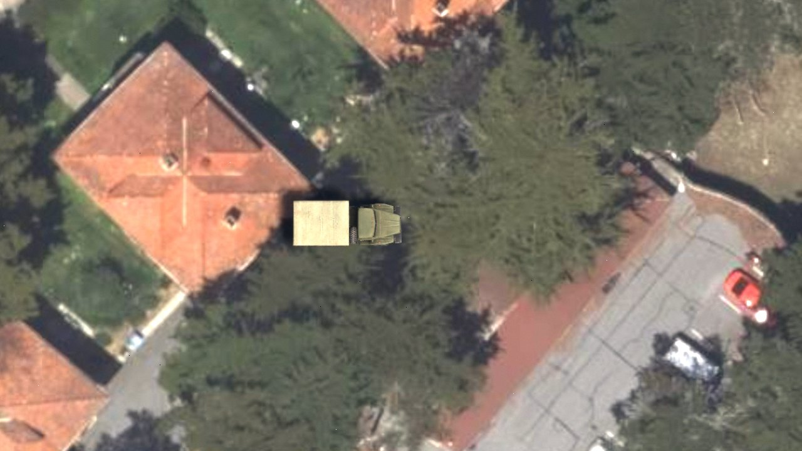 | 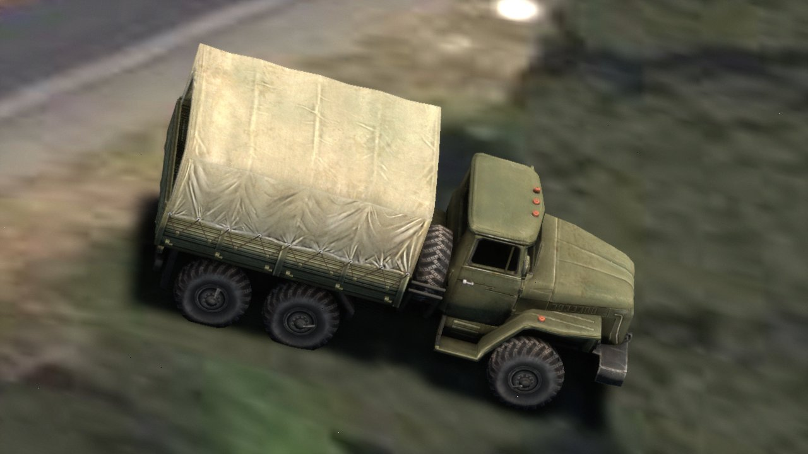 | 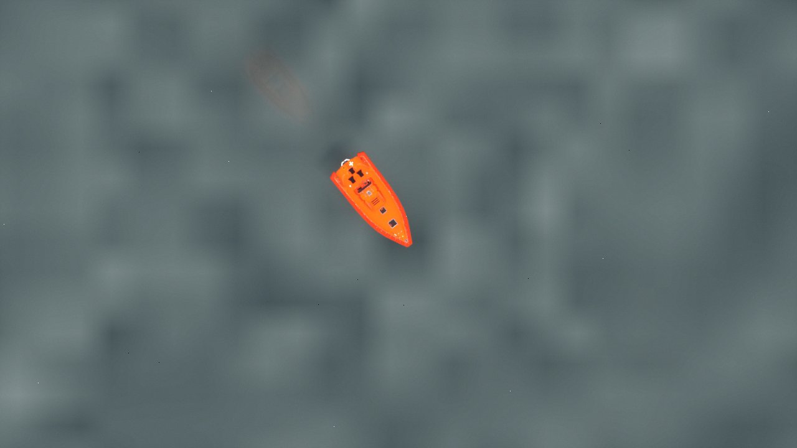 | 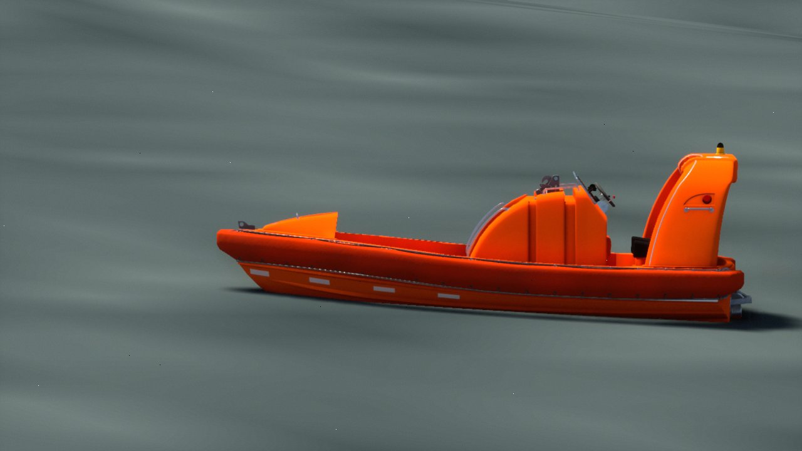 |

Findings from the live run:

- The bay's rendered surface at the boat circle is Cesium's bathymetric seabed, ~23 m below
  sea level (KLV Tag 25): the boat sits on what is drawn, but its altitude is below sea level.
- The boat first rode on the water with no draft (keel ~0.14 m above the model origin);
  fixed with the per-type `z_offset_m`.
- First-appearance hitch: a trace (`-trace=cpu,frame`) showed `FShaderCompilingManager::
  ProcessAsyncResults` taking ~130 ms on the game thread (material shader maps for the glTF
  materials, fetched from the DDC and finalised on first use by the editor binary) with the
  render thread waiting on the shader jobs. Fixed: `FCamSimEntityManager::WarmUpModels` draws
  each preloaded model once, 50 km below the world, for 30 s after startup. A respawn of an
  already-seen type never hitched.
- ~~Periodic GC stalls (0.6–1.0 s every ~61 s) and slow narrow-FOV views.~~ **Fixed
  2026-09-29.** One cause: with frustum culling off, off-screen tiles were kept at the
  *on-screen* SSE, and Cesium measures SSE in screen pixels, so a narrow FOV loaded
  zoomed-in detail all the way round the camera. At 10° FOV that was 226k UObjects (61k with
  culling on): each GC pass spent 160–820 ms in reachability analysis (plus the Python
  plugin's `PyUtil::CollectGarbage`, which is not the cause: with `-DisablePython` a pass
  still took 819 ms), and the tile work kept frames at 150–700 ms. Fix: the culled SSE follows
  the zoom, `SSE × tan(30°) / tan(HFOV / 2)` (never below the on-screen SSE), updated every
  frame in `FCamSimStreamingController::UpdateLevelOfDetail`. 10° FOV now: 101k objects,
  13–26 ms GC, no frame over 66 ms in 150 s; Yosemite 90° snaps at 60° unchanged (settle
  0.6–0.9 s, 0% coarse at +1 s). Trade-off: a snap while zoomed in lands on 60°-view detail
  and refines for about a second.
- Moving vehicles leave a faint TSR ghost trail in close-ups.

Carry-overs:

- ~~Tight oriented boxes and occlusion in the ground truth (sub-project 2)~~: done in 2.7.
- ~~Ocean surface~~ (done in 2.6, with a scripted `M_Ocean`) and wakes (still open: no
  `NS_VesselWake`).
- DR acceleration and PDU timestamps (extrapolation runs from arrival time).
- DIS articulation parameters (turrets, guns).
- Inland water where Cesium terrain has no flat surface (the EGM96 fallback covers only the
  sea). ~~Boats over bathymetry sit on the seabed surface~~: fixed in 2.6 (the sea wins over
  the seabed).
- The model shader warm-up runs once per session (the first 30 s): a model added later by a
  config hot reload still hitches on its first appearance, and hot reload loads its glTF
  synchronously on the game thread.

### 2.6 Ocean surface for boats (done 2026-09-30)

Sub-project "ocean for boats": a sea-level water surface that follows the globe, sea state
(Beaufort or CIGI Wave Control), boats that pitch, roll and heave on it, and HAT/HOT that sees
the water. It fixes the main 2.5 finding (boats sat on the bathymetric seabed ~23 m below sea
level). Spec: `docs/superpowers/specs/2026-09-29-ocean-surface-design.md`; plan:
`docs/superpowers/plans/2026-09-29-ocean-surface.md`; guides: [`docs/dis.md`](docs/dis.md)
(placement, HOT), [`docs/configuration.md`](docs/configuration.md) (`ocean:`).

**Rule 5 exception.** Rule 5 ("no new feature phases until Milestones 0–4 land") is waived for
this, as it was for 2.5: the ocean was the main 2.5 carry-over, and the boats were wrong
without it. The old Phase 19 ocean (a flat 200 km UE plane at the georeference height, with no
material) is removed rather than extended.

What was built:

- `Ocean/OceanWaves.h/.cpp` (`FOceanWaves`, pure C++): up to 4 Gerstner waves on the tangent
  plane of a fixed anchor, driven by sim time (`FSimClock`, closing the 2.1 "ocean waves use
  DeltaTime" item). `FromBeaufort` spreads the `FBeaufortTable` sea over 4 waves (λ × 0.6–1.4,
  ±10/30°), scaled so 4·√(Σa²/2) = Hs, with Σ Qᵢkᵢaᵢ ≤ 1. `HeightAt` inverts the horizontal
  displacement (fixed point, ≤ 8 steps).
- `Ocean/OceanSurface.h/.cpp` (`FOceanSurface`): sea level = EGM96 geoid + CIGI tide offset,
  the Beaufort set or the host's Wave Control set, clarity, water temperature. It is owned by
  `UCamSimSubsystem` (`GetOceanSurface()`) and is the one source for placement, HAT/HOT and
  the drawn sea.
- `Ocean/OceanMeshBuilder.h/.cpp` + `OceanMesh.h/.cpp`: one 257 × 257 warped grid (centre cell
  2 m, radius = horizon distance up to `max_radius_km`), vertices on ellipsoid + geoid, centred
  on the camera's frame centre (nadir fallback), rebuilt on the game thread when the centre or
  radius moves past a threshold (rate-limited to 4 Hz), on a teleport, on a Cesium origin
  shift, or when the CIGI tide moves more than 1 cm (the tide is baked into the vertices);
  a `UProceduralMeshComponent`.
- `M_Ocean` / `MPC_Ocean` (`Content/Ocean/`), generated headless by
  `scripts/ocean/make_ocean_material.sh` from `make_ocean_material.py` and
  `Shaders/Private/CamSimOcean.ush`: Single Layer Water; WPO is the same Gerstner sum as the
  CPU (faded where the mesh cell is coarser than λ/8–λ/4), normals per pixel (faded by pixel
  footprint) plus a small procedural ripple, and roughness raised by the slope variance the
  pixels can't resolve. VS 276 / PS 716 instructions.
- `Ocean/FOceanManager` (rewritten): anchor and mesh policy from the camera alone (so boats
  get waves even when the sea isn't drawn), MPC writes (time-folded phases, UE-world N/E/U
  axes), CIGI Wave Control / Maritime Surface Conditions (Global scope; Wave IDs 0–3; CIGI
  Direction is "toward", stored as "from").
- Boat placement (`Entity/SurfaceClamp`): base height = max(Cesium centre hit, sea level)
  (a lake wins above max(sea level, geoid + 2 m)); on the sea, heave/pitch/roll from `HeightAt` at
  bow/stern/port/starboard (`vessel_motion`, `vessel_motion_scale`). Ocean off: byte-identical
  to 2.5. `ACamSimEntity::ApplyVesselMotion` is gone.
- HAT/HOT (`CIGI/CigiQueryHandler`, `Ocean/OceanQueries`): terrain height = max(Cesium hit,
  sea surface with waves) when the trace hits; a miss stays invalid (water only raises a valid
  hit, so a host never gets a confident sea-level answer over tiles that aren't loaded);
  extended responses report the water normal when the water wins.
- Config `ocean:` replaces `phase19:` (`enabled`, `beaufort`, `wave_direction_deg`,
  `choppiness`, `vessel_motion`, `vessel_motion_scale`, `max_radius_km`, `material`).
- Ground truth: COCO annotations gain `geo` `{lat, lon, alt_m}` (the entity origin at capture;
  for a boat, its waterline), added in the acceptance task because no output carried the boat's
  altitude.
- Tests: `CamSim.Ocean.{Waves,Mesh,Config,Commands,Queries,Surface}.*`, `CamSim.Surface.*`
  (ocean cases), `CamSim.Hosts.*` (Wave Control / Maritime), and
  `CamSim.GPU.Ocean.MatchesCpu` (rendered depth of `M_Ocean` vs `FOceanWaves`, max 3.8 mm
  against a 2 cm limit, on a wave travelling north-east).

Deviations from the spec:

- Material parameter names follow the plan: `Dir{i}` (not `WaveDir{i}`) and one `Water`
  vector (absorption scale, scattering scale, ripple strength) instead of `Absorption` /
  `Scattering`.
- The component is not translated between rebuilds: a rebuild takes ~7–9 ms and the mesh is
  geographic, so a rebuild is the exact answer (rate-limited to one per 0.25 s; teleports,
  origin shifts and the first build bypass the limit). Cost: the fine region lags the frame
  centre by up to 0.25 s.
- A Cesium origin shift forces a rebuild (not in the spec; the sea would otherwise be up to
  20 km off after a shift).
- Wave normals are faded by the per-pixel footprint (screen-space derivatives), not the vertex
  cell size, so waves texture the whole sea; WPO keeps the cell-size fade. Roughness grows with
  the unresolved slope variance (not in the spec).
- A frame centre further than `max_radius_km` − horizon from the nadir falls back to the nadir.
- Lakes: the Cesium hit wins only above max(sea level, geoid + 2 m) (Cesium's water surface
  and the geoid differ by decimetres, and Cesium's surface doesn't move with the CIGI tide, so
  neither a low nor a high tide turns the open sea into a lake). On a trace miss a lake holds
  max(last height, sea level); a boat at sea follows sea level (e.g. a falling tide). The boat
  floats at geoid + tide.
- CIGI Maritime Surface Conditions Clarity is a percent (0–100, CIGI 3.3; CCL bounds-checks
  it): CamSim divides by 100. A Wave Control packet with a period and no length gets
  λ = g·T²/(2π) (deep water).
- Single Layer Water held on Metal (SM5); no Default Lit fallback was needed.
- The Phase 19B/19D vessel wake trail and SSR options are gone with `phase19:` (they never
  worked: no `NS_VesselWake` asset).

Acceptance (`scripts/ocean_check.py`, macOS M-series, Metal, 2026-09-30). One CamSim launch
per sea state; DIS `boat-circle` in San Francisco Bay; eight camera views per run (nadir
1000 m; 12° close-up at ~250 m slant; **500 ft above the water, 500 ft out, 45° down**, at 30°
and 60° FOV; waterline 6 m up and 40 m out; shallows; Golden Gate coastline; 10 km horizon).
a_max = 1.5 · Hs/2 (Beaufort) or Σ amplitudes (CIGI); tolerance 0.5 m + a_max. The CIGI run
sends two Wave Control packets (1.5 m / 45 m toward 60°, 0.8 m / 20 m toward 100°) and every
run sends one extended HAT/HOT request at the boat.

| Run | COCO boat IDs (frames) | Boat alt − sea level: mean, range | HOT − sea level | Frame time median / max, > 66 ms | Rebuilds: n, median / max |
|---|---|---|---|---|---|
| Beaufort 0 | 1 (1197) | 0.00 m, 0.00 … 0.00 m | +0.00 m | 33.3 / 179.4 ms, **1** | 6, 6.9 / 9.7 ms |
| Beaufort 3 | 1 (1194) | −0.03 m, −0.27 … +0.28 m (lim ±0.95) | +0.27 m | 33.3 / 47.0 ms, 0 | 6, 6.8 / 11.2 ms |
| Beaufort 6 (re-run) | 1 (1231) | −0.18 m, −1.63 … +1.42 m (lim ±2.38) | −0.90 m | 33.3 / 47.5 ms, 0 | 6, 7.0 / 10.6 ms |
| CIGI waves | 1 (1193) | −0.15 m, −1.12 … +1.01 m (lim ±1.65) | −0.50 m | 33.3 / 49.5 ms, 0 | 6, 6.8 / 7.7 ms |

- The first Beaufort 6 run had no terrain (Cesium ion connection errors: 0% tiles, so the sea
  covered an empty world); its placement, HOT and frame checks passed but mean nothing. The
  table shows the re-run (`.cache/ocean_check_b6`), which loaded every tile.
- Every check passes except **one frame of 179 ms in the Beaufort 0 waterline view**. It is not
  the ocean: in that frame game, render and GPU time were 27, 34 and 33 ms, no mesh rebuild
  happened within 5 s, and the tiles were still streaming (the tracked 6 m-high view keeps
  moving, `load_pct` 95–100%). A targeted re-run of that one view for 60 s, twice with the
  ocean on and twice with it off, gave 8 and 4 frames over 66 ms with the ocean on (max 213 ms)
  and 5 and 6 with it off (max 207 ms), all game- or render-thread stalls while tiles stream.
  It is the pre-existing close-up tile-streaming hitch, recorded as a FAIL, not waived.
- The median bar is one 30 fps frame (33.3 ms; the engine is locked to 30 fps, so "33 ms"
  cannot be read as 33.0).
- The boat is labelled in every boat view of every run (COCO records matched to views by camera
  altitude; 121–344 labelled frames per view; 0 at the no-boat shallows altitude).
- HOT at the boat returns the sea surface (−32.2 m ± waves), not the seabed (≈ −55 m).
- Mesh rebuilds: 6.8–7.0 ms median, max 11.2 ms (two over the 10 ms target, none near 30 ms).
- Ocean GPU cost (`gpu_ms`, same views, ocean on vs `CAMSIM_OCEAN_ENABLED=0`): +3.6 ms median
  in the bench's 3 km orbit (`run_bench.py --smoke`: 16.2 → 19.8 ms; p95 24.4 → 25.6 ms;
  frame pacing unchanged; 0 hitches over 66 ms with the ocean on, 1 off) and +3 ms at the waterline (22.0 → 25.1 ms).
- KLV unaffected: `check.js stream` on the Beaufort 6 re-run's live stream (300 packets) and
  its capture (180 packets) all conform to misb.js 0.1.30, with `--max-age-sec` raised (the
  harness sets the sim date to 2026-06-21 over CIGI, which the default 1 h age check rejects).

**Default: `ocean.enabled: true`.** The ocean holds the frame budget; the one failing frame is
the tile-streaming hitch that the ocean-off run shows too.

| Boat from 500 ft, 45° down (30° FOV) | At the waterline, Beaufort 3 | At the waterline, Beaufort 6 |
|---|---|---|
| 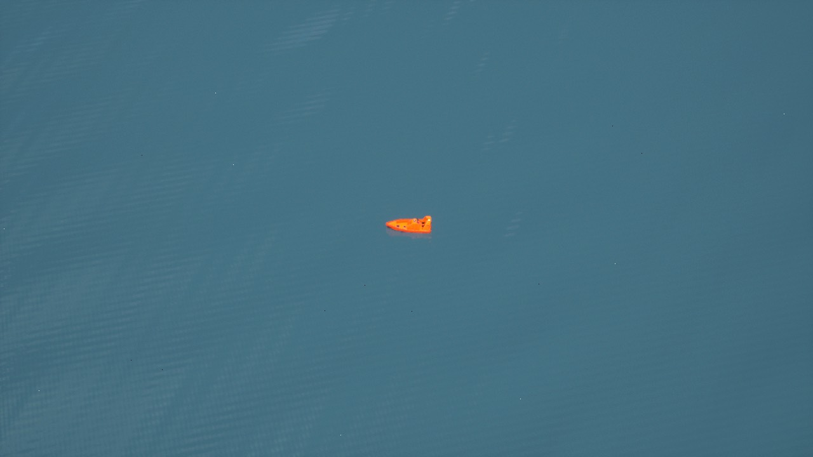 | 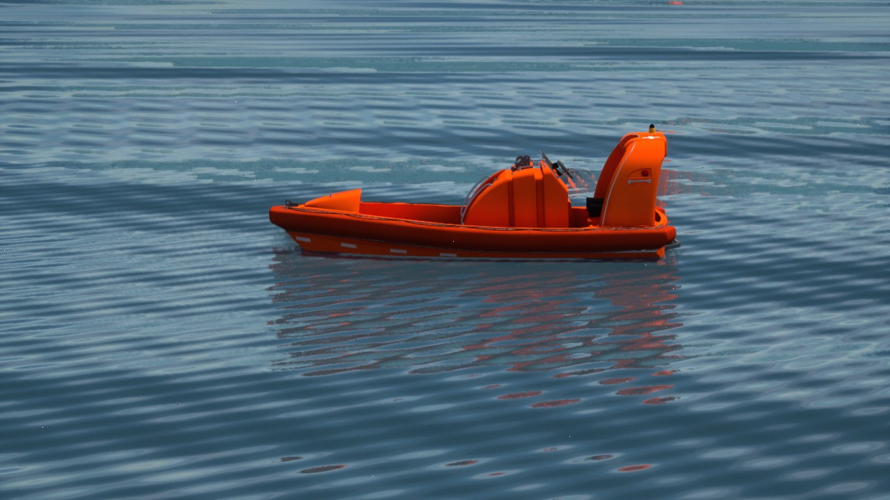 | 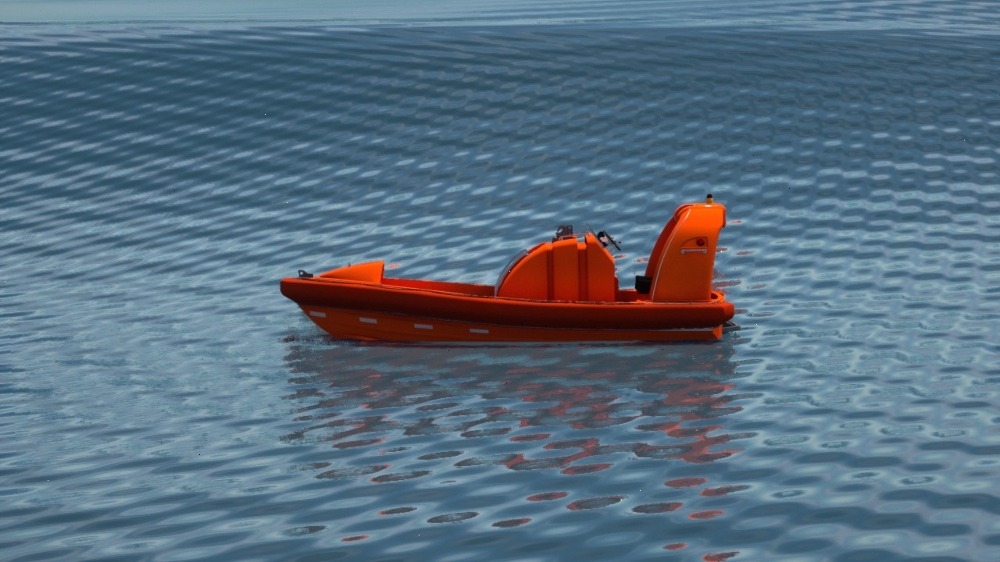 |

| CIGI waves at the shore (Aquatic Park) | Golden Gate coastline | 10 km up, looking west |
|---|---|---|
| 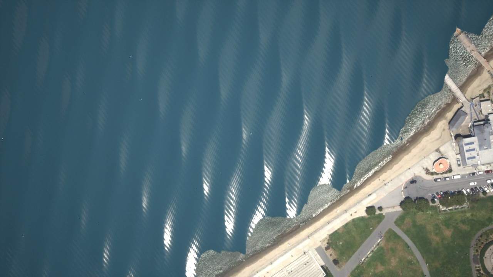 | 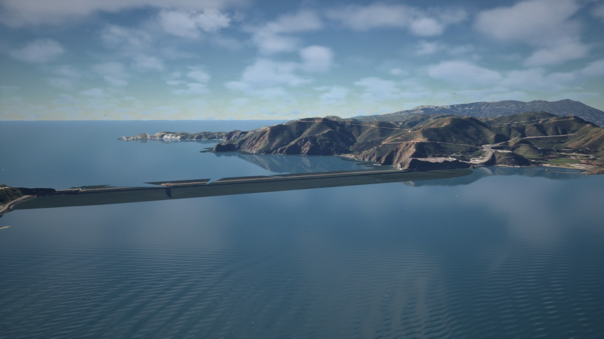 | 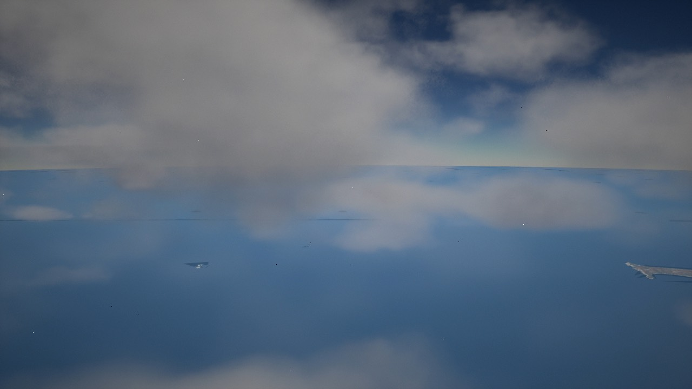 |

Findings from the live runs:

- Boats sit at their draft on the drawn water at every sea state; at Beaufort 6 the hull heaves
  ±1.5 m with the swell and no crest cuts through it in the waterline views. The COCO
  altitude spread (sd 0.11 m at Beaufort 3, 0.65 m at Beaufort 6, 0.52 m for the CIGI sea)
  is the heave.
- The sea follows the globe to the 10 km horizon with no mesh edge; coastlines occlude it
  cleanly (Marin headlands, Presidio).
- **Piers flood**: Cesium World Terrain drapes piers and breakwaters on terrain below sea level,
  so the sea covers them (Fisherman's Wharf). Same fix as inland below-sea-level land
  (water-mask clip).
- **The Golden Gate Bridge draws as a flat slab at the waterline**: CWT has no bridge, only the
  deck imagery draped down to the water; with the ocean it reads as a low causeway.
- Beaches show a saw-toothed waterline where the sea plane cuts the coarse terrain triangles
  (shallows shots); no shimmer was seen.
- The seabed shows through near the shore as lighter water (Single Layer Water absorption).
- Near noon a nadir view is dominated by the sun glint (Beaufort 0 shows the sun's disc), and
  the sensor AE exposes for it, so the rest of the sea goes dark.
- Cesium ion availability decides a run: one run lost its terrain to connection errors and a
  re-run to HTTP 429 (rate limit after many back-to-back launches). The script now fails a run
  whose tiles never load (`terrain tiles loaded`).
- The host going to sleep freezes CamSim mid-run (12–15 min gaps, then 100+ ms frames); the
  acceptance runs are launched under `caffeinate -ims`.
- **The sea runs on the sim clock** (`FSimClock`): CIGI Celestial Sphere Control with
  Ephemeris Model Enable off (`SetRate(0)`) freezes the waves, boat heave/pitch/roll and HOT,
  while dead-reckoned boats keep moving (DR uses `DeltaTime`, 2.1) and the ripple normal keeps
  animating on engine time. Found in the final review; not seen in acceptance (the harness
  keeps the clock running).
- Unrelated: `CamSim.VideoEncoder.VideoToolboxRespectsMaxRate` failed once in the full suite
  (worst 1 s window 565.9 KB vs 550 KB) and passed twice when re-run alone: a flaky hardware
  encoder rate check.

Carry-overs:

- Wakes, whitecaps, spray, breaking waves (Breaker Type is carried but unused).
- LOS against the water surface; Environmental Conditions Request/Response.
- Inland below-sea-level land and draped piers flood: clip with Cesium's water mask. The same
  land gets the wrong HOT: over land below sea level (Death Valley, Dutch polders, the Dead
  Sea shore) HAT/HOT returns sea level, since the sea is taken to cover it.
- **Off-centre boats heave against a calmer drawn sea.** The mesh fades each wave by its cell
  size (fine only near the frame centre), while placement and HOT use the unfaded sum. From
  500 ft the cells are ~15 m at 240 m from the frame centre, so at Beaufort 6 the two shorter
  waves are fully faded there: a boat a few hundred metres off-centre heaves and pitches on
  waves the drawn sea no longer shows. Acceptance covers only a centred boat. Fix options:
  publish the mesh's centre, radius and warp alpha to placement behind a flag (and apply the
  same fade), or a denser grid / smaller centre cell.
- Regional/Entity-scoped Wave Control and Maritime Surface Conditions (logged once, ignored).
- Physical IR of water (Milestone 4); until then IR sees the visible-light proxy.
- Ripples run on engine time (the material Time node), not sim time; the three fixed ripple
  directions hatch visibly at close zoom; ripple precision degrades > 200 km from the anchor.
- The close-up tile-streaming hitch above (not ocean work).
- Linux/Vulkan and SM6 are unverified for `M_Ocean` (compiled and tested on Metal SM5).
- Deferred minors from review: tests for zero-wave accessors, NaN/negative `SetWaves` input,
  the four untested ocean env vars, hot reload / restart-only logging for `ocean.enabled`,
  `FOceanManager` scope and Wave ID gates, a handler-level water-normal test; roughness
  treats UE roughness as alpha; `ddx` is 0 in ray-tracing hit shaders; a failed
  `BuildOceanMesh` retries every tick; the resting-boat re-commit runs every tick (also with
  motion off) and costs a pose commit per resting boat; regenerating `M_Ocean` churns GUIDs;
  `FOceanWaves` `Waves[i]` accessors have no bounds assert; `SetHostWave` rebuilds when
  removing an absent ID; a vertex with no geoid value silently takes the centre's sea level;
  `FOceanManager::Init` collides on the component name if run twice;
  `CamSim.GPU.Ocean.MatchesCpu` does not assert the mean bias; before the camera first
  ticks there is no wave anchor, so boats heave uniformly (no pitch/roll) until it does —
  seeding the anchor (e.g. from the georeference origin) is a carry-over; at a re-anchor,
  placement and the drawn sea disagree in phase for one frame; the displacement padding (3·Σa + 10 m) over-inflates the bounds of small meshes; a tide
  that falls from above +2 m while the boat's trace misses is held at the old level, level (the
  held height can't be told from a lake without a hit; the next hit corrects it).
- Bridges absent from Cesium World Terrain (the Golden Gate) draw as a flat slab at the
  water; fixing that needs 3D tiles (photogrammetry / OSM buildings).

---

### 2.7 Ground truth for ATR: tight boxes, OBBs, occlusion (done 2026-09-30)

Sub-project 2 of "boats and trucks for ATR": every COCO annotation's box now fits the vehicle's
**rendered** pixels in the **encoded** frame (after the lens distortion), and says how much of
the vehicle is hidden and how much the frame edge cuts off; oriented boxes, the projected 3D box
and an RLE mask come with it. Spec: `docs/superpowers/specs/2026-09-30-atr-ground-truth-design.md`;
plan: `docs/superpowers/plans/2026-09-30-atr-ground-truth.md`; guide:
[`docs/ground-truth.md`](docs/ground-truth.md) (every field, conventions, limitations).

What was built:

- Tagging: `FStencilSlotAllocator` (`Entity/`) gives each live entity a custom-depth stencil
  value 1..255 (lowest free first, reuse delayed 4 frames so a frame in the readback ring never
  maps a value to the wrong entity); every mesh of the actor (`UMeshComponent`s, never
  particles) renders custom depth with it, only when `ml_training.enabled` and `bounding_boxes`
  and the ID pass is available (`UCamSimSubsystem::IsGroundTruthMaskAvailable`, decided once at
  startup). `r.CustomDepth=3`.
- `InstanceIdCS` (`CamSimShaders`, `Shaders/Private/CamSimInstanceId.usf`): per output pixel,
  the source position of `SensorCS`'s distortion resample (shared `UndistortScale`), then
  `amodal` = custom stencil and `visible` = amodal where custom depth is not behind scene
  depth; `visible | amodal << 8`, two pixels per `uint32`. With the ocean on, a hidden amodal
  pixel whose custom-depth point lies below its entity's water plane (the sea surface with
  waves at the entity, `ComputeSeaSurfacePlane`, one plane per stencil, moved into translated
  world on the render thread) is cut from the silhouette (final review I2): the submerged hull. It runs in the sensor graph only on
  annotated frames, and its readback rides in the frame's ring slot (the slot completes when
  both copies land). `IsInstanceIdPassSupported` gates it separately from the sensor graph.
- `FInstanceMaskAnalyzer` (`GroundTruth/`, task thread): one scan of the ID image → modal /
  amodal counts and boxes, row-extreme convex hulls → oriented rectangles along the projected
  vehicle axis (box3d rear-face → front-face centre, `RectAlongAxis`; final review I3), or the
  minimum-area rectangle (`MinAreaRect`, rotating calipers) when that axis is < 0.25 × the
  silhouette's longer side or the corners are invalid; modal COCO RLE (`EncodeCocoRle`,
  pycocotools-compatible). `stat CamSimGroundTruth` times it.
- `ProjectOrientedBox` (`GroundTruth/FEntityProjection`): the entity's local bounds (the union
  of its tagged, shown meshes — `ACamSimEntity::GetGroundTruthLocalBox`, final review I1) rotated
  with its pose, 8 corners through the pinhole + forward distortion, truncation by
  Sutherland–Hodgman clipping of their hull against the image.
- COCO gains `mask_source`, `visibility`, `bbox_amodal`, `obb`, `obb_amodal`, `segmentation`,
  `truncation`, `box3d`; `bbox`/`area` are the modal box and mask area. VOC gets the modal box
  and `<occluded>` (`visibility < 0.95`). Config: `ml_training.min_visible_pixels` (1),
  `ml_training.segmentation` (true).
- Tests: `CamSim.GroundTruth.*` (mask geometry, RLE against pycocotools fixtures, analyzer,
  projection, allocator, writers), `CamSim.Render.FrameGrab.IdWaitDecision`,
  `CamSim.GPU.GroundTruth.InstanceId.*` (synthetic, scaled depth, distortion matches
  `SensorCS`, submerged-hull cut); `scripts/tests/test_gt_check_lib.py`. Final fix wave added
  `Box3D.MeshesOnly`, `Box3D.YawCornerOrder`, `SeaSurfacePlane.AtEntity`,
  `Mask.RectAlongAxis`, `Analyzer.ObbFollowsVehicleAxis`, `Analyzer.ObbAxisFallsBackToMinArea`,
  `Collector.CachedAtOpen`, `GPU.GroundTruth.InstanceId.SubmergedCut`.

Acceptance (`scripts/gt_occlusion_check.py .cache/gt_check_final`, macOS M-series, Metal,
2026-09-30, after the final-review fix wave; exit 0). DIS truck + boat (`send_dis_test.py both`),
ground truth on every frame (`annotation_interval_frames` 1), depth map off, 1280 × 720. Four
launches: `main` (Beaufort 3), `crest` (Beaufort 6), `calm` (Beaufort 0), `mloff`
(`CAMSIM_ML_ENABLED=0`). Every annotation in every run was `mask_source: render` (main 3412 truck
+ 657 boat, crest 2975, calm 3156; one stable ID per vehicle), and every OBB took the vehicle-axis
path (no min-area fallback in these views).

| # | Check | Result |
|---|---|---|
| 1 | Nadir truck (10° FOV, ~330 m up): visibility median ≥ 0.95, truncation ≤ 0.01, OBB heading error median ≤ 10° | **PASS**: 450 annotations, visibility 1.000 (min 1.000), truncation 0, heading error median 0.00° (max 0.03°) |
| 1 | Nadir boat, same bars | **PASS**: 450, visibility 1.000 (min 0.815), truncation 0, heading error median 0.02° (max 0.03°) |
| 2 | Edge framing (look-at point offset half a footprint): some frame with 0.3 ≤ truncation ≤ 0.7 and the modal box reaching x = W | **PASS**: 281 of 537 (truncation 0.43–0.99 over the view) |
| 3 | Beaufort 6, ~300 m at ~3° depression: ≥ 10 % with visibility < 0.9 (the gate) | **PASS**: 475 of 1053 (45.1 %), median 0.954, min 0.185 |
| 3 | …same view at Beaufort 0 (baseline, info) | 1180 annotations, visibility 1.000 in every one (submerged hull cut) |
| 3 | …Beaufort 6 below the calm median − 0.1 (0.900) (info) | 475 (45.1 %) |
| 4 | Fixed camera 20 m above the ground (CIGI HOT), 250 m outside the loop, across the Presidio (info) | 1274 annotations, 38.7 % with visibility < 0.9, median 0.921; the truck disappears from the labels behind the ridge |
| 5 | Every `segmentation` decodes (pycocotools) and its area equals `area` | **PASS**: 10200 masks, 0 problems |
| 6 | Frame time, nadir views, ground truth on vs off: \|Δ median\| < 2 ms | **PASS**: wall 33.33 vs 33.33 ms (900 frames each); `gpu_ms` 20.04 vs 19.89 (+0.16), `render_ms` +0.08, `game_ms` −0.22 |

| Truck, nadir (OBB along the heading) | Boat, nadir | Truck on the right edge (truncation 0.58) |
|---|---|---|
| 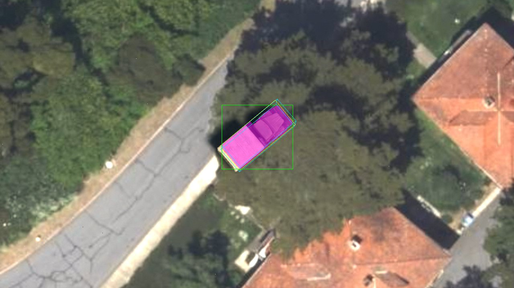 | 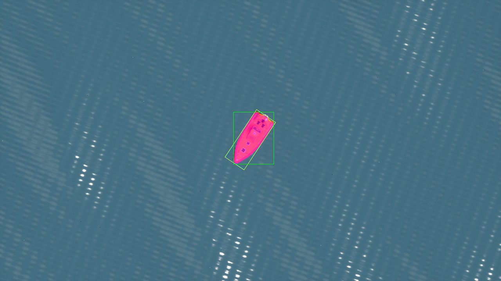 | 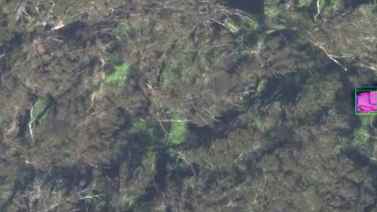 |

| Boat behind a Beaufort 6 crest (visibility 0.44) | Same view, Beaufort 0 (visibility 1.00) | Truck across the Presidio (visibility 0.54) |
|---|---|---|
| 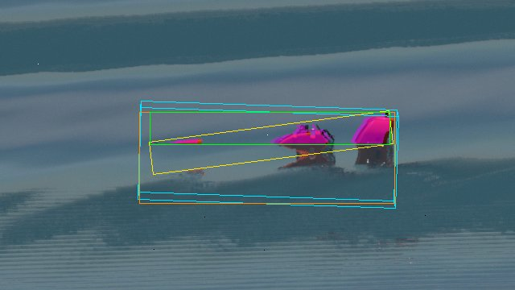 | 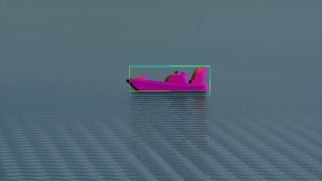 | 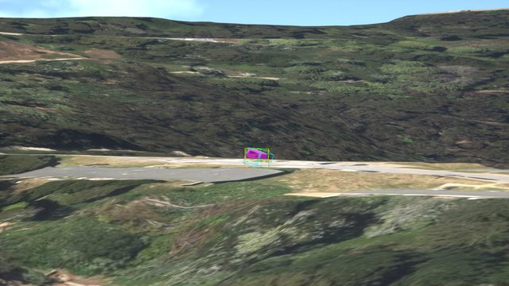 |

Overlays: modal mask magenta, `bbox` green, `bbox_amodal` orange (when it differs), `obb`
yellow, `box3d` cyan.

Findings from the live runs:

- **Single Layer Water writes scene depth on Metal** (spec Risk 1 did not happen): crests hide
  the hull, down to 18.5 % visible, and the overlays show the mask following the waterline.
- **Submerged hull** (first acceptance, before the fix wave): the custom-depth silhouette
  included the hull below the waterline, so a side-view boat on a flat sea had visibility 0.83
  in every frame. Now cut at the sea surface under the boat: 1.000 at Beaufort 0.
- **The cut plane must follow the waves at the boat, not still water.** The fix wave first cut
  at a still-water plane (geoid + tide) at the frame centre. Live, that erased the crest
  occlusion too — a boat hidden by a crest is in the trough behind it, below still water: only
  2.1 % of the Beaufort 6 annotations fell below 0.9 (amodal height 44 px in troughs vs
  ~100 px level). With one plane per entity at the wave surface under it: 45.1 %.
- **Side-view OBBs no longer tilt**: the minimum-area rectangle of the boat's wedge-shaped
  profile leaned 9.1° (median, Beaufort 0 side view, first acceptance) off the projected hull
  axis; the OBB is now built on that axis (0.00°), and crest-split fragments no longer give
  diagonal slivers.
- Frame time: the engine is locked to 30 fps, so the wall-clock median sits at 33.33 ms either
  way; the GPU cost of the ID pass + second readback is ~0.15 ms at 720p. Between launches the
  host flips between two states (`gpu_ms` ~16.4 / `game_ms` ~1.6 vs ~20 / ~6.8) whatever ground
  truth does; one `main` run in the fix wave landed in the other state from its `mloff` and
  reported ±3.5 / ±5.2 ms "differences" (the gate, wall time, passed regardless).
- Cesium streaming is not guaranteed: one fix-wave `main` launch got no terrain tiles (the HOT
  query for `terrain_truck` returned nothing and the views showed only sea); it was re-run.
- The first acceptance attempt's low view tracked the truck from a fixed height above an
  assumed ground and ended up inside the hill (Cesium tile skirts and the sea showing through);
  replaced by a fixed camera placed by a CIGI HOT query.
- `InstanceMaskAnalyzer` (Perf1080p, wall clock, Development build, two blobs): median 2.53 ms
  run alone, 5.4 ms inside the full suite; `stat CamSimGroundTruth` shows it live.

Deviations from the spec / plan:

- Check 3: the first acceptance added a stricter gate (≥ 10 % of Beaufort 6 frames below the calm
  median − 0.1) because the brief's bar was also met by a flat sea (the submerged hull, 0.83).
  With the submerged-hull cut the calm baseline is 1.000, so the brief's bar (≥ 10 % below 0.9)
  is the gate again; the calm baseline and the crest-vs-calm comparison are printed as info, and
  a missing calm run prints an explicit SKIP.
- Submerged-hull cut (final review I2): the ruling said a still-water plane at the camera's
  frame centre; implemented as one plane per entity at the sea surface with waves under it (see
  findings: the still-water plane failed the brief's crest bar at 2.1 %). Spec §2.
- OBB (final review I3): along the projected vehicle axis when `corners_px` is valid and that axis
  is ≥ 0.25 × the amodal mask's longer side, else min-area (spec §3 said min-area).
- Check 1's expected OBB angle comes from the annotation's own `box3d.yaw_deg` (the entity's
  geo pose, independent of the mask), mapped into the image with the camera yaw; the spec's
  "modal area ≤ old projected box area" is not checked (the old box is no longer written; the
  Task 7 smoke run compared the modal box with the `box3d` corner extent: ≤ 2 px over).
- Check 4 uses a fixed camera 20 m above HOT ground, 250–600 m from the truck, instead of a
  camera tracking the truck at ~400 m.
- `IsInstanceIdPassSupported` is separate from `IsSensorGraphSupported`, so a ground-truth
  shader failure can't disable video; tagging and the ID readbacks follow one startup decision
  (`IsGroundTruthMaskAvailable`).
- Entities sharing a stencil value in one frame fall back to `projection` (never expected).
- When no tagged primitive renders in a frame UE binds dummy custom depth/stencil, so the
  frame's IDs are all zero and its entities are dropped rather than falling back.
- The analyzer costs ~2.5 ms at 1080p (task thread, Development build, measured alone), above
  the spec's 1–2 ms estimate; within the frame budget, it runs off the game thread.

Carry-overs:

- Vehicle-on-vehicle amodal masks (custom depth draws only tagged vehicles, in one pass).
- Submerged-hull cut: one horizontal plane per entity at the wave surface under its origin (a
  pitched boat on a steep wave is off by decimetres at bow/stern); lake boats get no cut.
- Per-frame instance PNG (only RLE per annotation today).
- Depth map and KLV frame corners are still pinhole (3B.3 "distortion-aware ground truth").
- TSR jitter: up to ~0.5 render texel misregistration of mask edges (not corrected).
- Linux/Vulkan unverified for `InstanceIdCS` (written portable: integer ops, no wave
  intrinsics).
- Deferred minors: no RLE fixture for the negative-delta path; `MinAreaRect` tolerances are
  absolute; a degenerate (zero-area) projected hull reports truncation 0; no
  `ProjectOrientedBox` test with distortion (yaw is covered by `Box3D.YawCornerOrder`); `ReuseDelayFrames` counts `GFrameCounter`
  (safe at the fixed 30 fps); the duplicate-stencil warning repeats every frame; the
  analyzer's perf test is wall-clock; no VOC `<occluded>` test; the COCO JSON escape covers
  only `\` and `"`.

## Milestone 3: GPU-resident sensor pipeline

Current path:

1. Render an 8-bit, already tone-mapped image.
2. Read it back to the CPU.
3. Run about 2,000 lines of CPU effects.
4. Convert colour with `sws_scale`, then encode.

Target path:

1. **Capture in HDR scene-linear** (plus the thermal pass from Milestone 4), not the
   8-bit tone-mapped image.
2. **Sensor model as RDG compute shaders:**
   - optics: MTF/PSF, lens distortion, vignette, chromatic aberration
   - detector: noise, fixed-pattern noise, hot/dead pixels, rolling shutter, AC banding
   - electronics: AGC, quantization, polarity
3. Keep stateful control logic (AGC histograms, NUC timing) on the CPU as small parameter
   updates.
4. **Convert RGB/gray → NV12 on the GPU**, then either:
   - encode directly from GPU memory with NVENC (see UE AVCodecs / Pixel Streaming 2), or
   - read back only NV12 (1.5 bytes/px instead of 4).
5. Readback is a ring of render-thread-polled readbacks. (Done in 3A.1: a three-slot ring,
   `Camera/ReadbackRing.h`, delivers frames in capture order; 3B.1 puts NV12 through it.)
6. Retire the parallel CPU pipeline (`Sensor/SensorPostProcess.cpp`) and the partial
   material-based GPU path. Keep one reference implementation, used for tests and as the
   fallback when no NVIDIA GPU is present (Mesa/llvmpipe).
7. Evaluate rendering the sensor through the primary view family under `-RenderOffscreen`
   instead of `SceneCapture2D`. That would allow TSR/temporal AA and full renderer
   features, and avoids paying for a second scene render if the main viewport also renders.

**Exit criteria:** 1080p30 EO and IR with all sensor effects enabled, below 50% of the frame
budget on the reference GPU (RTX 5090). The pipeline benchmark is tracked in CI.

**Plan (2026-09-26).** Split into four sub-projects, each with its own spec and plan:

| #  | Sub-project                 | Covers                                                                                                                              |
| -- | --------------------------- | ----------------------------------------------------------------------------------------------------------------------------------- |
| 3A | Render path + measurement   | Benchmark/reference-shot harness; sensor rendered as the primary view (TSR, one scene render, Cesium LOD transitions, origin shift); hitch and SSE tuning. Item 7 above. |
| 3B | Sensor model on the GPU     | Items 1–3, 6 (item 5, the readback ring, done early as 3A.1): tonemapper replaced by RDG compute on HDR input (minimal core effects first, auto-fallback to CPU), NV12, readback ring. |
| 3C | GPU-texture encode          | Item 4: UE `AVCodecs` NVENC/VideoToolbox from GPU textures; FFmpeg for TS/KLV muxing only.                                          |
| 3D | CI performance gate         | Exit criterion: 3A's harness as a tracked CI threshold.                                                                             |

3A is first because the user-visible problems are tile pop-in and frame rate/hitches, and the
current path probably renders the scene twice (main viewport + `SceneCapture2D`). 3A targets
macOS (M1 Pro) only; Linux/5090 runs are deferred.

Design: `docs/superpowers/specs/2026-09-26-render-path-design.md` (approved); plan:
`docs/superpowers/plans/2026-09-26-render-path.md`.

**3A status (2026-09-27): implemented on macOS; awaiting visual review.** Measured with
`scripts/bench/` on an M1 Pro, 1280x720, warm cache (baseline → 3A final, per phase):

| Metric | Baseline (SceneCapture2D) | 3A (primary view) |
| --- | --- | --- |
| Scene renders per frame | 1.50 (the unused game viewport rendered too) | **1.00** |
| Pop-in (frames with tiles loading) | orbit 0.48, slew 0.09, far 0.87 | **0.18, 0.03, 0.53** |
| Frames > 66 ms (orbit + low pass) | 8 | **2** (hitch counts are noisy run to run) |
| Frame time p99 | 34.7–37.7 ms | 34.8–37.3 ms |
| GPU p50 | 14.7–16.5 ms | 16.8–18.9 ms at 100% TSR; **13.4–15.4 ms at 75%** |
| Output frame rate | 14.9 fps | 14.9 fps (unchanged: see below) |

- The sensor is the game viewport's view (TSR, full Lumen/VSM/exposure history); a scene view
  extension grabs the final image into the existing readback ring. `render.view_source:
  scene_capture` keeps the old path (now without the unused viewport render) until 3B.
- Cesium LOD crossfade on (0.5 s); only the slew-prefetch stand-in camera remains; origin shift
  every 20 km (`render.origin_shift_distance_m`); TSR history reset on pose jumps.
- 1080p runs at the engine's fixed 30 Hz on the M1 Pro at defaults: p50 33.3 ms, no frames
  dropped to 15 Hz, GPU 17–19 ms (about 55% of the budget), but p95 is 33.9–35.6 ms, just over
  the spec's literal 33.3 ms (fixed-step jitter). No dev profile was needed.
  75% TSR is visually indistinguishable and saves 20–30% GPU (documented, not default).
- SSE stays 16: 8 costs GPU and pop-in, 4 collapses (277 hitches in the slew phase).
- The per-render GPU cost of the primary view (~18 ms) is higher than a SceneCapture render
  (~10 ms); the baseline's cost was dominated by the wasted viewport render.

Exit criteria (macOS): one render per frame ✅; fewer hitches ✅; less pop-in ✅; SSE ≤ 16 ✅;
1080p30 ⚠️ (holds 30 Hz with GPU headroom, but p95 33.9–35.6 ms misses the literal ≤ 33.3 ms; a
fixed-step engine can't meet a p95 equal to its own step); tests ✅ (219 automation + bench pytest); **orbit GPU below baseline ❌ at
100% TSR (✅ at 75%)**; visual review by the user ✅ (2026-09-27, shots after the −1 EV exposure change); `ci_validate` smoke skipped
(CI deferred by the user). Deferred: RTX 5090 runs.

Findings for follow-up:
- ~~**Output is ~15 fps, not 30**~~ **Fixed in 3A.1** (pulled forward from 3B item 5): a
  three-slot readback ring (`Camera/ReadbackRing.h`) delivers frames in order, and
  `FEncoderThread` now paces start to start (it slept a full interval after each encode, capping
  output near 26 fps once input reached 30). Full bench on the M1 Pro: 29.7–29.9 fps in every
  phase at 720p and 1080p (was 14.8–15.0), 0 dropped, frame time p95 34–36 ms; stream 30.0 fps
  with 33.3 ms PTS spacing; KLV conformant. The CPU sensor model keeps up at 1080p with the
  default effects. The CPU sensor model now has ~33 ms per frame; if it falls behind, frames are
  skipped until 3B's GPU sensor model (decision 2026-09-27).
- ~~**Over-exposure**~~ **Addressed (2026-09-27)**: auto-exposure kept (user decision) with
  `render.exposure_compensation_ev` = −1 EV relative to UE's default bias (+1); mean shot luma
  ≈200 → ≈170. `r.EyeAdaptation.CachedLightingPreExposure=8` covers the physically bright sun
  (it removes Lumen's clipping warning but was not the cause). Remaining: a flat bluish aerial
  haze from the atmosphere — a separate follow-up if wanted.
- ~~Restarting within ~30 s fails to bind the health port (:8080, TIME_WAIT) while logging
  "listening".~~ **Fixed (2026-09-27)**: the bind failure is detected
  (`GetHttpRouter(..., bFailOnBindFailure)`); the server logs that it is not listening and
  retries every 2 s until the port frees (verified live: up 18 s after a restart into
  TIME_WAIT). Address reuse stays off (UE's option also sets SO_REUSEPORT).
- ~~A View Definition FOV and a Sensor Control gain in the same host frame fight (the preset wins
  every frame).~~ **Fixed (2026-09-27)**: a gain changes the FOV only when it selects a
  different preset, and View Definition is applied after Sensor Control. Verified live: a host
  sending Sensor Control every frame plus a 30° View Definition gets HFOV 30.0° in all 300 KLV
  packets.
- ~~`scripts/tests/test_send_cigi.py::test_pack_ig_control_header` is stale~~ **Fixed
  (2026-09-27)**.
- ~~Ten minor items from the 3A final review~~ **Fixed (2026-09-27)**: snapshot requests are
  answered 503 at shutdown and the PNG encode holds no module reference; non-positive camera-cut
  thresholds are a validation error and skipped; a stretched grab (view aspect ≠ capture) is
  logged once; the unread `GrabCount` is gone; a relative `frame_stats_path` is taken from the
  launch directory; `use_lod_transitions` applies only in the primary view; the bench tolerates
  a partial frame-stats line, checks only the local address for a busy port, and stops waiting
  if no pid file appears.

**3B.1 status (2026-09-27): GPU sensor pipeline implemented on macOS; visual review signed off by the user (2026-09-27).**
Spec: `docs/superpowers/specs/2026-09-27-gpu-sensor-model-design.md`; plan:
`docs/superpowers/plans/2026-09-27-gpu-sensor-3b1-pipeline.md`. With
`render.sensor_path: gpu` the sensor model replaces UE's tonemapper
(`EPostProcessingPass::ReplacingTonemapper`) as RDG compute on HDR scene-linear input: a histogram
accumulated in the same pass feeds a CPU AE/AGC controller, gain + BT.709 OETF (EO) or detector
signal + AGC/polarity (IR/NVG), then NV12 packing on the GPU and a 1.5 bytes/px readback through the
3A.1 ring. `auto` (the default) still selects legacy, because the default config enables effects
that arrive in 3B.2/3B.3. Chromatic aberration is one of them (3B.3): UE 5.8 applies it inside the
tonemapper the graph replaces, so `auto` treats `optical_realism.chromatic_aberration` as unported.
The other tonemapper-stage UE effects (vignette, film grain, colour grading, bloom dirt mask) don't
apply on the GPU path either. A GPU path that can't run falls back to legacy with an error log: a
capture width not a multiple of 4 or an odd height (NV12), NullRHI, no SM5 compute, or missing
sensor shaders.

Measured with `scripts/bench/` on an M1 Pro, warm cache, per phase (orbit / slew / low pass / far
origin); baselines `scripts/bench/baselines/macos-m1pro-3b1-{720p,1080p}.json`:

| Metric | 3A.1 baseline 720p | Legacy 720p (3B.1 build) | GPU 720p | GPU 1080p (3A.1 1080p baseline) |
| --- | --- | --- | --- | --- |
| Frame time p95 (ms) | 37.1 / 35.0 / 34.8 / 36.0 | 33.9 / 34.5 / 34.7 / 36.2 | 34.0 / 34.7 / 35.1 / 36.3 | 34.1 / 34.8 / 35.0 / 36.3 (34.1 / 34.7 / 34.8 / 35.9) |
| GPU frame p50 (ms) | 19.4 / 18.3 / 19.0 / 19.0 | 16.8 / 16.6 / 18.1 / 18.4 | 16.9 / 12.9 / 18.0 / 19.4 | 17.1 / 18.0 / 18.4 / 19.2 |
| Sensor graph GPU p50 / p95 (ms) | — | — (CPU model) | 0.14–0.17 / 0.16–0.18 | 0.33–0.37 / 0.36–0.40 |
| Emitted fps | 29.8–29.9 | 29.7–30.0 | 29.7–30.0 | 29.8–29.9 |
| Dropped frames | 0 | 0 | 0 | 0 |
| Render thread p50 (ms) | 5.7–6.1 | 5.5–6.0 | 2.7–3.1 | 2.8–3.2 |
| Game thread p50 (ms) | 3.8–4.6 | 3.1–4.1 | 3.4–4.5 | 3.4–4.5 |

Exposure (GPU path, 720p `*_sensor.png`, BT.709 luma of the decoded frame, 0–255): daylight EO
shots (nadir, slant, horizon, low oblique, far-origin slant/nadir) mean **105–114**, ≤ 0.02%
clipped; dawn 93, dusk 78 (twilight: both clamp slightly at `max_gain_ev`); `night_slant` EO
**26** (clamped at `max_gain_ev` −12.5); `night_slant_nvg` 67 at gain −8.8 (not clamped). 1080p
agrees within ±5. Calibration: scene medians are 2^10.9–2^12.4 in daylight, 2^9.4 dawn, 2^8.9
dusk, 2^6.6 night. The provisional run was dark (mean luma ~73) because EO's −1 EV
`render.exposure_compensation_ev` was added to the sensor AE target (median at 0.09); that bias
no longer applies to the GPU path (refinement 10), so EO `target_grey` 0.18 puts the median at
18% grey. EO `max_gain_ev` −12.5, NVG `highlight_percentile` 0.97 (0.99 held
night NVG at gain −10.7, luma 25). UE's pre-exposure equals 2^`AutoExposureBias` exactly under
manual exposure, so `UeExposureOffsetEv` stays 0. The legacy `/snapshot` is pre-CPU-sensor UE AE
output (daylight ~170, night 161: UE's AE brightens night), so it is not a like-for-like
exposure comparison.

Found and fixed during calibration: `sensor_gpu_ms` read 0 on every frame, because MetalRHI
resolves `RQT_AbsoluteTime` queries to the command buffer's end time truncated to whole seconds;
the graph is now timed through the GPU profiler (`RDG_EVENT_SCOPE_STAT` + `FGPUStat::OnTimingResults`,
`Camera/SensorGpuTimer.h`). The GPU-path stream is tagged BT.709 transfer (it applies the BT.709
OETF; legacy stays sRGB), verified with ffprobe.

Tests: 278 automation tests pass under NullRHI (276 + 2 with expected warnings; includes the 5
`CamSim.GPU.*`, skipped there; 274 before the final-review fixes); `scripts/run_gpu_tests.sh` 5/5 on Metal; bench/CIGI pytest 42/42;
KLV conformance export OK (misb.js 0.1.30); `scripts/ci_validate.sh --native` passes on both paths
(`CAMSIM_RENDER_SENSOR_PATH=gpu` and default/legacy: H.264 + KLV, no decode errors, 150/150 KLV
packets conformant in 5 s).

3B exit criteria (spec) after 3B.1, macOS:

| # | Criterion | 3B.1 |
| --- | --- | --- |
| 1 | `sensor_path=gpu` whole run; legacy CPU/SceneCapture/material paths deleted | ✅ gpu for every run; deletion is 3B.4 |
| 2 | 30 fps, 0 dropped per phase; frame p95 ≤ 3A.1 + 1 ms | ✅ 29.7–30.0 fps, 0 dropped; worst p95 delta +0.33 ms (1080p far origin) |
| 3 | `sensor_gpu_ms` p95 ≤ 4 ms at 1080p, all effects; controller < 0.2 ms; 1.5 B/px readback | ✅ 0.40 ms p95 (3B.1 core only; effects come in 3B.2/3B.3); controller not isolated (game thread +0.3–0.4 ms p50 vs legacy, an upper bound); NV12 readback ✅ |
| 4 | night EO < 40; daylight EO 90–170, < 1% clipped; cut converges in one frame | ✅ 26; 105–114, ≤ 0.02%. ◐ cut: the controller snaps on the first histogram rendered after the cut, which reaches it 1–3 frames later (stats readback latency), so the stream converges 1–3 frames after a cut, not in one; only the controller is tested (`CamSim.Sensor.Controller.CutAndModeSwitchSnap`) |
| 5 | NullRHI tests, `CamSim.GPU.Sensor.*` on Metal, `ci_validate --native` | ✅ |
| 6 | Visual review of EO/IR/NVG post-sensor shots | ✅ signed off 2026-09-27 (`scripts/bench/shots/macos/3b1/`) |
| 7 | Docs | ✅ this section, `docs/configuration.md`, CLAUDE.md |

Final-review fixes (2026-09-27): the sensor path is decided once by `UCamSimSubsystem` (the
capture and the encoder's transfer tag follow it) and falls back to legacy with an error when the
GPU path can't run (verified live: forced `gpu` at 1366×720 runs legacy, sRGB-tagged, no crash); a
hot reload can't change `capture_width`/`capture_height`/`render.sensor_path`; the NV12 width check
is a validation error only when the GPU path is wanted (legacy 1366×768 validates clean again);
built-in NVG defaults carry the red-heavy `signal_weight_*`; AE/AGC lag no longer depends on when
histograms arrive; legacy frame stats write `sensor_gain_ev`/`scene_median_log2` as `null`.

Refinements to the spec made while planning 3B.1:
1. UE exposure is manual but not constant: the controller sets UE's `AutoExposureBias` each tick
   so scene colour stays in fp16 range, and the shader divides out `View.OneOverPreExposure`.
2. The histogram is accumulated inside the Apply pass (no separate stats pass) and reaches the
   game thread through a mailbox fed by its own readback ring, not the NV12 ring.
3. `render.sensor_path: auto | gpu | legacy` (`CAMSIM_RENDER_SENSOR_PATH`, default `auto`); 3B.1's
   bench runs with `gpu`.
4. The path is fixed for the session; no hot switching (legacy is deleted in 3B.4).
5. `GET /snapshot/sensor` is a second route instead of `?stage=sensor`; in 3B.1's GPU path it
   equals `/snapshot` (both return the sensor image: the graph replaces the tonemapper, so there
   is no pre-sensor frame to grab).
6. Path reporting goes to `/metrics` (`camsim_sensor_path{path=...}`) and `camsim_health.json`;
   `/health` stays the liveness watchdog.
7. The encoder keeps YUV420P input: NV12 is de-interleaved on the CPU (no `sws_scale`).
   Codec-native NV12 / GPU textures are 3C.
8. Exposure keys are `min_gain_ev` / `max_gain_ev` (log2 of the gain on absolute scene-linear
   values); detector weights are per-mode `signal_weight_r/g/b`.
9. NV12 digital zoom is nearest-neighbour, as the BGRA path's.
10. `render.exposure_compensation_ev` applies only to UE's auto-exposure (legacy path); the GPU
    sensor AE target is `exposure.target_grey` alone. This overrides the spec's "keeps its meaning
    as a bias on the EO AE target": the −1 EV was a 3A correction for UE's own over-bright
    metering, meaningless for the sensor AE, and applying it silently halved the EO target.

Open points for the visual review: the NVG stream is monochrome (the green tint is applied only
to the viewport display; NV12 chroma is neutral for IR/NVG); IR at night is dark (mean luma 14,
22% black) because its AGC stretches the visible-light proxy between the 1st and 99th
percentiles and the bright clouds on the horizon set the top. Thermal radiance is Milestone 4.

Next: the 3B.2 plan (port the optics and detector effects so `auto` selects the GPU path with the
default config).

Terrain snap check (2026-09-27, Yosemite Valley, 3,200 m, 90° gimbal snaps and 18–60°/s pans):
- **Coarse tiles after a snap, fixed.** Off-screen tiles were kept at culled SSE 200 (FOV-scaled),
  so 30–80% of a newly snapped-to view stayed coarse for ~2 s. `culled_screen_space_error` now
  defaults to `maximum_screen_space_error` (16): 0% coarse, no settling, for ~60% more tiles
  (~930 MB; cache default raised to 2,048 MB) and no frame-time cost. SF bench vs 3A.1: pop-in
  orbit 0.16 → 0.001, slew 0.04 → 0, low pass 0.40 → 0.22; hitches > 66 ms low pass 3 → 11, far
  origin 6 → 12 (collision cooking for the extra tiles is the likely cause; hitch counts are noisy).
- **UE motion blur leaked in** with `optical_realism.enabled: false` (UE default on, 0.5): pans
  smeared. Now off unless optical realism enables it.
- **Encoder watchdog killed CamSim during a slow first tile load** (frames held by the terrain
  gate counted as a dead encoder). A stall now needs frames submitted and none written.
- Continuous pans at 18 and 60°/s kept tiles 100% loaded before and after the change.
- **The extra hitches were Cesium's LOD crossfade**, not collision cooking. With
  `use_lod_transitions` on, Cesium calls `UpdateFade` on every tile in the render set every frame
  (`Cesium3DTileset.cpp`, `updateTileFades`), and the render set includes the off-screen tiles
  now kept at full detail: game thread p50 3–4 → 8–12 ms (Insights: UpdateTileFades +2.0 ms,
  updateView +1.3 ms, ShowTilesToRender/SetCollisionEnabled +1.1 ms per frame). Crossfade length
  made no difference. `use_lod_transitions` now defaults to false: SF bench game thread p50
  2.4–3.2 ms, hitches > 66 ms orbit/slew/low pass/far origin 3/1/1/5 (3A.1: 4/0/3/6), frame p95
  33.8–35.0 ms. Cost: tile refinements switch instead of dithering in.

Carried into 3B.2 from the 3B.1 reviews (all before the first Linux/Vulkan run):
- Shader hardening: a NaN test that survives fast-math (`asuint` bit test, not `V != V`);
  `floor(x + 0.5)` instead of HLSL `round` in the NV12 packing (Y is at the 1 DN tolerance on
  Metal); clamp the bilinear scene and bloom UVs to their view rects.
- GPU tests: a size with partial thread groups (e.g. 68×34, or 1080p-shaped), and scene + bloom
  against the reference.
- Tests for the NV12 digital zoom (`ApplyDigitalZoomNv12`), the NV12 branches of
  `OfferSnapshot`/`SubmitFrameToEncoder`.
- Cleanup: the `SensorGraph.h` comments (`.a` is luma only for IR/NVG; doc block order around
  `IsSensorGraphSupported`), the stale `FSensorGpuTimer` comment/include, reset `LatestMs` to −1
  if the GPU profiler stops reporting.
- Docs: compare against `macos-m1pro-3a1-720p-exposure.json` too; note that the luma criteria are
  full-range RGB luma (the stream's limited-range Y reads ~38.7 on `night_slant`).
- Known, pre-existing: `FVideoEncoder` reads the subsystem's config while a hot reload
  move-assigns it (the capture size and sensor path are now pinned; other fields can still tear).
- ~~3B.4 deletes the unused BGRA render-target ring and colour readback pool on the GPU path.~~
  Done in 3B.2 (Task 2).

**3B.2 status (2026-09-28): physical sensor model implemented on macOS; awaiting visual review.**
Spec: `docs/superpowers/specs/2026-09-27-physical-sensor-model-design.md`; plan:
`docs/superpowers/plans/2026-09-27-physical-sensor-3b2.md`. The default config runs the whole
model live in one fused GPU pass: optics (distortion resample, cos⁴ vignetting, pixel-integrated
diffraction PSF) → electrons → detector noise → ADC → defects → display → NV12. EO uses the
`eo_hd_cmos` preset, IR `mwir_cooled` (`lwir_uncooled` optional). The legacy CPU sensor path,
NVG, the scene-capture render path, the HUD/laser/precipitation overlays and the quality-preset
system are gone (full list under "Removed" below and in `docs/configuration.md`).

Measured with `scripts/bench/` on an M1 Pro, warm cache, per phase (orbit / slew / low pass / far
origin); baselines `scripts/bench/baselines/macos-m1pro-3b2-{720p,1080p}.json`, shots
`scripts/bench/shots/macos/3b2/`. "Post-crossfade" is the last pre-3B.2 SF run with Cesium's LOD
crossfade off (`.cache/bench/h2-nofade-full`, 720p, legacy CPU sensor path):

| Metric | Post-crossfade 720p | 3B.1 GPU 720p | **3B.2 720p** | **3B.2 1080p** (3B.1 1080p) |
| --- | --- | --- | --- | --- |
| Frame time p95 (ms) | 33.8 / 34.5 / 34.2 / 35.0 | 34.0 / 34.7 / 35.1 / 36.3 | **33.7 / 34.4 / 34.2 / 34.9** | **33.8 / 34.5 / 34.3 / 35.0** (34.1 / 34.8 / 35.0 / 36.3) |
| GPU frame p50 (ms) | 16.6 / 16.7 / 18.3 / 18.0 | 16.9 / 12.9 / 18.0 / 19.4 | 17.5 / 17.7 / 19.2 / 19.0 | 18.4 / 18.7 / 20.2 / 19.8 (17.1 / 18.0 / 18.4 / 19.2) |
| Sensor graph GPU p50 / p95 (ms) | — (CPU model) | 0.14–0.17 / 0.16–0.18 | **0.77 / 0.77** | **1.70 / 1.71** (0.33–0.37 / 0.36–0.40) |
| Emitted fps | 29.8–30.0 | 29.7–30.0 | 29.8–30.0 | 29.9–30.0 |
| Dropped frames | 0 | 0 | **0** | **0** |
| Render thread p50 (ms) | 5.3–5.6 | 2.7–3.1 | 2.7–3.0 | 2.8–3.1 |
| Game thread p50 (ms) | 2.4–3.2 | 3.4–4.5 | 2.5–3.2 | 2.5–3.3 |
| Frames > 66 ms | 3 / 1 / 1 / 5 | — | 0 / 0 / 0 / 5 | 0 / 1 / 0 / 1 |

The full model costs ~0.6 ms (720p) / ~1.3 ms (1080p) of GPU over 3B.1's display-only graph and
doesn't move the frame time. Sensor GPU p95 at 1080p by PSF radius (EO, Task 10): default R 2 +
cos⁴ 1.71 ms, R 3 1.87, R 4 2.38, R 5 2.58, R 8 3.24 ms.

**Linux, 2026-10-01** (Ubuntu 24.04, Core Ultra 9 285K, RTX 5080, driver 595.91.07, Vulkan SM6,
NVENC, power profile `performance`; baseline `scripts/bench/baselines/linux-rtx5080-3b2-720p.json`,
shots `scripts/bench/shots/linux/3b2/`), 720p, per phase: frame p95 34.3 / 38.9 / 35.4 / 36.9 ms;
GPU frame p50 2.4–2.6 ms (~7× the M1 Pro); sensor graph GPU 0.09 ms; render thread p50 2.9–3.3 ms
(as macOS); game thread p50 4.0–5.3 ms (~1.6× macOS, not yet investigated); 30.0 fps, 0 dropped.
On the `balanced` power profile the render and game threads were ~2× and ~1.25× slower, so
benchmark Linux hosts on `performance`. Frames > 66 ms (1 / 0 / 1 / 2) all fall in the first
0.5 s of a phase, i.e. on the camera cut: an Insights trace of the far-origin cut shows a 206 ms
game-thread frame, 117 ms of it `Cesium::RemoveCollisionForTiles` (two tilesets dropping every
tile's physics mesh, which `create_physics_meshes` adds) plus 28 ms `ShowTilesToRender` and
13 ms `OriginShift`; the render/RHI threads just wait. **Accepted**: one stalled frame on a
long jump, which hosts rarely command. The bench's `game_ms` attributes such a stall to the
frame after the hitch.

Exposure and noise (720p `*_sensor.png`, BT.709 luma of the decoded frame, 0–255; "clipped" =
any RGB channel ≥ 255, "luma-clipped" = luma ≥ 255; temporal noise = std of the difference of two
consecutive `/snapshot/sensor` frames / √2, centre half, luma DN):

| Shot | Mean luma | Clipped / luma-clipped | Temporal noise (DN) |
| --- | --- | --- | --- |
| nadir 3 km / slant 10 km / horizon / low oblique | 111 / 108 / 106 / 106 | 0.06 / 0.01 / 0 / 0 % — luma ≤ 0.01 % | 1.13 (day) |
| far-origin slant / nadir | 118 / 111 | 1.24 / 1.78 % — luma 0.10 / 0 % | — |
| dawn / dusk slant | 104 / 91 | 2.1 / 2.1 % | 1.52 (dusk) |
| night slant (EO) | 34 | 1.1 % (city lights) | **1.83** |
| IR nadir / dusk / night | 64 / 37 / 12 | ~1 % (AGC top percentile) | 0.42 / 0.28 / 0.23 |

1080p agrees within ±2. IR residual fixed pattern (`mwir_cooled`: DSNU 2,000 e⁻ of a 7 Me⁻
well, no column term), measured on the flat sky of an IR horizon view as the high-pass of a
12-frame mean minus its temporal share: **≤ 0.21 DN** (an upper bound; scene texture included).
Camera cuts (22 in the 720p bench, from `frames.jsonl`): the AE snaps on the first histogram
rendered after the cut, 2 frames after a single-frame cut (every case) and 1–3 frames after the
last frame of a two-frame cut (the shot teleports); afterwards the gain follows the scene as its
tiles stream in, with the normal 2-frame lag.

Calibration: none of the config defaults changed. One controller fix (`535972e`): the AE's
highlight limit (`FSensorController::ClipLinear`) was still 2.0 from 3B.1, where the display knee
reached white at 2.0. Since Task 7's normalised knee, full scale (full well / ADC max) is white,
so the limit is now 1.0. Before the fix: dawn/dusk 3.4/4.7 % clipped, far-origin nadir 3.4 %, night
EO mean 51 at 2.4 % clipped.

3B.2 exit criteria (spec), macOS M1 Pro:

| # | Criterion | 3B.2 |
| --- | --- | --- |
| 1 | Legacy removed; default config runs the GPU sensor model with every stage on | ✅ |
| 2 | Physics tests pass; GPU matches the reference on Metal | ✅ 17 `CamSim.Sensor.Physics.*`; `CamSim.GPU.Sensor.*` 10/10 (Y ≤ 1 DN, UV ≤ 2 DN, histogram totals equal) |
| 3 | 30 fps, 0 dropped in every phase at 720p and 1080p; frame p95 ≤ post-crossfade + 1 ms | ✅ 29.8–30.0 fps, 0 dropped; every phase at or below the post-crossfade p95 (worst +0.05 ms, 1080p low pass) |
| 4 | Sensor graph GPU p95 ≤ 2 ms at 1080p | ✅ 1.71 ms (default presets; PSF radius ≥ 4 exceeds it — warned at startup) |
| 5 | Daylight EO 90–170, < 1 % clipped; night darker with more temporal noise; IR striping < 2 DN; cuts converge in 1–3 frames | ✅ 106–118, luma-clipped ≤ 0.1 % (◐ any-channel 1.2–1.8 % on the two far-origin shots: red saturation of sunlit dry grass, which the luma-metered AE doesn't see); night 34 with 1.83 vs 1.13 DN; `mwir_cooled` residual FPN ≤ 0.21 DN (column striping is `lwir_uncooled`'s, tested in `CamSim.Sensor.Physics.MicrobolometerFpn`); AE snap 1–3 frames |
| 6 | `ci_validate --native`; Yosemite snaps 0 % coarse | ✅ ci_validate (150/150 KLV packets conformant). ❌ Yosemite: south/north snaps load 50–55 % with a coarse far field for ~1.7 s (east/west/horizon 0 %). **Not a 3B.2 regression**: identical at `81ae684` (pre-3B.2), and 0 % again at HEAD with `CAMSIM_USE_LOD_TRANSITIONS=1` — the crossfade default-off (`b5a7990`, made after the 3B.1 snap check) is the cause. Needs a decision (see known issues) |
| 7 | Visual review of the new EO/IR shot set | ⏳ awaiting the user |
| 8 | Docs | ✅ this section, `docs/configuration.md`, CLAUDE.md |

Known issues and open points for the visual review:
- **Night IR is dark** (mean luma 12, 26 % black): IR is still the visible-light proxy, so the AGC
  stretches a dark city with bright clouds at the top. Thermal radiance is Milestone 4; not
  calibrated around.
- **Vignetting**: `cos⁴` at 60° HFOV darkens the corners to ~0.48× the centre (visible in every
  shot). Physically right for a simple lens, but real turret optics are often flatter; lower
  `optics.vignetting_exponent` if the look is too strong.
- **PSF radius ≥ 4** (σ_o > 2/3 px, e.g. `extra_blur_px` ≥ ~0.6) takes the large-tile shader path
  and exceeds the 2 ms 1080p budget (2.38–3.24 ms); a startup warning, not an error. Every preset
  is R ≤ 3.
- **Yosemite snap coarseness** since the crossfade went off (above): restoring
  `use_lod_transitions` costs the game thread 8–12 ms p50 (3B.1 terrain check), so it's a
  trade-off for the user, not fixed here.
- ~~**Linux/Vulkan unverified.**~~ **Verified on NVIDIA 2026-09-30** (Ubuntu 24.04, RTX 5080,
  driver 595.91.07, Vulkan SM6): the sensor graph is available, frames flow, and
  `ci_validate.sh --native` passes (H.264 via NVENC, misb.js KLV at the commanded pose). Still
  unverified: Mesa llvmpipe/lavapipe (the CPU Docker path). There is no CPU fallback, so a host
  without `IsSensorGraphSupported` produces no frames and `/ready` stays false. GPU tests
  (`CamSim.GPU.*`) have not been run on Vulkan yet.
- **Cut convergence**: a camera cut or mode switch snaps the AE on the first histogram whose
  serial is at or after the cut, but histograms already in flight from before the cut still
  arrive first and nudge the gain for one frame (within the 1–3-frame convergence above).

Carried to 3B.3 (found in the 3B.2 final review):
- **Radiometric photon gain**: `exposure.max_photon_gain_ev` is currently each mode's sensitivity
  calibration; `optics.f_number`, `pixel_pitch_um`, QE and integration time don't set exposure
  (dark current also integrates over the frame time, not the AE's integration time).
- **Distortion-aware ground truth**: bounding boxes, depth and the KLV frame corners are pinhole;
  with `optics.k1`/`k2` ≠ 0 the labels misalign with the distorted image toward the edges.
  Boxes, masks and the projected 3D box are done in 2.7 (measured in the distorted output);
  the depth map and KLV corners are still pinhole.
- **AGC max gain cap**: the IR AGC has no ceiling on its display stretch, so a flat or black scene
  gets a huge display gain (amplified noise).
- **Mode-switch AE transients**: skip histograms with `Serial < SnapAfterSerial` while a snap is
  pending (instead of letting them nudge the gain), and seed a mode's first entry rather than
  starting from the neutral gain.
- **Dead designator state**: `DisEntityAdapter::GetDesignatorSpot` has no consumer since the drawn
  laser spot was removed; wire it to ground truth/KLV or delete it.
- **Before Linux CI**: NullRHI tests read the machine-local `unreal_project/CamSimTest/camsim_config.yaml`
  (gitignored; `run.sh` refreshes it, a direct test run doesn't) — make the tests self-contained;
  add GPU tests for a NaN bloom texel and for non-same-size + bloom + blur partial thread groups;
  lavapipe (Mesa Vulkan) may lack what the sensor graph needs.
- **Config NaN checks**: `highlight_percentile`, the AGC percentiles and `max_photon_gain_ev` still
  use range checks that a NaN passes; make them NaN-safe like the other sensor keys.
- **Python floor**: `scripts/check_cigi_responses.py` and `scripts/capture_cigi_stream.py` catch
  `TimeoutError`, which only covers socket timeouts on Python ≥ 3.10; declare it (PEP 723 header).

Removed in 3B.2: NVG (SensorId 2); the legacy CPU sensor path (`FSensorPostProcess`,
`IPixelPipeline`, the path selector, `render.sensor_path`); the 27A material path; the scene-capture
render path (`render.view_source`) and the BGRA readback/encode; the HUD overlay (`Overlay/`),
drawn laser spot and CPU precipitation overlay; the legacy per-mode sensor effect keys and the
`sensor_quality` presets; `render.exposure_compensation_ev`. `exposure.max_gain_ev` is now
`max_photon_gain_ev`. Removing `randomization.randomize_weather` also removed its draw from
`FScenarioRandomizer`'s RNG stream, so a seeded `randomization` config produces a different
sequence of randomized values than before 3B.2 (same seed, different scenario). EO and IR now get
independent fixed patterns for the same `seed` (the mode is folded into the hash seed), so a
seeded sensor's PRNU/DSNU/defect maps differ from earlier 3B.2 builds.

Tests: 262 automation tests (259 pass + 3 with expected warnings under NullRHI, where the 10
`CamSim.GPU.*` are skipped); `scripts/run_gpu_tests.sh` 10/10 on Metal; bench/CIGI pytest 43/43;
`scripts/ci_validate.sh --native` passes.

3B.2 implementation log (per task):
- Task 1: NVG removed (EO and IR only).
- Task 2: the legacy CPU sensor path is gone — `FSensorPostProcess`/`IPixelPipeline`, the path
  selector and `render.sensor_path`, the 27A material path (`performance.gpu_sensor_*`), the HUD
  overlay (`Overlay/`, `overlay.*`), the drawn laser spot (`laser_designator.*`; DIS Designator
  PDUs are still tracked), the CPU precipitation overlay (`phase18.precipitation/rain_intensity/
  snow_intensity`, `randomization.randomize_weather/weather_probability`) and
  `render.exposure_compensation_ev` (UE auto-exposure, legacy only). The GPU sensor graph is the
  only path: `UCamSimSubsystem::IsSensorGraphAvailable()` is decided at startup; without it no
  frames are produced and `/ready` stays false. Streams are always tagged BT.709. The BGRA
  render-target ring, colour readback pool and backbuffer grab are gone (NV12 readback only).
- Task 3: primary view only — `render.view_source` / `EViewSource` / `CAMSIM_RENDER_VIEW_SOURCE`
  are gone (`scene_capture` reports as an unknown YAML key). Every `IsPrimary()` branch collapsed
  to its primary-view side (`FCamSimStreamingController::NumStreamingCameras` always 1,
  `CamSim::Geospatial::UseLodTransitions` follows `bUseLodTransitions` alone,
  `UCamSimSubsystem::CanRunSensorGraph` no longer checks the view source). The encoder takes NV12
  only: `FSensorFrame` is `{ TArray<uint8> Nv12 }` (no format enum), `FVideoEncoder` dropped
  `SwsCtx`/`RgbCompressedScratch`/`bSwsColorSpaceApplied` and the BGRA/sws_scale/IR-grayscale
  encode path, and `FMultiViewFrameSink::ApplyDigitalZoom` (BGRA) is gone (`ApplyDigitalZoomNv12`
  only). `Camera/CamSimPixelConvert.h` (BGRA readback conversion) and `swap_rb_readback` /
  `readback_format` / `CAMSIM_SWAP_RB_READBACK` / `CAMSIM_READBACK_FORMAT` are deleted
  (`readback_ready_polls` stays — the NV12 poll still uses it). `FrameGrabRequestQueue::DecidePoll`
  dropped its now-always-true `bNeedsGrab` parameter.
- Task 4: legacy sensor effect config keys and the quality-preset system removed —
  `FSensorModeConfig` trimmed to `SignalWeights`/`Exposure`/AGC only.
- Task 5: sensor-class presets — `CamSimSensorPresets::Apply` (`Sensor/SensorPresets.h/.cpp`)
  supplies `eo_hd_cmos`/`mwir_cooled`/`lwir_uncooled` optics/detector defaults;
  `FSensorModeConfig` gains `Preset`/`Seed`/`Optics`/`Detector` (`FSensorOpticsConfig`,
  `FSensorDetectorConfig`, `ESensorDetectorType`). `sensor_modes.<mode>.preset` (default
  `eo_hd_cmos`/`mwir_cooled`) selects a preset; `optics:`/`detector:` blocks override
  individual fields; `seed` sets the per-mode PCG noise stream. `exposure.max_gain_ev`
  renamed to `exposure.max_photon_gain_ev` (the photon/analog gain split lands in Task
  6; behaviour unchanged). `Validate()` reports an unknown preset, `full_well_e <= 0`,
  `adc_bits` outside `[8, 16]`, negative noise/`f_number`, defect fractions outside
  `[0, 0.01]`, and `|k1|`/`|k2| > 1`; an unknown preset keeps the mode's built-in preset
  defaults. `deploy/camsim_config.yaml` and `docs/configuration.md` document the
  preset table and override keys.
- Task 6: `FSensorFrameParams` carries the physical model's inputs (exposure: `PhotonGain`,
  `AnalogGain`, `DisplayGain`, `DisplayOffset`; detector fields, `Seed`, `FrameIndex`; optics
  fields, 0 until Task 10); `Gain`/`Offset` are gone. `FSensorController` splits the AE's total
  gain photon-first: the photon stage takes gain up to `max_photon_gain_ev`, analog gain the rest
  up to `detector.max_analog_gain_db` (none for a microbolometer; the IR presets set 0 dB). The AE
  state is per mode, and IR AGC now also runs the AE for its photon gain, stretching its band on
  the normalised signal (`DisplayGain`/`DisplayOffset`). `DarkE = dark_current_e_s /
  performance.render_frame_rate_hz`. The display path keeps 3B.1's output on
  `signal × PhotonGain × AnalogGain` until the detector lands (Tasks 7/9); the only visible change
  is EO at night, which analog gain now lifts past the old photon clamp.
- Task 7: CPU reference detector — `CamSimShaders/Public/SensorHash.h` (integer-exact PCG hash of
  (x, y, frame, seed, stream), 24-bit uniforms, Box-Muller Gaussian; to be mirrored in HLSL) and
  `CamSimSensorRef::DetectPixel`/`DetectImage`/`DisplayEo`/`DisplayIr`: photon detector (PRNU,
  shot, dark, DSNU, read noise, full-well clip, analog gain, ADC), microbolometer (temporal,
  pixel/column/row FPN), hot/dead defects. `CamSimSensorRef::Run` is now the full model
  (optics pass-through until Task 8); `RunDisplayOnly` keeps the 3B.1 path that the GPU graph
  still computes, and `CamSim.GPU.Sensor.*` compare against it until Task 9 ports the detector.
  Physics tests `CamSim.Sensor.Physics.*` (photon transfer, determinism, hash statistics,
  microbolometer FPN, defect fractions, clipping, analog gain).
- Task 9: the GPU graph runs the full physical model — one fused compute pass, `SensorCS`
  (`Shaders/Private/CamSimSensor.usf`, helpers in `CamSimSensorCommon.ush`): sanitize, scale,
  [+bloom], distortion resample, cos^n, histogram, PSF blur, detector, ADC, defects, display and
  NV12, mirroring `CamSimSensorRef::Run` expression for expression (the linear image stays in
  groupshared memory; separate optics/blur/detector/pack passes measured ~0.6 ms slower at 1080p).
  The blur works on a (16 + 2R)² groupshared tile; `BLUR_MAX_R` permutations 0 / 3 / 8 size it
  (the presets need R ≤ 3). PSF taps are computed on the CPU (`CamSimOptics::SetPsf` fills
  `FSensorFrameParams::PsfTaps`) and both the reference `Blur` and the shader consume them. Hash
  keys per stream (`CamSimHash::StreamKey`) are precomputed on the CPU and the row half of the
  hash once per group. Bloom is sampled at the scene sample's normalised position, clamped to its
  view rect, and the reference now does the same. `RunDisplayOnly` is gone:
  `CamSim.GPU.Sensor.*` (`scripts/run_gpu_tests.sh`) compare the GPU with the full `Run()`
  (detector presets, MWIR, bolometer FPN, optics, bloom, partial groups, NaN/Inf), noise on.
  Live, the detector now runs (noise, FPN and defects are visible); optics stay off until Task 10.
  Sensor GPU p95 at 1080p on an M1 Pro: 1.14 ms optics off, 1.87 ms with optics + a preset PSF
  (R = 3), 3.2 ms at the largest PSF (R = 8, σ_o > 2.0 px). The PSF radius is
  R = min(ceil(3 σ_o) + 1, 8), so the large-tile path (`BLUR_MAX_R` 8) starts at R ≥ 4 (σ_o > 2/3 px).
- Task 10: the live pipeline runs optics + detector + ADC end to end. `UpdateSensorParams` takes the
  live HFOV (`SceneCapture->FOVAngle`) and fills the optics fields through `CamSimOptics::SetOptics`:
  `FocalPx` from the capture width and live HFOV, `K1`/`K2`, `VignettingExponent`, and the PSF from
  the OPTICAL sigma (`PsfOpticalSigmaPx`, taps via `SetPsf`), cached until the lens or FOV changes.
  `Validate()` rejects a distortion whose Newton inverse "does not converge out to the frame corner"
  (`CamSimOptics::DistortionConverges`: 64 rd samples over [0, corner] at `hfov_deg`); at runtime a
  wider live FOV that breaks it logs one warning and drops K1/K2 (vignetting and PSF kept). The
  shader's Newton count comes from `FSensorFrameParams::NewtonIterations` (`NEWTON_ITERATIONS`
  define), the same constant as `CamSimOptics::NewtonIterations`. New
  `FCamSimConfig::ValidateWarnings()` (logged at startup) warns when σ_o > 2/3 px (R > 3) exceeds
  the 1080p GPU budget tier. `Validate()` also rejects `pixel_pitch_um`/`wavelength_um <= 0` and
  `extra_blur_px < 0`. Sensor GPU p95 on an M1 Pro, EO, 1080p: default preset 1.71 ms (R 2 +
  cos⁴), R 3 1.87, R 4 2.38, R 5 2.58, R 8 3.24 ms; 720p default 0.77 ms. A `BLUR_MAX_R` 5
  permutation measured R 4 / R 5 at 2.15 / 2.37 ms — still over 2 ms, so it was not kept.

---

## Milestone 4: Physically based IR (flagship)

Today IR is the luma of the EO image pushed through a curve. So hot/cold relationships
follow visible albedo, night IR goes dark, and ATR models learn EO cues.

| ID  | Item                                                                                                                                                                                                             |
| --- | ---------------------------------------------------------------------------------------------------------------------------------------------------------------------------------------------------------------- |
| 4.1 | **Thermal material model:** a data asset keyed by physical material / class ID holding base temperature, emissivity, thermal inertia, and solar-loading response.                                                |
| 4.2 | **Terrain classification:** drape a land-cover raster (e.g. ESA WorldCover) as a Cesium raster overlay so terrain and photogrammetry get thermal classes.                                                        |
| 4.3 | **Entity thermal state:** engine, exhaust, and skin temperatures driven by entity state (running, speed, damage) through the component/CIGI interface.                                                           |
| 4.4 | **Thermal render pass:** compute in-band radiance (MWIR/LWIR) from temperature, emissivity, sky/solar terms, and path attenuation, independent of visible lighting. Feed it into the Milestone 3 detector model. |
| 4.5 | **Class-ID stencil reuse:** the same stencil gives semantic and instance segmentation for ML ground truth.                                                                                                       |
| 4.6 | **Validation:** compare against reference imagery / published contrast data (e.g. NETD-limited scenes, diurnal crossover).                                                                                       |

---

## Milestone 5: Drone-community interfaces

| ID  | Item                                                                                                             |
| --- | ---------------------------------------------------------------------------------------------------------------- |
| 5.1 | **MAVLink adapter:** PX4/ArduPilot software-in-the-loop sims drive vehicle pose and gimbal (Gimbal Protocol v2). |
| 5.2 | **RTSP/RTP output** alongside MPEG-TS multicast, for the autonomy/QGroundControl toolchain.                      |
| 5.3 | **ROS 2 bridge** (images + camera info + TF) via the control API.                                                |
| 5.4 | **CIGI 4.0** adapter.                                                                                            |

---

## Later / only when there's demand

- Mass/ECS entities with a timestamped interpolation buffer, for pattern-of-life scenes with
  thousands of entities. (One actor per entity is fine up to a few hundred.)
- Multiple sensors per platform and multiple platforms per instance, with sensors as
  components.
- SAR/radar, VR/dome output, scenario editor GUI.

## Parked

Existing features (weather FX, HUD, DIS, CoT, scenario engine, formation flying,
optical realism, etc.) stay in the tree and keep working. They are not being extended until
Milestones 0–4 land. Designs for those features remain in `docs/superpowers/specs/`.
