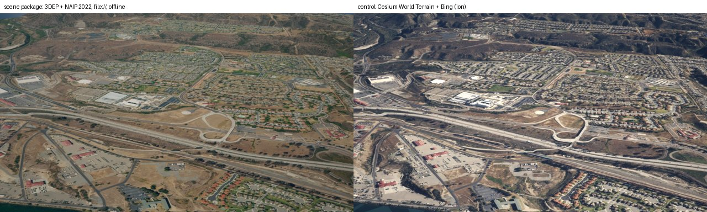
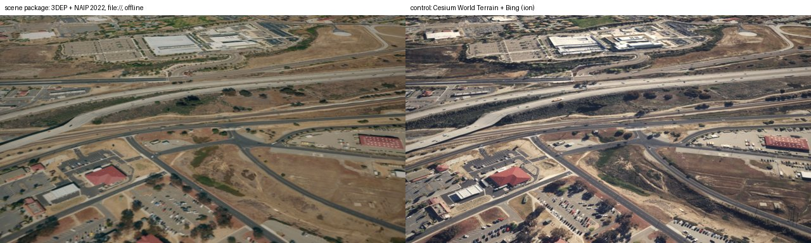
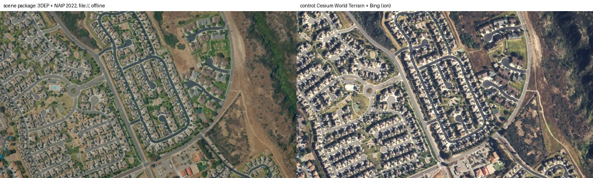
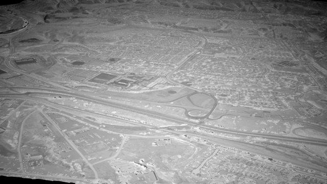
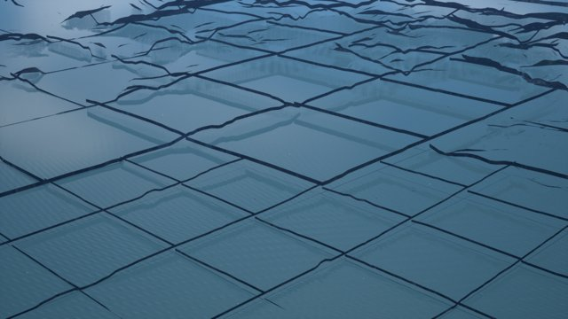
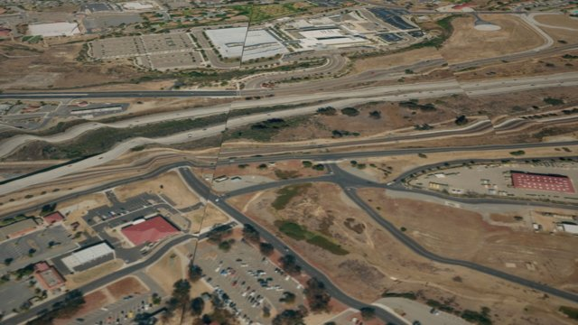

# Realism R0 spike: Camp Pendleton scene package (2026-10-07)

The spike behind `REALISM.md` R0. Question: can CamSim render a scene package built from US public
data (3DEP terrain, NAIP imagery), loaded from local files with no Cesium ion and no internet, with
correct geometry and geo-registration? **Yes.** Code: `scripts/scene/spike/` (throwaway reference).
Background reports: `docs/realism/data-sources.md`, `docs/realism/cesium-findings.md`,
`docs/realism/offline-hosting.md`.

Test area: Camp Pendleton (bbox W -117.62 S 33.19 E -117.24 N 33.52, about 1,300 km²). The spike
package covers a 5.6 × 5.5 km box across the base's southern boundary (W -117.41 S 33.20 E -117.35
N 33.25): Oceanside, the Santa Margarita river mouth, I-5 and the coast. Machine: M1 Pro, Metal.

## Results

| Check | Result |
|---|---|
| Quantized-mesh terrain from `file:///…/layer.json` (existing `terrain.source: url`, no code change) | Loads; gzipped tiles fine |
| NAIP as local TMS (`file:///…/tilemapresource.xml`, throwaway `imagery.source: tms` patch) | Loads |
| Offline (ports 80/443 blocked by `sandbox-exec`) | `/ready` in 21 s, every shot rendered. The only network use: 3 failed ion requests from `Main.umap`'s own actors at frame 0 (below) |
| Geo-registration, package vs Cesium World Terrain + Bing (nadir, 2 km, phase correlation) | 0 px shift (GSD 0.84 m) |
| CIGI frame-centre height (opcode 107) vs 3DEP truth, 5 nadir points | Package: +0.06 / +0.22 m where 1 m DEM exists, +0.89 / +0.22 / −0.71 m on the 10 m DEM. Cesium World Terrain at the same points: +0.39 … +2.18 m |
| Decoded tile vertices vs source DEM | median 2–3 cm, p99 0.31 m, max 2.5 m (steep cuts; u/v quantisation) |
| Thermal IR (MWIR) on the package | Renders; land cover and class refinement work as on CWT |
| Size, 1 m terrain to z16 (30.8 km²) | 628 tiles, 4.6 MB gzipped → **0.15 MB/km², ~20 tiles/km²** |
| Size, NAIP 0.6 m to z17, JPEG q85 | 2,293 tiles, 37 MB → **1.2 MB/km², ~75 tiles/km²** |
| Build time | Terrain: 16 s mosaic + 3 s tiling. Imagery: 338 s, dominated by reading 4 NAIP COGs over the network |

Shots (left: package, right: CWT + Bing control):

MWIR on the package: 

Extrapolated to the design target (40,000 km²) at full detail: terrain ~6 GB / ~0.8 M files,
imagery ~48 GB / ~3 M files. The Pendleton bbox (1,300 km²): ~0.2 GB terrain, ~1.6 GB imagery. The
file counts, not the bytes, are the hosting problem (see `docs/realism/offline-hosting.md`).

## Findings that change the plan

1. **No public LiDAR or 1 m DEM inside Camp Pendleton.** Every 3DEP LiDAR project wraps around
   the base; the newest 1 m DEM (`CA_SanDiegoCo_D24`, published 2026-09) stops at the boundary
   on a diagonal. Inside, only the 1/3 arc-second (~10 m) DEM exists. NAIP is *not* masked.
   So inside the base, `high` (1 m terrain, LiDAR building and canopy heights) is impossible;
   Overture/OSM heights (73 % of 81,825 buildings in the bbox have one) and Meta CHMv2 canopy
   height become the primary sources.
2. **The package must cover the whole globe.** Offline there is no Cesium World Terrain to
   fall back to: beyond the spike box the terrain is a flat sea floor and imagery is absent (the
   `high_edge` shot sees only ocean). A global low-zoom base (DEM + imagery) is part of every
   package.
3. **`Main.umap` contacts Cesium ion before CamSim's config applies.** The level's terrain
   tileset (ion 1), OSM Buildings (ion 96188) and the Bing overlay (ion 2) issue endpoint requests
   at frame 0. Offline they fail harmlessly, but an air-gapped deployment should not try. Human
   editor change: remove the ion assets from `Main.umap` (or have CamSim create its tileset).
4. **The datum chain must be explicit.** NAVD88 → ellipsoid is −35.06 m here (GEOID18), and
   NAD83(2011) → ITRF2014 shifts 1.35 m horizontally. PROJ's default `EPSG:4979` target picks an
   old GEOID03 chain (0.78 m off), and `EPSG:9755` silently drops the geoid (34 m). Pin the
   GEOID18 + ITRF2014 pipeline and vendor the grid. NAVD88 zero vs CamSim's EGM96 sea level differs
   by 0.38 m here (coast check in R1).
5. **Cesium's request cache holds only 4,096 items** (`MaxCacheItems`, not set in CamSim), so R5's
   "warm the cache" idea is moot until that is raised. With local packages it isn't needed for the
   package area at all.
6. **Offline hosting** (`docs/realism/offline-hosting.md`): Cesium reads no tile archive, so a
   package travels as one SquashFS/EROFS image mounted read-only (or a zip served on localhost).
   Global base: ETOPO 2022 + Blue Marble NG to z8, WorldCover S2 composite ring. Caching Cesium
   World Terrain or Bing for offline use is forbidden by the ion terms.
7. **Data source changes since REALISM.md was written**: NHD is retired (use 3DHP); HIFLD Open is
   offline (use OSM `power=*`); Microsoft Global ML Building Footprints is now CDLA Permissive 2.0
   (US-only repo still ODbL); Overture deletes releases after 60 days (snapshot and hash); NAIP CA
   2024 is only on the USDA image service / EarthExplorer (Planetary Computer stops at 2022);
   Meta CHMv2 supersedes v1; tree canopy % is USFS TCC v2025-6, not Annual NLCD.

## Pitfalls hit (each cost a debugging round; R0's encoder must avoid them)

| Symptom | Cause | Fix |
|---|---|---|
| Terrain renders as shiny blue panels below the sea  | pydelatin's vertex `y` already counts **up from the last row** (south when row 0 is north). Treating it as image rows mirrored every tile N–S and made its triangles clockwise (back faces) | `lat = south + y·Δ`; keep Delatin's (CCW) triangles as they are |
| Imagery tears at tile boundaries  | Same mirror: east–west neighbours still matched, north–south ones did not | Same fix; caught by decoding tiles and comparing vertex heights with the source (`gen_terrain.py` verify) |
| Cracks / missing skirts | `quantized-mesh-encoder` 0.5.0 casts positions to **float32** (~0.7 m at lon −117) and **truncates** to int16, so edge vertices miss 0/32767 and get no skirt | Quantise from float64 and round (the spike monkeypatches `interp_positions`); snap edge vertices exactly. R0 should write its own encoder (the format is small) |
| Potential garbage triangles | The encoder assumes **high-water-mark** vertex order and does not reorder | Renumber vertices by first use before encoding |
| NaN physics bounds (Chaos `AABBTree` ensure) | Degenerate triangles at the poles in the whole-globe level-0 tiles (NaN normals), and Cesium upsampling of them | Normals fall back to the ellipsoid up vector; one ensure is still logged from an upsampled tile. R1: generate full global low-zoom coverage, don't rely on upsampling |
| White, untextured terrain far away | The TMS pyramid started at zoom 10; Cesium wanted coarser levels for big tiles | Build imagery down to zoom 0 (the global base needs it anyway) |
| TMS overlay fails with "Is a directory" | For `file://`, the TMS `Url` must name `tilemapresource.xml`; nothing is appended | Point at the XML |
| `?extensions=octvertexnormals` appended to `file://` tile URLs | Cesium adds it for quantized-mesh | Harmless: the file accessor ignores the query |

## Not covered by the spike

- Buildings (R3), vegetation (R4), land-cover/road rasters (R2), a global base layer, a large
  (1,000 km²+) build, NAIP 2024 (used 2022 from Planetary Computer), Linux/Vulkan and Docker
  (`file://` from a mounted volume), Cesium game-thread cost of a deep (z16) local pyramid, and
  the coast check (CamSim's EGM96 sea vs NAVD88/MHW shoreline).
